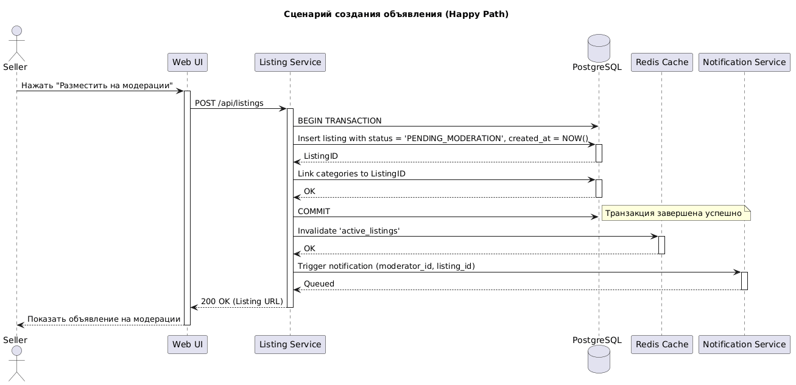
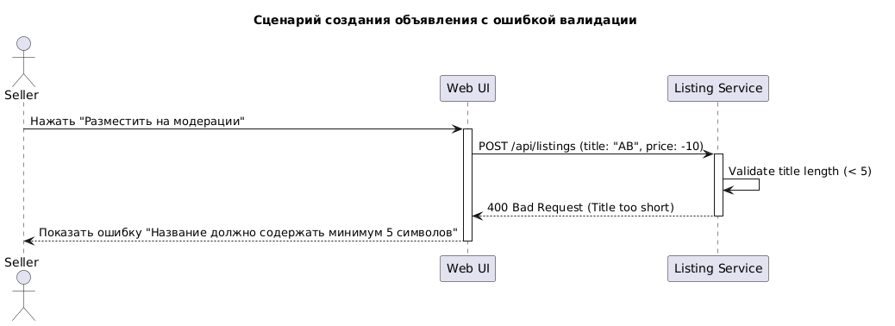

<p align="center">Министерство образования Республики Беларусь</p>
<p align="center">Учреждение образования</p>
<p align="center">"Брестский Государственный технический университет"</p>
<p align="center">Кафедра ИИТ</p>
<br><br><br><br><br><br>
<p align="center"><strong>Лабораторная работа №1</strong></p>
<p align="center"><strong>По дисциплине:</strong> "Проектирование интернет-систем"</p>
<p align="center"><strong>Тема:</strong> "Сценарий транзакции: моделирование use-case и границ ответственности"</p>
<br><br><br><br><br><br>
<p align="right"><strong>Выполнил:</strong></p>
<p align="right">Студент 3 курса</p>
<p align="right">Группы ПО-13</p>
<p align="right">&lt;Тютьков К. О.&gt;</p>
<p align="right"><strong>Проверил:</strong></p>
<p align="right">Шорох Д. В.</p>
<br><br><br><br><br>
<p align="center"><strong>Брест 2026</strong></p>

---

## Цель работы

Научиться анализировать бизнес-процессы интернет-системы, выявлять границы ответственности компонентов и моделировать транзакционные сценарии с учётом возможных сбоев.

---

## Вариант №8 - Объявки «Бери, пока горячее»

**Питч:** _От велосипеда до учебника - всё тут_

**Ядро домена:** _Объявления, Категории, Цены, Модерация, Статусы_

---

## Ход выполнения работы

### 1. Структура проекта

```
lab-01/
├── Отчет.md # Основной отчёт (этот документ)
├── use-case.md # Текстовое описание use-case
├── diagrams/
│ ├── sequence-happy.puml # PlantUML для успешного сценария
│ ├── sequence-happy.png # Экспорт диаграммы
│ ├── sequence-error-publish.puml
│ └── sequence-error-publish.png
├── scenarios.feature # Gherkin-сценарии
└── analysis.md # Анализ границ ответственности
```

---

### 2. Use-case описание

👉 **Ссылка на файл:** [use-case.md](use-case.md)

**Основной сценарий:** Публикация лонгрида.

**Первичный актор:** Автор.

**Цель:** Опубликовать готовую статью, обновить теги и уведомить подписчиков.

**Краткое описание основного потока:**
1. Продавец нажимает кнопку «Разместить на модерации» в редакторе.
2. Система проверяет валидность данных (название ≥ 5 символов, описание ≤ 5000 символов, цена ≥ 0).
3. Система открывает транзакцию в БД.
4. Система создаёт объявление со статусом `PENDING_MODERATION` и фиксирует связи с категориями.
5. Система закрывает транзакцию (Commit).
6. Система инициирует асинхронную очистку кэша и отправку уведомления модератору.
7. Продавец получает подтверждение размещения на модерации.

**Альтернативные потоки:**
- **3a. Название слишком короткое:** Система выводит ошибку и не создаёт объявление.
- **3b. Описание слишком длинное:** Система выводит ошибку и не создаёт объявление.
- **3c. Отрицательная цена:** Система выводит ошибку и не создаёт объявление.

**Исключительные ситуации:**
- **4a. Ошибка БД при сохранении:** Система делает откат (Rollback), объявление не создаётся.
- **6a. Сбой сервиса уведомлений:** Объявление создано, но уведомление ставится в очередь на повтор.

---

### 3. Диаграммы последовательности (Sequence Diagrams)

#### 3.1. Happy Path (успешный сценарий)

👉 **PlantUML исходник:** [sequence-happy.puml](diagrams/sequence-happy.puml)



**Описание потока:**
Пользователь инициирует запрос, который обрабатывается `Listing Service`. Сервис выполняет синхронное обновление в БД (в рамках одной транзакции создаётся объявление со статусом PENDING_MODERATION и привязываются категории). После подтверждения записи (Commit), сервис отправляет асинхронные команды в `Redis` (сброс кэша) и `Notification Service` (уведомление модератору).

**Участники:**
- **Seller**: Первичный актор.
- **Listing Service**: Логика приложения.
- **ListingDB**: Реляционная база данных.
- **Redis**: Кэш-слой.
- **Notification Service**: Внешний сервис оповещений.

#### 3.2. Error Case (сценарий с ошибкой валидации)

👉 **PlantUML исходник:** [sequence-error-publish.puml](diagrams/sequence-error-publish.puml)



**Описание потока:**
Показан сценарий ошибки валидации при создании объявления (название слишком короткое, отрицательная цена). Система проверяет данные перед открытием транзакции, возвращает ошибку валидации и не создаёт объявление. Данные остаются консистентными.

---

### 4. Gherkin-сценарии

👉 **Ссылка на файл:** [scenarios.feature](scenarios.feature)

**Реализовано сценариев:** 4

**Список сценариев:**
1. ✅ **Успешный сценарий** (Happy Path) — Публикация лонгрида.
2. ✅ **Ошибка:** Слишком короткий текст (менее 500 знаков).
3. ✅ **Ошибка:** Сбой БД в процессе сохранения (Rollback).
4. ✅ **Ошибка:** Таймаут сервиса уведомлений (Eventual consistency).

**Пример сценария:**
```gherkin
Scenario: Успешная публикация
  Given автор авторизован и открыл черновик с текстом 1200 символов
  When автор нажимает кнопку "Опубликовать"
  Then статус статьи в БД меняется на "PUBLISHED"
  And система отправляет уведомления подписчикам
  And пользователь видит сообщение "Ваш лонгрид в эфире! 🚀"
```
---

### 5. Анализ границ ответственности

👉 **Ссылка на файл:** [analysis.md](analysis.md)

#### 5.1. Транзакционные границы

| Операция | Синхронная/Асинхронная | Откат при ошибке | Retry-стратегия | Идемпотентность |
|----------|------------------------|------------------|-----------------|-----------------|
| _Создание объявления в БД_ | _Синхронная_ | _Да (ROLLBACK)_ | _[Описание]_ | _Да_ |
| _Запись категорий в БД_ | _Синхронная_ | _Да (в той же транзакции)_ | _Нет_ | _Да_ |
| _Сброс кэша (Redis)_ | _Асинхронная_ | _Нет_ | _3 попытки_ | _Да_ |
| _Отправка уведомления модератору_ | _Асинхронная_ | _Нет_ | _Exponential backoff_ | _Да_ |


#### 5.2. Обработка исключительных ситуаций

**Реализовано стратегий обработки:** _2_

**Примеры:**

##### Исключительная ситуация 1: 

- **Условие возникновения:** _Потеря связи во время записи связей "статья-теги_
- **Обнаружение:** _ConnectionException от драйвера БД_
- **Реакция:** _Вызов ROLLBACK транзакции_
- **Компенсация:** _Состояние данных возвращается к исходному (черновик)_
- **Уведомление пользователя:** _Ошибка сохранения. Данные в сохранности, попробуйте позже_

##### Исключительная ситуация 2: 

- **Условие возникновения:** _Firebase или Email-провайдер не ответил вовремя._
- **Обнаружение:** _TimeoutException при сетевом вызове_
- **Реакция:** _Статья остается опубликованной, задача уходит в очередь (Outbox)_
- **Компенсация:** _Повторные попытки воркером (Background job)_
- **Уведомление пользователя:** _Статья опубликована! Подписчики узнают о ней в ближайшее время_

---

## Таблица критериев оценки

| Критерий | Баллы | Выполнено |
|----------|-------|-----------|
| Use-case описание (полнота: акторы, предусловия, основной поток, альтернативы, исключения) | 15 | ✅ |
| Sequence diagram (happy path) - корректность нотации UML, включение всех ключевых компонентов | 20 | ✅ |
| Sequence diagram (error case) - моделирование хотя бы одной исключительной ситуации | 15 | ✅ |
| Gherkin-сценарии - минимум 4 сценария (1 успешный + 3 ошибочных) | 20 | ✅ |
| Анализ границ ответственности - таблица транзакционных границ, обоснование выбора синхронных/асинхронных операций | 15 | ✅ |
| Обработка исключений - описание стратегий retry, компенсации, уведомлений | 10 | ✅ |
| Качество документации - оформление, читаемость, грамотность | 5 | ✅ |
| **ИТОГО** | **100** | |

---

## Контрольные вопросы

**Подготовка к защите:**
1. Что такое транзакционная граница? Где она проходит в вашем сценарии?
   - _Это логический предел, внутри которого все действия атомарны. В моем сценарии она проходит внутри Listing Service и охватывает запросы к PostgreSQL для создания объявления и записи категорий._
2. Почему операция X выбрана синхронной, а Y - асинхронной?
   - _Создание объявления критично для консистентности (продавец должен видеть, что объявление создано). Уведомления могут быть отложены (eventual consistency), это не влияет на целостность данных объявления._
3. Как обеспечить идемпотентность при повторных запросах?
   - _Проверкой текущего состояния (если объявление уже имеет статус, не создавать новое) или использованием уникальных ключей (idempotency_key) от клиента._
4. Что произойдёт, если внешний сервис вернёт ошибку после частичного выполнения операции?
   - _Так как БД-транзакция уже закрыта (Commit), объявление будет считаться созданным. Сбой уведомлений будет обработан через механизм Retry в фоне._
5. Как система обнаружит, что внешний сервис недоступен?
   - _Посредством анализа HTTP статус-кодов (503, 504) или срабатывания тайм-аута в HTTP-клиенте._
6. Какие данные нужно логировать для диагностики сбоев?
   - _Correlation-ID запроса, ListingID, SellerID, сообщение об ошибке, время сбоя и текущую фазу транзакции_

---

## Ссылка на репозиторий

👉 **GitHub:** _https://github.com/kerubifi_

---

## Вывод

> В ходе выполнения лабораторной работы был проанализирован бизнес-процесс создания объявления в маркетплейсе «Бери, пока горячее!». Были разработаны use-case описания и диаграммы последовательности, визуализирующие взаимодействие компонентов и границы транзакций. Я освоил работу с PlantUML для визуализации системных вызовов и синтаксис Gherkin для описания сценариев поведения. Были определены стратегии обработки исключений, что позволило спроектировать систему, устойчивую к частичным отказам внешних сервисов.
---

**Дата выполнения:** _12.05.2026_

**Оценка:** _____________

**Подпись преподавателя:** _____________
