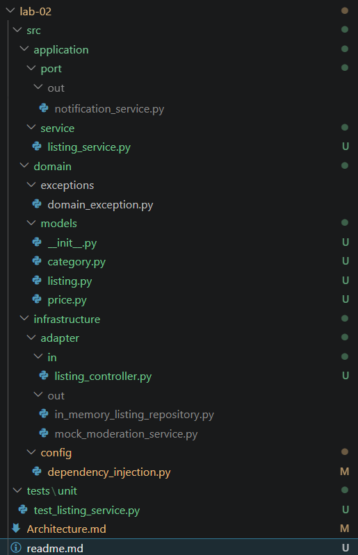

<p align="center">Министерство образования Республики Беларусь</p>
<p align="center">Учреждение образования</p>
<p align="center">"Брестский Государственный технический университет"</p>
<p align="center">Кафедра ИИТ</p>
<br><br><br><br><br><br>
<p align="center"><strong>Лабораторная работа №2</strong></p>
<p align="center"><strong>По дисциплине:</strong> "Проектирование интернет-систем"</p>
<p align="center"><strong>Тема:</strong> "Гексагональная архитектура: проектирование портов и адаптеров"</p>
<br><br><br><br><br><br>
<p align="right"><strong>Выполнил:</strong></p>
<p align="right">Студент 3 курса</p>
<p align="right">Группа ПО-13</p>
<p align="right">Тютьков К. О.</p>
<p align="right"><strong>Проверил:</strong></p>
<p align="right">Шорох Д. В.</p>
<br><br><br><br><br>
<p align="center"><strong>Брест 2026</strong></p>

---

## Вариант №8 - Объявки «Бери, пока горячее»

**Питч:** _От велосипеда до учебника - всё тут_

**Ядро домена:** _Объявления, Категории, Цены, Модерация, Статусы_

---

## Ход выполнения работы

### Часть 1. Архитектурная диаграмма

**Описание сервиса:**
Listing Service отвечает за жизненный цикл объявления: создание, валидацию полей (название ≥5 символов, описание ≤5000 символов, цена ≥0), отправку на модерацию, одобрение/отклонение, отметку о продаже, архивацию. Основные сущности: Listing (Объявление), Category (Категория - как значение), Seller (Продавец). Value Objects: Price (Цена), Category (Категория).


**Диаграмма слоёв:**

```text
┌─────────────────────────────────────────────┐
│   Infrastructure Layer (Адаптеры)           │
│  ┌──────────────┐    ┌──────────────────┐   │
│  │ REST API     │    │ InMemory         │   │
│  │ (Controller) │    │ ListingRepository│   │
│  └──────┬───────┘    └─────────┬────────┘   │
└─────────┼──────────────────────┼─────────────┘
           │                      │
           ▼                      ▼
┌──────────────────────────────────────────────────────────┐
│   Application Layer (Порты и Сервис)                     │
│  ┌──────────────┐    ┌──────────────────────────────┐   │
│  │ In Ports     │    │ Out Ports                    │   │
│  │ (Use Cases)  │    │ (Interfaces)                 │   │
│  └──────┬───────┘    └──────────┬───────────────────┘   │
│         │                        │                        │
│  ┌──────▼────────────────────────▼──────────────────┐    │
│  │    ListingService (Orchestrator)                 │    │
│  └──────────────────────────────────────────────────┘    │
└─────────────────┬────────────────────────────────────────┘
                  │
                  ▼
┌──────────────────────────────────────────────┐
│       Domain Layer (Ядро бизнеса)            │
│  ┌─────────┐      ┌──────────┐               │
│  │ Listing │      │ Category │               │
│  │(Entity) │      │  (Value) │               │
│  │  Price  │      │(VO)      │               │
│  └─────────┘      └──────────┘               │
└──────────────────────────────────────────────┘
```

---


### Часть 2. Структура проекта (скелет)

**Технология:** _Python_

**Структура папок:**

```
lab-02/
├── src/
│   ├── application/
│   │   ├── command/
│   │   │   └── create_listing_use_case.py          # CreateListingUseCase
│   │   ├── port/
│   │   │   ├── in_/                                 # Входящие порты
│   │   │   │   ├── create_listing_use_case.py       # CreateListingUseCase
│   │   │   │   ├── get_listing_use_case.py          # GetListingUseCase
│   │   │   │   └── moderate_listing_use_case.py     # ModerateListingUseCase
│   │   │   └── out/                                  # Исходящие порты
│   │   │       ├── listing_repository.py            # ListingRepository
│   │   │       ├── moderation_service.py            # ModerationService
│   │   │       └── notification_service.py          # NotificationService
│   │   └── service/
│   │       └── listing_service.py                   # ListingService
│   ├── domain/
│   │   ├── exceptions/
│   │   │   └── domain_exception.py
│   │   └── models/
│   │       ├── listing.py                           # Entity Listing
│   │       ├── price.py                             # Value Object Price
│   │       └── category.py                          # Value Object Category
│   └── infrastructure/
│       ├── adapter/
│       │   ├── in/
│       │   │   └── listing_controller.py            # ListingController
│       │   └── out/
│       │       ├── in_memory_listing_repository.py  # InMemoryListingRepository
│       │       ├── mock_moderation_service.py       # MockModerationService
│       │       └── console_notification_service.py  # ConsoleNotificationService
│       └── config/
│           └── dependency_injection.py              # DependencyContainer
└── tests/
    └── unit/
        └── test_listing_service.py
```

**Скриншот структуры в IDE:**

  - 

---


### Часть 3. Domain Layer (Доменный слой)

#### Доменные сущности

**Entity**: _Listing (Объявление)_

```python
class Listing:
    def __init__(self, listing_id: str, seller_id: str, title: str, 
                 description: str, price: Price, images: List[str] = None):
        self.id = listing_id
        self.seller_id = seller_id
        self.title = title
        self.description = description
        self.price = price
        self.images = images or []
        self.status = "PENDING_MODERATION"
        self._validate()

    def _validate(self):
        if len(self.title) < 5:
            raise ValueError("Название должно содержать минимум 5 символов")
        if len(self.description) > 5000:
            raise ValueError("Описание не должно превышать 5000 символов")

    def approve(self):
        if self.status != "PENDING_MODERATION":
            raise ValueError("Можно одобрить только объявление на модерации")
        self.status = "ACTIVE"

    def reject(self, reason: str):
        if self.status != "PENDING_MODERATION":
            raise ValueError("Можно отклонить только объявление на модерации")
        self.status = "REJECTED"

    def mark_as_sold(self):
        if self.status != "ACTIVE":
            raise ValueError("Можно отметить как проданное только активное объявление")
        self.status = "SOLD"

    def archive(self):
        if self.status not in ["ACTIVE", "SOLD"]:
            raise ValueError("Можно архивировать только активное или проданное объявление")
        self.status = "ARCHIVED"
```

**Value Object Price (Цена):**
```python
@dataclass(frozen=True)
class Price:
    amount: float
    currency: str = "USD"

    def __post_init__(self):
        if self.amount < 0:
            raise ValueError("Цена не может быть отрицательной")
        object.__setattr__(self, 'amount', round(self.amount, 2))

    @property
    def is_free(self) -> bool:
        return self.amount == 0
```

**Value Object Category (Категория):**
```python
@dataclass(frozen=True)
class Category:
    name: str
    parent_category: Optional['Category'] = None

    def __post_init__(self):
        if not self.name or not self.name.strip():
            raise ValueError("Название категории не может быть пустым")
```

**Доменные исключения**:

- _ListingValidationError (Некорректные данные объявления)_
- _InvalidListingStateError (Некорректное состояние объявления)_

---


#### Бизнес-правила

1. _Объявление может быть создано только при:_
   - _Заголовке от 5 символов_
   - _Описании не более 5000 символов_
   - _Цене ≥ 0_
2. _Статус по умолчанию — `PENDING_MODERATION`_

---


### Часть 4. Application Layer (Прикладной слой)

#### Входящие порты (Inbound Ports)

**CreateListingUseCase:**

```python
class CreateListingUseCase(ABC):
    @abstractmethod
    def create_listing(self, command: CreateListingCommand): pass
```


**GetListingUseCase:**

```python
class GetListingUseCase(ABC):
    @abstractmethod
    def get_listing(self, listing_id: str): pass
```


**ModerateListingUseCase:**

```python
class ModerateListingUseCase(ABC):
    @abstractmethod
    def moderate_listing(self, listing_id: str, moderator_id: str, approved: bool, rejection_reason: str = None): pass
```

---


#### Исходящие порты (Outbound Ports)

Интерфейсы, через которые система взаимодействует с внешним миром:

**ListingRepository:**

```python
class ListingRepository(ABC):
    @abstractmethod
    def save(self, listing: Listing) -> Listing: pass
    @abstractmethod
    def find_by_id(self, listing_id: str) -> Optional[Listing]: pass
    @abstractmethod
    def find_by_seller(self, seller_id: str) -> List[Listing]: pass
```


**ModerationService:**

```python
class ModerationService(ABC):
    @abstractmethod
    def check_content(self, title: str, description: str) -> Tuple[bool, List[str]]: pass
```


**NotificationService:**

```python
class NotificationService(ABC):
    @abstractmethod
    def notify_seller(self, seller_email: str, message: str): pass
```

---


#### Application Service

- **ListingService** — реализует сценарии создания, получения и модерации объявления, используя репозиторий для загрузки/сохранения, вызывая доменную логику сущности и оповещая продавца через NotificationService.

---


### Часть 5. Infrastructure Layer (Инфраструктурный слой)

#### Входящий адаптер: REST API

**ListingController:**

```python
class ListingController:
    def handle_moderate(self, listing_id: str, moderator_id: str, approved: bool, rejection_reason: str = None):
        # Вызов moderate_listing_use_case
        return self.moderate_use_case.moderate_listing(listing_id, moderator_id, approved, rejection_reason)
```

---


#### Исходящие адаптеры: Repository и Сервисы

- **InMemoryListingRepository** — хранит объекты Listing в обычном словаре `dict` для быстрой работы без внешней БД в рамках прототипа.

- **MockModerationService** — мок-сервис проверки контента с флагом `auto_approve`, не требующий внешних API.

- **ConsoleNotificationService** — выводит уведомления в консоль для демонстрации работы слоя уведомлений.

---


### Часть 6. Dependency Injection (Конфигурация зависимостей)

- **DependencyContainer** — класс-конфигуратор, который создаёт экземпляр `InMemoryListingRepository`, `MockModerationService` и связывает всё дерево зависимостей, передавая их в конструктор `ListingService`.

---


### Часть 7. Тестирование

#### Юнит-тесты для ListingService

**Что тестируется**:

- ✅ Успешное одобрение объявления, находящегося на модерации.
- ✅ Ошибка при попытке одобрить не найденное объявление.
- ✅ Выброс `ValueError` при названии менее 5 символов.
- ✅ Выброс `ValueError` при описании более 5000 символов.
- ✅ Бесплатное объявление (`price = 0`) — `is_free == True`.
- ✅ Корректность сохранения данных в InMemory-репозитории.
- ✅ Отклонение объявления (`reject`) меняет статус на REJECTED.
- ✅ Отметка о продаже (`mark_as_sold`) меняет статус на SOLD.
- ✅ Архивирование (`archive`) меняет статус на ARCHIVED.

---


## 3. Архитектурная диаграмма

### Описание портов и адаптеров

| Тип | Название | Назначение |
|-----|---------|------------|
| **Входящий порт** | CreateListingUseCase | _Интерфейс для создания объявления_ |
| **Входящий порт** | GetListingUseCase | _Интерфейс для получения объявления по ID_ |
| **Входящий порт** | ModerateListingUseCase | _Интерфейс для модерации объявления_ |
| **Исходящий порт** | ListingRepository | _Интерфейс для хранения и поиска объявлений_ |
| **Исходящий порт** | ModerationService | _Интерфейс для проверки контента_ |
| **Исходящий порт** | NotificationService | _Интерфейс для отправки уведомлений_ |
| **Входящий адаптер** | ListingController | _REST API контроллер_ |
| **Исходящий адаптер** | InMemoryListingRepository | _Хранилище данных в памяти_ |
| **Исходящий адаптер** | MockModerationService | _Мок-сервис модерации_ |
| **Исходящий адаптер** | ConsoleNotificationService | _Уведомления в консоль_ |

---


## 4. Критерии выполнения

| Критерий | Выполнено | Комментарий |
|----------|-------|-------------|
| Структура проекта (domain/application/infrastructure) | ✅ | _Созданы все папки domain/app/infra_ |
| Domain Layer (чистая бизнес-логика) | ✅ | _Содержит логику валидации полей объявления_ |
| Порты (входящие и исходящие интерфейсы) | ✅ | _Определены абстрактные классы (ABC)_ |
| Адаптеры (минимум 1 входящий + 2 исходящих) |  ✅ | _Реализован InMemory репозиторий_ |
| DI-конфигурация (зависимости инжектятся) | ✅ | _Реализован класс DependencyContainer_ |
| Документация (диаграмма, описание) |  ✅ | _Диаграмма и пояснения в наличии_ |

**Итого**: _6_ / 6

---


## 5. Выводы

### Что получилось хорошо

> Удалось достичь полной изоляции бизнес-логики. Доменный слой (Value Objects Price и Category, Entity Listing) не содержит зависимостей от внешних библиотек или БД. Цена реализована как Value Object, что позволяет иметь бесплатные объявления с валидацией ≥ 0, а статусы `approve / reject / mark_as_sold / archive` инкапсулируют всю логику жизненного цикла внутри сущности Listing.

---


### С какими трудностями столкнулись

> Основная сложность заключалась в понимании того, почему интерфейсы (порты) должны лежать в слое Application, а их реализация (адаптеры) — в Infrastructure. После реализации стало ясно, что это позволяет менять способ хранения данных и способ модерации без правки логики. Также пришлось отдельно продумать разделение сущности Listing на методы `approve()`, `reject()`, `mark_as_sold()`, `archive()`.

---


### Что узнали нового

> Изучил принципы Гексагональной архитектуры и Dependency Inversion. Понял, как структура папок помогает поддерживать чистоту кода в крупных проектах. Также освоил работу с Value Objects — Price поддерживает бесконечное изменение стоимости, а Category позволяет строить иерархию рубрик объявлений.

---


### С какими трудностями столкнулись

> Основная сложность заключалась в понимании того, почему интерфейсы (порты) должны лежать в слое Application, а их реализация (адаптеры) — в Infrastructure. После реализации стало ясно, что это позволяет менять способ хранения данных без правки логики.

---


### Что узнали нового

> Изучил принципы Гексагональной архитектуры и Dependency Inversion. Понял, как структура папок помогает поддерживать чистоту кода в крупных проектах.

---


### Ссылка на репозиторий

_https://github.com/kerubifi_

---


**Дата сдачи**: _12.05.2026_  
**Подпись студента**: _Тютьков К. О._