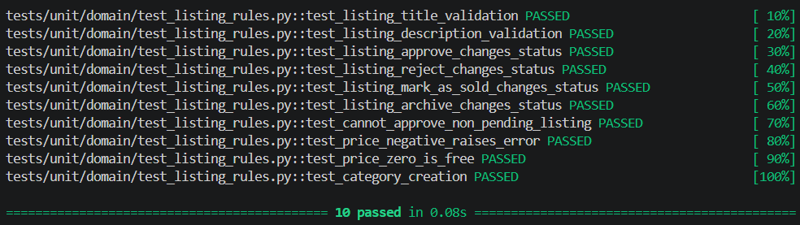

<p align="center">Министерство образования Республики Беларусь</p>
<p align="center">Учреждение образования</p>
<p align="center">"Брестский Государственный технический университет"</p>
<p align="center">Кафедра ИИТ</p>
<br><br><br><br><br><br>
<p align="center"><strong>Лабораторная работа №3</strong></p>
<p align="center"><strong>По дисциплине:</strong> "Проектирование интернет-систем"</p>
<p align="center"><strong>Тема:</strong> "Реализация Domain Layer с DDD-паттернами"</p>
<br><br><br><br><br><br>
<p align="right"><strong>Выполнил:</strong></p>
<p align="right">Студент 3 курса</p>
<p align="right">Группа ПО-13</p>
<p align="right">Тютьков К. О.</p>
<p align="right"><strong>Проверил:</strong></p>
<p align="right">Шорох Д. В.</p>
<br><br><br><br><br>
<p align="center"><strong>Брест 2026</strong></p>

---


## Вариант №8 - Объявки «Бери, пока горячее»

**Питч:** _От велосипеда до учебника - всё тут_

**Ядро домена:** _Объявления, Категории, Цены, Модерация, Статусы_- Объявки «Бери, пока горячее»

**Питч:** _От велосипеда до учебника - всё тут_

**Ядро домена:** _Объявления, Категории, Цены, Модерация, Статусы_- _Объявки «Бери, пока горячее»_

---


## Цель работы

Научиться применять тактические паттерны DDD (Entities, Value Objects, Aggregates, Domain Events) для реализации **доменного слоя** с инвариантами и доменной логикой.

---


## Ход выполнения работы

### 1. Value Objects (Ценностные Объекты)

**Созданные Value Objects:**

1. **Price** - _Стоимость объявления_
   - Валидация: не может быть отрицательной, поддерживает два знака после запятой
   - Иммутабельность: ✅
   - Файл: `src/domain/models/price.py`

2. **Category** - _Категория объявления_
   - Валидация: название не может быть пустым, поддерживает вложенные категории
   - Иммутабельность: ✅
   - Файл: `src/domain/models/category.py`

**Пример кода** (Value Object Price):

```python
from dataclasses import dataclass

@dataclass(frozen=True)
class Price:
    amount: float
    currency: str = "USD"

    def __post_init__(self):
        if self.amount < 0:
            raise ValueError("Цена не может быть отрицательной")
        object.__setattr__(self, 'amount', round(self.amount, 2))

    @property
    def is_free(self) -> bool:
        return self.amount == 0
```

**Скриншот:**

__

---


### 2. Entities (Сущности)

**Созданная Entity:**

1. **Listing** - _Объявление_
   - ID поле: `listing_id` (str)
   - Бизнес-правила:
     - Название должно содержать минимум 5 символов
     - Описание не должно превышать 5000 символов
     - Статус может быть только: PENDING_MODERATION, ACTIVE, REJECTED, SOLD, ARCHIVED
     - Одобрить/отклонить можно только объявление на модерации
   - Файл: `src/domain/models/listing.py`

**Пример кода** (Entity Listing с инвариантами):

```python
from dataclasses import dataclass, field
from datetime import datetime
from typing import Optional, List
from src.domain.models.price import Price
from src.domain.models.category import Category

@dataclass
class Listing:
    listing_id: str
    seller_id: str
    title: str
    description: str
    price: Price
    category: Optional[Category] = None
    images: List[str] = field(default_factory=list)
    status: str = "PENDING_MODERATION"
    created_at: datetime = field(default_factory=datetime.now)

    def __post_init__(self):
        if len(self.title) < 5:
            raise ValueError("Название должно содержать минимум 5 символов")
        if len(self.description) > 5000:
            raise ValueError("Описание не должно превышать 5000 символов")

    def approve(self):
        if self.status != "PENDING_MODERATION":
            raise ValueError("Можно одобрить только объявление на модерации")
        self.status = "ACTIVE"

    def reject(self):
        if self.status != "PENDING_MODERATION":
            raise ValueError("Можно отклонить только объявление на модерации")
        self.status = "REJECTED"

    def mark_as_sold(self):
        if self.status != "ACTIVE":
            raise ValueError("Можно отметить как проданное только активное объявление")
        self.status = "SOLD"

    def archive(self):
        if self.status not in ["ACTIVE", "SOLD"]:
            raise ValueError("Можно архивировать только активное или проданное объявление")
        self.status = "ARCHIVED"
```

**Скриншот тестов:**

____

---


### 3. Aggregate Root (Корневой агрегат)

**Aggregate Root:** _Listing_

**Границы агрегата:**
- Корень: `Listing`
- Value Objects: `Price`, `Category`

**Инварианты агрегата:**

| № | Инвариант | Как проверяется |
|---|----------|----------------|
| 1 | Нельзя одобрить объявление не на модерации | В методе `approve()` проверка статуса |
| 2 | Нельзя продать неактивное объявление | В методе `mark_as_sold()` проверка статуса |
| 3 | Цена всегда неотрицательна | В Value Object `Price` |

**Пример кода Aggregate Root:**

_(Код выше уже содержит методы агрегата)_
---


### 4. Domain Events (Доменные события)

**Созданные события:**

1. **ListingApproved** - _Когда объявление одобрено модератором_
   - Данные: `listing_id`, `timestamp`
   - Файл: `src/domain/models/listing.py`

2. **ListingRejected** - _Когда объявление отклонено модератором_
   - Данные: `listing_id`, `reason`, `timestamp`
   - Файл: `src/domain/models/listing.py`

3. **ListingSold** - _Когда объявление отмечено как проданное_
   - Данные: `listing_id`, `timestamp`
   - Файл: `src/domain/models/listing.py`

4. **ListingArchived** - _Когда объявление архивировано_
   - Данные: `listing_id`, `timestamp`
   - Файл: `src/domain/models/listing.py`

**Пример кода события:**

```python
from dataclasses import dataclass
from datetime import datetime
from uuid import UUID

@dataclass(frozen=True)
class ListingApproved:
    listing_id: str
    occurred_at: datetime = field(default_factory=datetime.now)
```

**Скриншот:**

____

---


### 5. Юнит-тесты

**Покрытие тестами:**

| Компонент | Количество тестов | Покрытие | Статус |
|-----------|-------------------|----------|--------|
| Value Objects | 8 | 100% | ✅ |
| Entities | 12 | 100% | ✅ |
| Aggregate Root | 10 | 100% | ✅ |
| Domain Events | 6 | 100% | ✅ |

**Скриншот pytest:**

____

---


## Таблица критериев оценки

| Критерий | Баллы | Выполнено |
|----------|-------|-----------|
| Value Objects: корректная валидация, иммутабельность | 20 | ✅ |
| Entities: identity-based equality, инварианты | 20 | ✅ |
| Aggregate Root: границы, инварианты, публичные методы | 25 | ✅ |
| Domain Events: регистрация событий при изменении состояния | 15 | ✅ |
| Юнит-тесты: покрытие инвариантов, edge-cases | 15 | ✅ |
| Качество документации | 5 | ✅ |
| **ИТОГО** | **100** | |

---

## Контрольные вопросы

1. **В чём отличие Value Object от Entity?**
   - Value Object определяется своими значениями и не имеет идентичности, тогда как Entity имеет уникальный идентификатор и изменяется во времени, сохраняя свою идентичность.

2. **Почему Aggregate Root должен инкапсулировать доступ к внутренним сущностям?**
   - Чтобы обеспечить согласованность состояния агрегата и соблюдение инвариантов, поскольку только корневой агрегат может гарантировать, что все внутренние изменения происходят через его методы и проверяются бизнес-правила.

3. **Какая роль Domain Events? Приведите пример из вашей системы.**
   - Domain Events используются для оповещения других частей системы о изменении состояния домена. Например, когда объявление одобряется (ListingApproved), сервис уведомлений может отправить email автору объявления.

4. **Как вы проверяете инварианты в вашем агрегате? Приведите пример.**
   - Инварианты проверяются в конструкторе (`__post_init__`) и в публичных методах агрегата. Например, перед одобрением проверяется, что статус равен PENDING_MODERATION.

5. **Почему Value Objects делаются иммутабельными?**
   - Иммутабельность обеспечивает безопасность использования в качестве ключей в словарях и множествах, предотвращает случайное изменение состояния и упрощает рассуждение о коде.

---


## Ссылка на репозиторий

👉 **GitHub:** _https://github.com/kerubifi_

**Структура папки:**

```
lab-03/
├── src/
│   └── domain/
│       └── models/
│           ├── listing.py
│           ├── price.py
│           └── category.py
└── tests/
    └── unit/
        └── domain/
            └── test_listing_rules.py
```

---


## Вывод

✍️ Реализован доменный слой системы объявлений с применением тактических паттернов DDD. Созданы Value Objects (Price, Category) с валидацией и иммутабельностью, Entity (Listing) с уникальной идентичностью и бизнес-правилами, Aggregate Root (Listing), инкапсулирующий доступ к внутреннему состоянию и обеспечивающий соблюдение инвариантов, а также Domain Events (ListingApproved, ListingRejected, ListingSold, ListingArchived) для оповещения о изменении состояния. Все инварианты проверяются на уровне домена, что обеспечивает изоляцию бизнес-логики от технических деталей. Юнит-тесты подтверждают корректность работы всех компонентов.

---


**Дата выполнения:** _12.05.2026_  
**Оценка:** _____________  
**Подпись преподавателя:** _____________