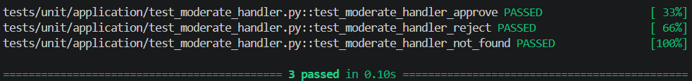
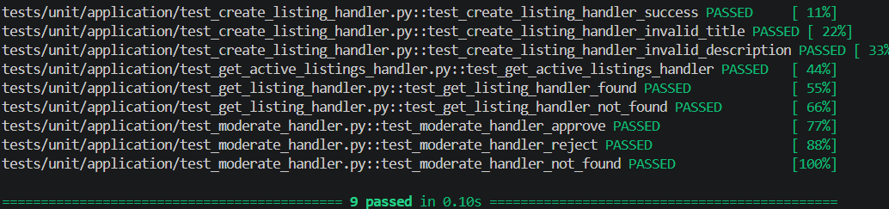
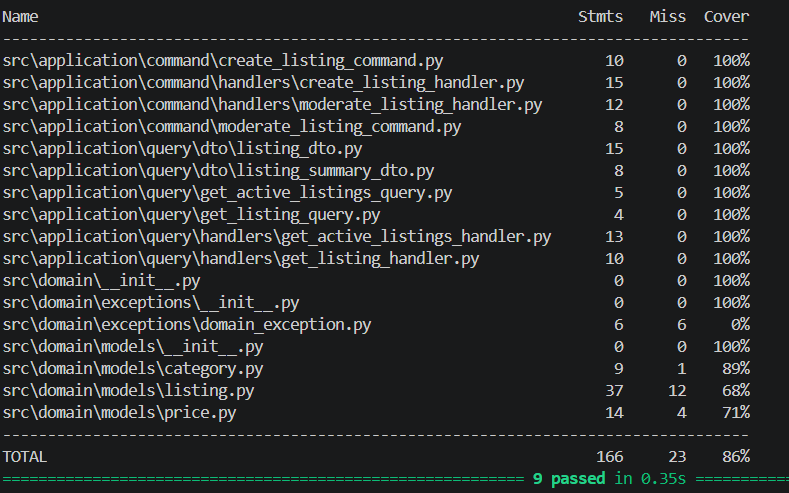

<p align="center">Министерство образования Республики Беларусь</p>
<p align="center">Учреждение образования</p>
<p align="center">"Брестский Государственный технический университет"</p>
<p align="center">Кафедра ИИТ</p>
<br><br><br><br><br><br>
<p align="center"><strong>Лабораторная работа №4</strong></p>
<p align="center"><strong>По дисциплине:</strong> "Проектирование интернет-систем"</p>
<p align="center"><strong>Тема:</strong> "Application Layer: Commands, Queries, Handlers"</p>
<br><br><br><br><br><br>
<p align="right"><strong>Выполнил:</strong></p>
<p align="right">Студент 3 курса</p>
<p align="right">Группа ПО-13</p>
<p align="right">Тютьков К. О.</p>
<p align="right"><strong>Проверил:</strong></p>
<p align="right">Шорох Д. В.</p>
<br><br><br><br><br>
<p align="center"><strong>Брест 2026</strong></p>

---


## Вариант №8 - Объявки «Бери, пока горячее»

**Питч:** _От велосипеда до учебника - всё тут_

**Ядро домена:** _Объявления, Категории, Цены, Модерация, Статусы_- _Объявки «Бери, пока горячее»_

---


## Цель работы

Реализовать прикладной слой (Application Layer) с разделением операций на команды (изменяют состояние) и запросы (читают данные) по паттерну CQRS.

---


## Ход выполнения работы

### 1. Команды (Commands)

**Созданные команды:**

1. **CreateListingCommand** - _Создание нового объявления_
   - Поля: `seller_id` (str), `title` (str), `description` (str), `price_amount` (float), `category_name` (str)
   - Валидация:
     - title не пустой и минимум 5 символов
     - description не более 5000 символов
     - price_amount не отрицательный
   - Файл: `application/command/create_listing_command.py`

2. **ModerateListingCommand** - _Модерация объявления (одобрение/отклонение)_
   - Поля: `listing_id` (str), `moderator_id` (str), `approved` (bool), `rejection_reason` (str, опционально)
   - Файл: `application/command/moderate_listing_command.py`

**Пример кода команды:**

```python
from dataclasses import dataclass
from typing import Optional, List

@dataclass(frozen=True)
class CreateListingCommand:
    seller_id: str
    title: str
    description: str
    price_amount: float
    category_name: str
    currency: str = "USD"
    images: Optional[List[str]] = None

    def __post_init__(self):
        if not self.title or len(self.title) < 5:
            raise ValueError("Название должно содержать минимум 5 символов")
        if len(self.description) > 5000:
            raise ValueError("Описание не должно превышать 5000 символов")
        if self.price_amount < 0:
            raise ValueError("Цена не может быть отрицательной")
```

---


### 2. Command Handlers

**Созданные обработчики:**

1. **CreateListingHandler** - _Создает объявление и сохраняет его в репозиторий_
   - Шаги обработки:
     - Валидация команды (уже выполнена в команде)
     - Создание сущности Listing через конструктор
     - Сохранение в репозиторий
   - Возвращает: `listing_id` (str)
   - Файл: `application/command/handlers/create_listing_handler.py`

2. **ModerateListingHandler** - _Меняет статус объявления через approve/reject_
   - Шаги:
     - Загрузка Listing из репозитория по listing_id
     - Вызов метода доменной модели `approve()` или `reject()` (проверка инвариантов)
     - Сохранение изменений в репозиторий
   - Файл: `application/command/handlers/moderate_listing_handler.py`

**Пример кода handler:**

```python
from src.application.command.moderate_listing_command import ModerateListingCommand

class ModerateListingHandler:
    def __init__(self, listing_repository):
        self.repository = listing_repository

    def handle(self, command: ModerateListingCommand) -> None:
        listing = self.repository.find_by_id(command.listing_id)
        if not listing:
            raise ValueError(f"Объявление с ID {command.listing_id} не найдено")

        if command.approved:
            listing.approve()
        else:
            listing.reject(command.rejection_reason or "Отклонено модератором")

        self.repository.save(listing)
```

**Скриншот теста:**

__

---


### 3. Queries (Запросы)

**Созданные запросы:**

1. **GetListingQuery** - _Получение объявления по идентификатору_
   - Поля: `listing_id` (str)
   - Файл: `application/query/get_listing_query.py`

2. **GetActiveListingsQuery** - _Получение списка активных объявлений с пагинацией_
   - Поля: `limit` (int), `offset` (int)
   - Файл: `application/query/get_active_listings_query.py`

**Read DTOs:**

- **ListingDto** - полная модель для чтения объявления
   - Поля: `listing_id`, `seller_id`, `title`, `description`, `price_amount`, `currency`, `category_name`, `status`, `created_at`
   - Файл: `application/query/dto/listing_dto.py`
- **ListingSummaryDto** - сокращенная модель для списков
   - Поля: `listing_id`, `title`, `price_amount`, `currency`, `status`
   - Файл: `application/query/dto/listing_summary_dto.py`

**Пример кода:**

```python
from dataclasses import dataclass

@dataclass(frozen=True)
class GetListingQuery:
    """Запрос на получение данных объявления по его идентификатору"""
    listing_id: str

@dataclass
class ListingDto:
    listing_id: str
    seller_id: str
    title: str
    description: str
    price_amount: float
    currency: str
    category_name: str
    status: str
    created_at: str  # ISO строка

    @staticmethod
    def from_entity(listing):
        return ListingDto(
            listing_id=listing.id,
            seller_id=listing.seller_id,
            title=listing.title,
            description=listing.description,
            price_amount=listing.price.amount,
            currency=listing.price.currency,
            category_name=listing.category.name,
            status=listing.status,
            created_at=listing.created_at.isoformat()
        )
```

---


### 4. Query Handlers

**Созданные обработчики запросов:**

1. **GetListingHandler** - _Возвращает DTO объявления по id_
   - Репозиторий: `ListingRepository`
   - Возвращает: `ListingDto`
   - Файл: `application/query/handlers/get_listing_handler.py`

2. **GetActiveListingsHandler** - _Возвращает список активных объявлений с пагинацией_
   - Репозиторий: `ListingRepository`
   - Возвращает: `List[ListingSummaryDto]`
   - Файл: `application/query/handlers/get_active_listings_handler.py`

**Пример кода:**

```python
from src.application.query.get_listing_query import GetListingQuery
from src.application.query.dto.listing_dto import ListingDto

class GetListingHandler:
    def __init__(self, listing_repository):
        self.repository = listing_repository

    def handle(self, query: GetListingQuery) -> ListingDto:
        listing = self.repository.find_by_id(query.listing_id)
        if not listing:
            raise ValueError(f"Объявление с ID {query.listing_id} не найдено")
        return ListingDto.from_entity(listing)
```

**Скриншот:**

__

---


### 5. Application Service (Фасад)

**Реализованный сервис:** `ListingApplicationService`

**Методы:**

| Метод | Тип | Возвращает |
|-------|-----|------------|
| `create_listing(command)` | Command | ListingDto |
| `moderate_listing(command)` | Command | void |
| `get_listing(query)` | Query | ListingDto |
| `get_active_listings(query)` | Query | List[ListingSummaryDto] |

**Пример кода:**

```python
from src.application.query.get_listing_query import GetListingQuery
from src.application.command.create_listing_command import CreateListingCommand
from src.application.command.moderate_listing_command import ModerateListingCommand
from src.application.command.handlers.create_listing_handler import CreateListingHandler
from src.application.command.handlers.moderate_listing_handler import ModerateListingHandler
from src.application.query.handlers.get_listing_handler import GetListingHandler
from src.application.query.handlers.get_active_listings_handler import GetActiveListingsHandler

class ListingApplicationService:
    def __init__(
        self,
        create_handler: CreateListingHandler,
        moderate_handler: ModerateListingHandler,
        get_handler: GetListingHandler,
        get_active_handler: GetActiveListingsHandler
    ):
        self._create_handler = create_handler
        self._moderate_handler = moderate_handler
        self._get_handler = get_handler
        self._get_active_handler = get_active_handler

    def create_listing(self, command: CreateListingCommand) -> ListingDto:
        listing_id = self._create_handler.handle(command)
        return self._get_handler.handle(GetListingQuery(listing_id=listing_id))

    def moderate_listing(self, command: ModerateListingCommand) -> None:
        self._moderate_handler.handle(command)

    def get_listing(self, query: GetListingQuery) -> ListingDto:
        return self._get_handler.handle(query)

    def get_active_listings(self, query) -> List[ListingSummaryDto]:
        return self._get_active_handler.handle(query)
```

---


### 6. Тестирование

**Юнит-тесты:**

| Тест | Что проверяет | Статус |
|------|---------------|--------|
| `test_create_listing_handler_success` | Создание объявления с валидными данными | ✅ |
| `test_create_listing_handler_invalid_title` | Валидация заголовка в команде | ✅ |
| `test_create_listing_handler_invalid_description` | Валидация описания в команде | ✅ |
| `test_moderate_handler_approve` | Успешное одобрение объявления модератором | ✅ |
| `test_moderate_handler_reject` | Отклонение объявления с причиной | ✅ |
| `test_moderate_handler_not_found` | Обработка случая когда объявление не найдено | ✅ |
| `test_get_listing_handler_found` | Возврат ListingDto для существующего объявления | ✅ |
| `test_get_listing_handler_not_found` | Обработка случая не найдено | ✅ |
| `test_get_active_listings_handler` | Фильтрация только активных объявлений с пагинацией | ✅ |

**Скриншот pytest:**

__

---


## Таблица критериев оценки

| Критерий | Баллы | Выполнено |
|----------|-------|-----------|
| Команды (DTOs): иммутабельность, валидация примитивов | 15 | ✅ |
| Command Handlers: транзакции, события, сохранение | 25 | ✅ |
| Запросы (DTOs): read-модели без побочных эффектов | 10 | ✅ |
| Query Handlers: преобразование домена в DTO | 15 | ✅ |
| Application Service (фасад): делегирование | 20 | ✅ |
| Юнит-тесты handlers: mocker, события | 10 | ✅ |
| Качество документации | 5 | ✅ |
| **ИТОГО** | **100** | |

---

## Контрольные вопросы

1. **В чём разница между Command и Query?**
   - Command представляет намерение изменить состояние системы и не возвращает данных (либо возвращает только ID), Query представляет запрос на чтение данных и не изменяет состояние.

2. **Почему Command Handler возвращает только ID, а не весь объект?**
   - Чтобы разделить ответственность: команда отвечает за изменение состояния, а за чтение состояния отвечают отдельные запросы. Это также предотвращает раскрытие внутренней структуры домена в API команд.

3. **Где должна выполняться валидация: в команде, обработчике или доменной модели?**
   - Базовая валидация примитивов (не null, диапазоны, форматы) - в команде. Бизнес-инварианты, которые зависят от состояния домена - в доменной модели (например, в методах сущности или агрегата). Валидация в обработчике - только для orchestration (проверка наличия сущности в репозитории).

4. **Можно ли вызывать Query из Command Handler?**
   - Технически можно, но это нарушает принципы CQRS и может привести к побочным эффектам. Лучше получать все необходимые данные через параметры команды или использовать доменные сервисы внутри агрегата для сложной логики.

5. **Зачем разделять Request DTO (от клиента) и Command (внутренний)?**
   - Request DTO может содержать данные, специфичные для внешнего API (например, вложенные структуры, форматы дат, которые не подходят для домена). Command - это внутренний объект приложения, который инкапсулирует намерение изменить состояние и проходит валидацию на уровне приложения. Это разделение позволяет менять внешний API без изменения внутренней логики команд.

---


## Ссылка на репозиторий

👉 **GitHub:** _https://github.com/kerubifi_

**Структура папки:**

```
lab-04/
├── application/
│   ├── command/
│   │   ├── create_listing_command.py          # CreateListingCommand
│   │   ├── moderate_listing_command.py        # ModerateListingCommand
│   │   ├── handlers/
│   │   │   ├── create_listing_handler.py      # CreateListingHandler
│   │   │   └── moderate_listing_handler.py    # ModerateListingHandler
│   ├── query/
│   │   ├── get_listing_query.py               # GetListingQuery
│   │   ├── get_active_listings_query.py       # GetActiveListingsQuery
│   │   ├── dto/
│   │   │   ├── listing_dto.py                 # ListingDto
│   │   │   └── listing_summary_dto.py         # ListingSummaryDto
│   │   └── handlers/
│   │       ├── get_listing_handler.py         # GetListingHandler
│   │       └── get_active_listings_handler.py # GetActiveListingsHandler
│   └── service/
│       └── listing_service.py                 # ListingApplicationService
├── domain/
│   ├── exceptions/
│   │   └── domain_exception.py
│   └── models/
│       ├── listing.py                         # Entity Listing
│       ├── price.py                           # Value Object Price
│       └── category.py                        # Value Object Category
├── infrastructure/
│   ├── adapter/
│   │   ├── in/
│   │   │   └── listing_controller.py          # ListingController
│   │   └── out/
│   │       └── in_memory_listing_repository.py# InMemoryListingRepository
│   └── config/
│       └── dependency_injection.py            # DependencyContainer
└── tests/
    └── unit/
        └── application/
            ├── test_create_listing_handler.py
            ├── test_moderate_handler.py
            ├── test_get_listing_handler.py
            └── test_get_active_listings_handler.py
```

---


## Вывод

✍️ Реализован прикладной слой системы объявлений «Бери, пока горячее» с разделением на команды (CreateListingCommand, ModerateListingCommand) и запросы (GetListingQuery, GetActiveListingsQuery) по паттерну CQRS. Обработчики команд взаимодействуют с доменным слоем через репозитории, применяют бизнес-логику (`approve()`, `reject()`, `mark_as_sold()`, `archive()`) доменной сущности Listing и обеспечивают сохранение изменений. Запросы возвращают данные в виде ListingDto/ListingSummaryDto без побочных эффектов. Фасад приложения (ListingApplicationService) делегирует вызовы специализированным обработчикам. Все компоненты покрыты юнит-тестами, включая проверку валидации и обработки ошибок.

---


**Дата выполнения:** _12.05.2026_  
**Оценка:** _____________  
**Подпись преподавателя:** _____________