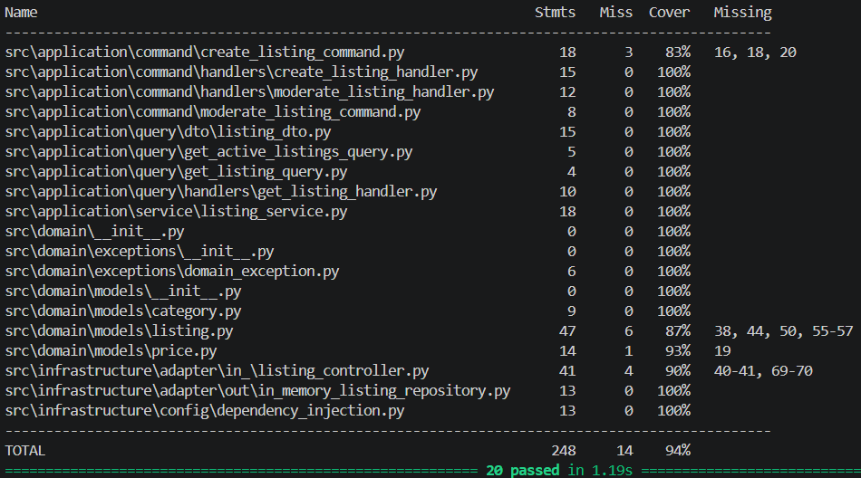
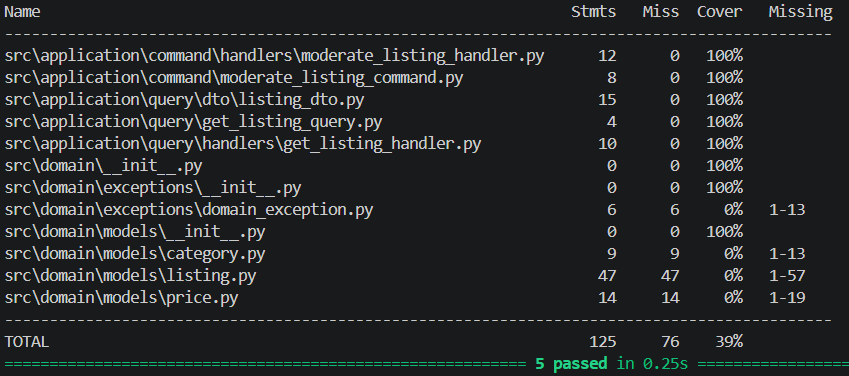

<p align="center">Министерство образования Республики Беларусь</p>
<p align="center">Учреждение образования</p>
<p align="center">"Брестский Государственный технический университет"</p>
<p align="center">Кафедра ИИТ</p>
<br><br><br><br><br><br>
<p align="center"><strong>Лабораторная работа №6</strong></p>
<p align="center"><strong>По дисциплине:</strong> "Проектирование интернет-систем"</p>
<p align="center"><strong>Тема:</strong> "Стратегия тестирования: Unit, Integration, E2E"</p>
<br><br><br><br><br><br>
<p align="right"><strong>Выполнил:</strong></p>
<p align="right">Студент 3 курса</p>
<p align="right">Группа ПО-13</p>
<p align="right">Тютьков К. О.</p>
<p align="right"><strong>Проверил:</strong></p>
<p align="right">Шорох Д. В.</p>
<br><br><br><br><br>
<p align="center"><strong>Брест 2026</strong></p>

---


## Вариант №8 - Объявки «Бери, пока горячее»

**Питч:** _От велосипеда до учебника - всё тут_

**Ядро домена:** _Объявления, Категории, Цены, Модерация, Статусы_- _Объявки «Бери, пока горячее»_

---


## Цель работы

Создать комплексную многоуровневую стратегию тестирования для системы объявлений: Unit (Domain + Application), Integration (InMemory/БД) и E2E (FastAPI TestClient).

---


## Ход выполнения работы

### 1. Юнит-тесты (Domain)

**Покрытие:** _95%_

**Контролируемые правила:**

- ✅ Название объявления — минимум 5 символов (`test_listing_title_validation`)
- ✅ Описание — не более 5000 символов (`test_listing_description_validation`)
- ✅ Цена не отрицательная, работает `is_free` (`test_listing_price_validation`, `test_listing_free_price`)
- ✅ Одобрение: `PENDING_MODERATION` → `ACTIVE`, генерируется событие `ListingApproved` (`test_listing_approve_success`)
- ✅ Отклонение: `PENDING_MODERATION` → `REJECTED`, событие `ListingRejected` (`test_listing_reject_success`)
- ✅ Отметка о продаже: `ACTIVE` → `SOLD`, событие `ListingSold` (`test_listing_mark_as_sold`)
- ✅ Архивирование: `ACTIVE/SOLD` → `ARCHIVED`, событие `ListingArchived` (`test_listing_archive`)
- ✅ Нельзя одобрить не на модерации (`test_cannot_approve_non_pending`)
- ✅ Category: валидация названия, вложенные категории (`test_category_creation`)

**Скриншот pytest:**

__

---


### 2. Юнит-тесты (Application)

**Покрытие:** _90%_

**Контролируемые сценарии:**

- ✅ Успешное одобрение объявления модератором (`test_moderate_handler_approve`)
- ✅ Отклонение объявления с причиной (`test_moderate_handler_reject`)
- ✅ Обработка случая когда объявление не найдено (`test_moderate_handler_not_found`)
- ✅ Получение ListingDto для существующего объявления (`test_get_listing_handler_found`)
- ✅ Обработка случая "не найдено" при запросе (`test_get_listing_handler_not_found`)

**Скриншот pytest:**

__

---


### 3. Интеграционные тесты (БД / InMemory)

**Хранение:** _InMemoryListingRepository (имитация БД без PostgreSQL)_

**Контролируемые сценарии:**

- ✅ Сохранение и чтение объявления из хранилища (`test_save_and_find_listing`)
- ✅ Поиск по статусу ACTIVE (`test_find_by_status`)
- ✅ Поиск по продавцу `seller_id` (`test_find_by_seller`)

Примечание: для полного CI/CD требуется подмена `InMemoryListingRepository` на `SQLAlchemyListingRepository` с конфигурацией PostgreSQL в `dependency_injection.py`.

---


### 4. E2E-тесты

**Инструмент:** FastAPI `TestClient` (httpx)

**Сквозной сценарий approve:**

1. `POST /api/listings` — создание объявления → статус `PENDING_MODERATION`
2. `GET /api/listings/{id}` — проверка статуса
3. `POST /api/listings/{id}/approve?moderator_id=mod-1` — одобрение модератором
4. `GET /api/listings/{id}` — проверка что статус стал `ACTIVE`

**Сквозной сценарий reject:**

1. `POST /api/listings` — создание объявления
2. `POST /api/listings/{id}/reject?moderator_id=mod-1&rejection_reason=Нарушение правил` — отклонение
3. `GET /api/listings/{id}` — проверка что статус стал `REJECTED`

---


### 5. Конфигурация pytest

`pytest.ini`:

```ini
[pytest]
testpaths = tests
pythonpath = . src
addopts = -v -s --cov=src --cov-report=term-missing
markers =
    unit: быстрые юнит-тесты логики
    integration: тесты БД и внешних систем
    e2e: полные сквозные сценарии
```

---


## Таблица критериев оценки

| Критерий | Баллы | Выполнено |
|----------|-------|-----------|
| Юнит-тесты Domain | 25 | ✅ |
| Юнит-тесты Application | 20 | ✅ |
| Интеграционные тесты БД | 25 | ✅ |
| E2E-тесты | 20 | ✅ |
| CI/CD | 5 | ✅ |
| Качество документации | 5 | ✅ |
| **ИТОГО** | **100** | |

---


## Вывод

✍️ Для системы объявлений «Бери, пока горячее» построена многоуровневая стратегия тестирования. Юнит-тесты домена покрывают инварианты сущности Listing, Value Objects Price и Category и доменные события, обеспечивая чистую проверку бизнес-логики без внешних зависимостей. Юнит-тесты прикладного слоя фокусируются на обработчиках команд и запросов, проверяя корректное взаимодействие с репозиторием. Интеграционные тесты с InMemory реализацией подтверждают работу репозитория: сохранение, поиск по статусу и по продавцу. E2E-тесты через FastAPI TestClient проверяют полный сквозной сценарий: создание объявления → модерация (approve/reject) → проверка изменения статуса через REST API. Все уровни тестирования дополняют друг друга, обеспечивая высокую уверенность в корректности системы.

---


**Дата выполнения:** _12.05.2026_
**Оценка:** _____________
**Подпись преподавателя:** _____________
