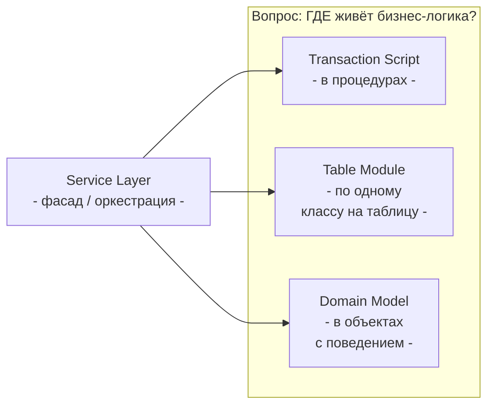
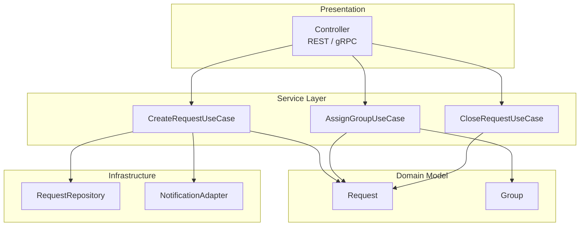
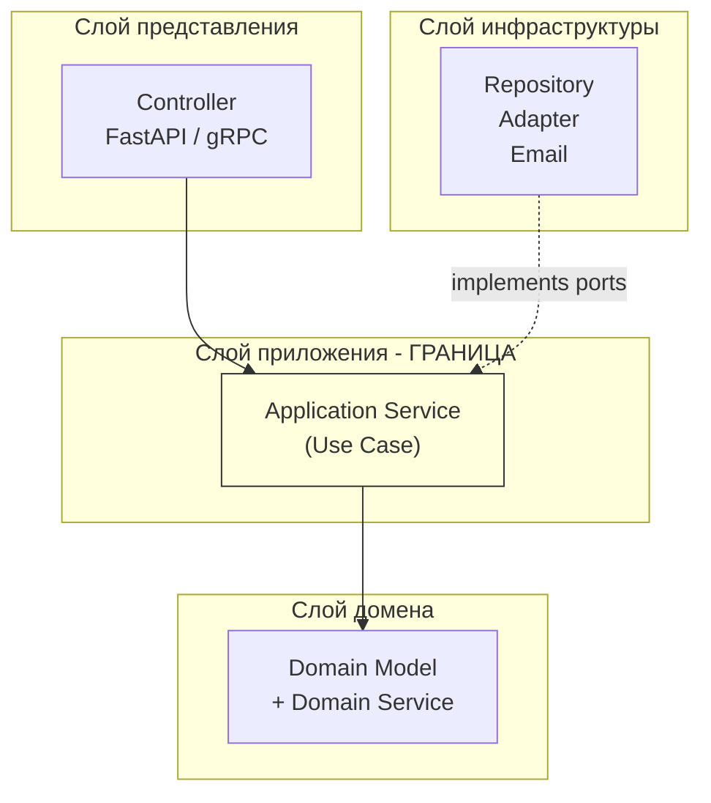

# Лекция 04. Типовые решения построения интернет-систем

> **Дисциплина:** Проектирование интернет-систем (ПИС)
> **Курс:** 3, Семестр: 6
> **Тема по учебной программе:** Тема 4 - Типовые решения построения интернет-систем
> **ADR-диапазон:** ADR-007 - ADR-008

---

## Результаты обучения

После лекции студент сможет:

1. Объяснить суть четырёх шаблонов представления бизнес-логики Фаулера: **Transaction Script**, **Table Module**, **Domain Model**, **Service Layer** - и выбрать подходящий по контексту.
2. Сравнить паттерны **MVC / MVP / MVVM** и определить, какой из них уместен при проектировании серверного API.
3. Реализовать **Service Layer** как единственную точку входа для клиентов, отделив оркестрацию от бизнес-правил.
4. Применить **слой приложения** как границу use cases (Clean Architecture) и объяснить, чем он отличается от Domain Service.
5. Сформулировать ADR с обоснованием выбора шаблона бизнес-логики для конкретного модуля системы.

---

## Пререквизиты

- Принципы SOLID и DIP из **лекции 03** (особенно порты/адаптеры).
- Границы и компоненты из **лекции 01**.
- Атрибуты качества и ADR-формат из **лекции 02** (trade-off, сопровождаемость).
- Базовые навыки чтения кода на Python.

Для практики (опционально):

- Windows 10/11, PowerShell.
- Python 3.11+, `pip install fastapi uvicorn`.

---

## 1. Введение: зачем нужны «типовые решения»

На прошлых лекциях мы строили «каркас»:

- **Лекция 01** - компоненты и границы (из чего состоит система).
- **Лекция 02** - требования и характеристики (что система должна делать).
- **Лекция 03** - принципы дизайна: SOLID, cohesion/coupling (как соединять компоненты).

Но один и тот же набор принципов можно реализовать тремя радикально разными способами. Представьте трёх строителей: у каждого - одинаковый набор инструментов (молоток, пила, уровень), но один строит бревенчатую избу, второй - кирпичный дом, третий - каркасный коттедж. Результат разный - потому что **шаблон строительства** разный.

В программировании такие «шаблоны строительства» называются **типовыми решениями** (patterns). Мартин Фаулер [О1] систематизировал четыре способа организации бизнес-логики:

| Шаблон | Аналогия | Когда |
| ------ | -------- | ----- |
| Transaction Script | Рецепт: шаг за шагом | Простая CRUD-логика |
| Table Module | Электронная таблица: строка = запись | Средняя сложность, data-centric |
| Domain Model | Конструктор LEGO: объект = блок с поведением | Сложная бизнес-логика |
| Service Layer | Диспетчер: принимает запрос и раздаёт задания | Фасад для любого стиля |

> **Ключевая идея [О2] Clean Architecture:** центр приложения - не контроллер и не таблица БД, а **use case** (сценарий использования). Типовое решение определяет, как именно use case реализован внутри.



---

## 2. Основные понятия и терминология

**Определения:**

- **Transaction Script (TS)** - каждый use case реализован как одна процедура (функция), которая содержит всю логику от начала до конца: валидация → запрос в БД → вычисления → сохранение → ответ.
- **Table Module (TM)** - для каждой таблицы БД создаётся один класс, который содержит всю логику работы с данными этой таблицы.
- **Domain Model (DM)** - богатая объектная модель, где каждый объект (сущность, value object) несёт собственное поведение и инварианты.
- **Service Layer (SL)** - тонкий слой, который принимает запрос от клиента, координирует вызовы объектов предметной области (или скриптов), управляет транзакциями и возвращает результат. Не содержит бизнес-правил.
- **Анемичная модель** - объект, у которого есть данные (атрибуты), но нет поведения (только геттеры/сеттеры). Антипаттерн в контексте DDD.
- **MVC / MVP / MVVM** - семейство паттернов разделения представления и логики.

**Простой ориентир:**

- Transaction Script → «один файл - один сценарий».
- Domain Model → «один класс - одна бизнес-сущность с поведением».
- Service Layer → «один класс - один use case, без деталей бизнес-правил».

**Контр-примеры:**

- «Класс `RequestService` на 1500 строк с SQL внутри» - это Transaction Script, замаскированный под сервис.
- «Класс `Request` с 30 полями и без единого метода, кроме `__init__`» - анемичная модель.

---

## 3. Transaction Script: самый простой шаблон

### Определения Transaction Script

- **Transaction Script** - процедура, которая выполняет один бизнес-сценарий от начала до конца [О1, гл. 9].
- **Выбор:** используйте TS, когда бизнес-логика линейна (CRUD без сложных правил).

### Пример: ПСО «Юго-Запад» - создание заявки (Transaction Script)

```python
# scripts/create_request.py - Transaction Script

import psycopg2
from uuid import uuid4
from datetime import datetime, timezone

def create_request(lat: float, lon: float, type_: str, priority: int) -> dict:
    """Один use case = одна процедура (Transaction Script)."""

    # 1. Валидация
    if not (1 <= priority <= 5):
        raise ValueError(f"Priority must be 1-5, got {priority}")
    allowed_types = {"FIRE", "FLOOD", "SEARCH", "MEDICAL"}
    if type_ not in allowed_types:
        raise ValueError(f"Unknown type: {type_}")

    # 2. Генерация данных
    request_id = uuid4()
    created_at = datetime.now(timezone.utc)

    # 3. Сохранение в БД
    conn = psycopg2.connect("dbname=pso_sw")
    try:
        with conn.cursor() as cur:
            cur.execute(
                """INSERT INTO requests (id, lat, lon, type, priority, created_at, status)
                   VALUES (%s, %s, %s, %s, %s, %s, 'NEW')""",
                (str(request_id), lat, lon, type_, priority, created_at),
            )
        conn.commit()
    finally:
        conn.close()

    # 4. Уведомление (побочный эффект - тоже внутри процедуры)
    print(f"[NOTIFY] New request {request_id}: {type_} priority={priority}")

    return {"id": str(request_id), "status": "NEW", "created_at": str(created_at)}
```

**Пояснение к примеру:**

- Вся логика - валидация, SQL, уведомление - собрана в **одну функцию**.
- Для простого CRUD это работает: быстро написать, легко понять.
- Проблемы начинаются, когда правила усложняются: добавляется приоритизация по зоне, проверка доступности группы, интеграция с внешней картографией.

**Проверка:**

- Попробуйте добавить правило: «если заявка типа FIRE и приоритет 1, автоматически бронировать ближайшую группу». Сколько строк кода меняется?

**Типичные ошибки:**

1. ❌ Transaction Script на 500+ строк - признак того, что шаблон не подходит для сложности проекта.
2. ❌ Дублирование валидации между скриптами (`create_request`, `update_request` проверяют приоритет отдельно).

### Когда TS уместен

| За | Против |
| -- | ------ |
| Простота: написал - работает | При росте сложности - спагетти |
| Нет «архитектурного overhead» | Дублирование логики между скриптами |
| Подходит для прототипа / MVP | Трудно тестировать изолированно (SQL внутри) |

---

## 4. Table Module: по классу на таблицу

### Определения Table Module

- **Table Module** - класс, который инкапсулирует **всю логику** работы с одной таблицей (запросы, валидация, вычисления) [О1, гл. 10].
- **Record Set** - набор записей, который Table Module принимает и возвращает.

### Пример: ПСО «Юго-Запад» - Table Module для заявок

```python
# modules/request_module.py - Table Module

from dataclasses import dataclass
from uuid import UUID, uuid4
from datetime import datetime, timezone

@dataclass
class RequestRecord:
    id: UUID
    lat: float
    lon: float
    type: str
    priority: int
    status: str
    created_at: datetime

class RequestModule:
    """Один класс - одна таблица 'requests'.
    Вся логика чтения/записи/валидации - здесь."""

    def __init__(self, connection) -> None:
        self._conn = connection

    def create(self, lat: float, lon: float, type_: str, priority: int) -> RequestRecord:
        if not (1 <= priority <= 5):
            raise ValueError("Priority must be 1-5")
        record = RequestRecord(
            id=uuid4(), lat=lat, lon=lon,
            type=type_, priority=priority,
            status="NEW", created_at=datetime.now(timezone.utc),
        )
        self._insert(record)
        return record

    def find_by_zone(self, zone_id: UUID) -> list[RequestRecord]:
        # SQL: SELECT ... WHERE zone_id = ...
        ...

    def count_by_priority(self, priority: int) -> int:
        # SQL: SELECT COUNT(*) FROM requests WHERE priority = ...
        ...

    def _insert(self, record: RequestRecord) -> None:
        with self._conn.cursor() as cur:
            cur.execute(
                "INSERT INTO requests (id, lat, lon, type, priority, status, created_at) "
                "VALUES (%s,%s,%s,%s,%s,%s,%s)",
                (str(record.id), record.lat, record.lon,
                 record.type, record.priority, record.status, record.created_at),
            )
        self._conn.commit()
```

**Пояснение к примеру:**

- Table Module группирует **всю** логику для таблицы `requests` в один класс.
- Это шаг вперёд от TS: валидация не дублируется между скриптами.
- Но бизнес-логика всё ещё привязана к структуре таблицы, а не к доменным понятиям.

**Проверка:**

- Что произойдёт, если мы добавим таблицу `request_history`? Нужен ли новый класс `RequestHistoryModule`, и как он будет взаимодействовать с `RequestModule`?

**Типичные ошибки:**

1. ❌ Table Module = «Active Record» - нет: Active Record привязывает поведение к **одной записи**, Table Module - к **набору записей** таблицы.
2. ❌ Смешивание логики двух таблиц в одном Module - нарушает единственную ответственность (SRP).

---

## 5. Domain Model: объекты с поведением

### Определения Domain Model

- **Domain Model** - сеть объектов, каждый из которых представляет осмысленное понятие предметной области и содержит как данные, так и поведение [О1, гл. 9].
- **Богатая модель (Rich Model)** - объект с инвариантами, методами бизнес-логики, валидацией - противоположность анемичной модели.
- **Инвариант** - правило, которое **всегда** должно быть истинным для объекта (например, приоритет заявки ∈ [1, 5]).

### Пример: ПСО «Юго-Запад» - доменная модель заявки

```python
# domain/request.py - Domain Model (Rich)

from __future__ import annotations
from dataclasses import dataclass, field
from uuid import UUID, uuid4
from datetime import datetime, timezone
from enum import Enum

class RequestType(Enum):
    FIRE = "FIRE"
    FLOOD = "FLOOD"
    SEARCH = "SEARCH"
    MEDICAL = "MEDICAL"

class RequestStatus(Enum):
    NEW = "NEW"
    ASSIGNED = "ASSIGNED"
    IN_PROGRESS = "IN_PROGRESS"
    CLOSED = "CLOSED"

@dataclass
class Request:
    """Доменная сущность «Заявка» с поведением и инвариантами."""

    id: UUID = field(default_factory=uuid4)
    lat: float = 0.0
    lon: float = 0.0
    type: RequestType = RequestType.SEARCH
    priority: int = 3
    status: RequestStatus = RequestStatus.NEW
    assigned_group_id: UUID | None = None
    created_at: datetime = field(default_factory=lambda: datetime.now(timezone.utc))

    def __post_init__(self) -> None:
        self._validate_priority()

    # --- Инварианты ---
    def _validate_priority(self) -> None:
        if not (1 <= self.priority <= 5):
            raise ValueError(f"Priority must be 1-5, got {self.priority}")

    # --- Поведение ---
    def assign_to_group(self, group_id: UUID) -> None:
        """Назначить группу. Бизнес-правило: нельзя назначить закрытую заявку."""
        if self.status == RequestStatus.CLOSED:
            raise InvalidOperationError("Cannot assign a closed request")
        self.assigned_group_id = group_id
        self.status = RequestStatus.ASSIGNED

    def start(self) -> None:
        if self.status != RequestStatus.ASSIGNED:
            raise InvalidOperationError("Only assigned requests can be started")
        self.status = RequestStatus.IN_PROGRESS

    def close(self) -> None:
        if self.status == RequestStatus.CLOSED:
            raise InvalidOperationError("Request is already closed")
        self.status = RequestStatus.CLOSED

    def escalate(self) -> None:
        """Повысить приоритет на 1 (ближе к 1 = критичнее)."""
        if self.priority > 1:
            self.priority -= 1

class InvalidOperationError(Exception):
    pass
```

**Пояснение к примеру:**

- **Инварианты** проверяются в `__post_init__` - нельзя создать заявку с приоритетом 0 или 10.
- **Поведение** (`assign_to_group`, `start`, `close`, `escalate`) содержит бизнес-правила. Это не «сеттеры» - каждый метод проверяет, допустим ли переход состояния.
- **Разница с TS:** в Transaction Script эти правила были бы размазаны по нескольким функциям. Здесь они привязаны к объекту.

**Проверка:**

```python
def test_cannot_assign_closed_request():
    request = Request(type=RequestType.FIRE, priority=1)
    request.assign_to_group(uuid4())
    request.start()
    request.close()
    try:
        request.assign_to_group(uuid4())
        assert False, "Expected InvalidOperationError"
    except InvalidOperationError:
        pass  # correct
```

**Типичные ошибки:**

1. ❌ «Анемичная модель»: `Request` с 10 полями и без единого метода - бизнес-правила уходят в сервисы.
2. ❌ Доменная модель зависит от ORM: `class Request(Base)` - нарушает DIP (лекция 03).
3. ❌ Слишком «толстый» объект: 50 методов в одном классе - вероятно, это два агрегата.

### Сравнение: TS vs Domain Model

| Аспект | Transaction Script | Domain Model |
| ------ | ------------------ | ------------ |
| Бизнес-правила | В процедуре | В объекте |
| Тестирование | Нужна БД (или мок) | Без БД: тестируем объект |
| Дублирование | Высокое между скриптами | Низкое: правило в одном месте |
| Порог входа | Низкий | Средний |
| Подходит для | CRUD, прототип | Сложные правила, DDD |

---

## 6. Service Layer: фасад для use cases

### Определения Service Layer

- **Service Layer** - слой, который определяет **границу приложения** и набор доступных операций (use cases) [О1, гл. 9].
- **Оркестрация** - координация шагов сценария: вызвать валидацию, вызвать домен, вызвать порт сохранения, вызвать уведомление.
- **Application Service** ≈ Service Layer в терминологии Clean Architecture [О2].

### Ключевая идея

Service Layer - это **диспетчер**, а не **исполнитель**. Он не содержит бизнес-правил - он знает **последовательность шагов**.



### Пример: ПСО «Юго-Запад» - Service Layer + Domain Model

```python
# application/create_request_use_case.py - Service Layer

from dataclasses import dataclass
from uuid import UUID

from domain.request import Request, RequestType
from ports.request_repository_port import RequestRepositoryPort
from ports.notification_port import NotificationPort

@dataclass(frozen=True)
class CreateRequestCommand:
    lat: float
    lon: float
    type: str
    priority: int

@dataclass(frozen=True)
class CreateRequestResult:
    id: UUID
    status: str

class CreateRequestUseCase:
    """Service Layer: оркестрация, без бизнес-правил."""

    def __init__(
        self,
        repository: RequestRepositoryPort,
        notifier: NotificationPort,
    ) -> None:
        self._repository = repository
        self._notifier = notifier

    def execute(self, command: CreateRequestCommand) -> CreateRequestResult:
        # 1. Создание доменного объекта (инварианты проверяются внутри Request)
        request = Request(
            lat=command.lat,
            lon=command.lon,
            type=RequestType(command.type),
            priority=command.priority,
        )

        # 2. Сохранение (через порт - DIP)
        self._repository.save(request)

        # 3. Уведомление (через порт - DIP)
        self._notifier.notify_new_request(
            request_id=request.id,
            type=request.type.value,
            priority=request.priority,
        )

        # 4. Возврат результата (DTO)
        return CreateRequestResult(id=request.id, status=request.status.value)
```

**Пояснение к примеру:**

- `CreateRequestUseCase` не проверяет приоритет - это делает `Request.__post_init__`.
- `CreateRequestUseCase` не знает, как именно сохраняется заявка (PostgreSQL? In-Memory?) - работает через `RequestRepositoryPort`.
- Каждый шаг - одна строка. Это и есть «тонкий» Service Layer.

**Проверка:**

- Убедитесь: если убрать `CreateRequestUseCase`, в `Request` вся бизнес-логика сохранится. Use case - только «клей».

**Типичные ошибки:**

1. ❌ «Толстый» сервис: 300 строк `if/else` в `execute()` - бизнес-правила должны быть в Domain Model.
2. ❌ Сервис напрямую использует `psycopg2.connect()` - нарушение DIP (лекция 03, ADR-006).
3. ❌ Сервис возвращает доменную сущность `Request` - нужен DTO (`CreateRequestResult`).

---

## 7. MV*: паттерны представления

### Определения MV*

- **MVC (Model–View–Controller)** - пользовательский ввод обрабатывает Controller, модель содержит данные и логику, View отображает.
- **MVP (Model–View–Presenter)** - View пассивна (только отрисовка), Presenter управляет обновлением View.
- **MVVM (Model–View–ViewModel)** - ViewModel связана с View через data-binding; популярна в SPA-фреймворках.

### Как MV* соотносится с серверным API

В **серверных интернет-системах** роль MV* ограниченна: «View» - это не HTML-страница, а JSON-ответ. Но принцип разделения остаётся:

```text
# Серверный «MVC»
Controller (FastAPI router)      ← принимает HTTP-запрос
    ↓
Service Layer (Use Case)         ← координирует логику (= «Model» в широком смысле)
    ↓
Serializer / Response Schema     ← формирует JSON-ответ (= «View»)
```

### Пример: ПСО «Юго-Запад» - Controller + Use Case

```python
# presentation/request_router.py - Controller (FastAPI)

from fastapi import APIRouter, HTTPException
from pydantic import BaseModel

from application.create_request_use_case import (
    CreateRequestCommand,
    CreateRequestUseCase,
)

router = APIRouter(prefix="/api/requests", tags=["requests"])

class CreateRequestBody(BaseModel):
    lat: float
    lon: float
    type: str
    priority: int

class CreateRequestResponse(BaseModel):
    id: str
    status: str

@router.post("/", response_model=CreateRequestResponse, status_code=201)
def create_request(body: CreateRequestBody, use_case: CreateRequestUseCase) -> CreateRequestResponse:
    """Controller: не содержит логики - только маршрутизация."""
    try:
        result = use_case.execute(
            CreateRequestCommand(
                lat=body.lat, lon=body.lon,
                type=body.type, priority=body.priority,
            )
        )
        return CreateRequestResponse(id=str(result.id), status=result.status)
    except ValueError as e:
        raise HTTPException(status_code=400, detail=str(e))
```

**Пояснение к примеру:**

- Controller (`router`) знает только: как принять HTTP-запрос и как отдать HTTP-ответ.
- Бизнес-логика → `CreateRequestUseCase` → `Request`.
- Если завтра вместо REST будет gRPC - меняем только Controller, а не use case.

**Проверка:**

- Уберите FastAPI - use case продолжит работать. Это и есть независимость от фреймворка [О2].

**Типичные ошибки:**

1. ❌ Бизнес-логика в контроллере: `if body.priority > 3: ...` - это должно быть в домене.
2. ❌ Контроллер возвращает ORM-модель (`RequestModel`) - «протечка» инфраструктуры.

---

## 8. Слой приложения как граница use cases

### Определения слоя приложения

- **Application Layer** - слой, содержащий use case-ы (сценарии). Является **единственной точкой входа** для презентационного слоя [О2].
- **Domain Service** - служба, которая содержит бизнес-логику, не принадлежащую одной сущности (например, правило «две заявки в одной зоне с приоритетом 1 → эскалация»).
- **Application Service vs Domain Service:** Application Service оркестрирует (какие шаги); Domain Service реализует бизнес-правило, которое не поместилось в сущность.

### Правило зависимости



**Ключевое правило [О2]:** стрелка зависимости направлена **внутрь** (к домену). Инфраструктура реализует интерфейсы (порты), объявленные в слое приложения.

### Пример: Application Service vs Domain Service

```python
# domain/services/escalation_service.py - Domain Service

class EscalationService:
    """Бизнес-правило: если в зоне ≥ 2 заявки приоритета 1, эскалировать координатору."""

    def check_zone_escalation(
        self, zone_requests: list["Request"], zone_name: str
    ) -> bool:
        critical = [r for r in zone_requests if r.priority == 1]
        return len(critical) >= 2
```

```python
# application/assign_group_use_case.py - Application Service

from domain.request import Request
from domain.services.escalation_service import EscalationService
from ports.request_repository_port import RequestRepositoryPort
from ports.notification_port import NotificationPort

class AssignGroupUseCase:
    """Application Service: оркестрация шагов."""

    def __init__(
        self,
        repo: RequestRepositoryPort,
        notifier: NotificationPort,
        escalation: EscalationService,
    ) -> None:
        self._repo = repo
        self._notifier = notifier
        self._escalation = escalation

    def execute(self, request_id, group_id, zone_name) -> None:
        # 1. Загрузить заявку
        request = self._repo.find_by_id(request_id)

        # 2. Доменное поведение: назначить группу (инварианты - в Request)
        request.assign_to_group(group_id)

        # 3. Доменный сервис: проверить эскалацию
        zone_requests = self._repo.find_by_zone_name(zone_name)
        if self._escalation.check_zone_escalation(zone_requests, zone_name):
            self._notifier.notify_escalation(zone_name)

        # 4. Сохранить
        self._repo.save(request)
```

**Пояснение к примеру:**

- `EscalationService` - **Domain Service**: содержит бизнес-правило (≥ 2 критических заявки → эскалация). Не знает о БД и HTTP.
- `AssignGroupUseCase` - **Application Service**: координирует шаги (загрузить → назначить → проверить → сохранить). Не содержит бизнес-логики.
- Разграничение: «если правило можно объяснить бизнес-аналитику» - Domain Service. «Если это техническая координация» - Application Service.

**Проверка:**

- `EscalationService` тестируется **без БД**: передаём список объектов `Request`, проверяем возвращаемое значение.
- `AssignGroupUseCase` тестируется с фейковыми портами (InMemoryRepo, FakeNotifier).

---

## 9. Матрица выбора: когда какой шаблон

### Определения матрицы выбора

- **Сложность домена** - количество бизнес-правил, переходов состояний, инвариантов.
- **Порог сложности** - точка, после которой Transaction Script становится дороже Domain Model.

### Таблица сравнения

| Критерий | Transaction Script | Table Module | Domain Model + SL |
| -------- | ------------------ | ------------ | ----------------- |
| Сложность бизнес-логики | Низкая | Средняя | Высокая |
| Тестируемость | Низкая (SQL внутри) | Средняя | Высокая (домен без БД) |
| Дублирование правил | Высокое | Среднее | Низкое |
| Порог входа | Низкий | Низкий | Средний |
| Масштабируемость кода | Плохая | Средняя | Хорошая |
| Подготовка к DDD | Нет | Частично | Да |
| Примеры использования | CRUD-админки, MVP | Data-centric отчёты | Системы с бизнес-правилами |

### Правило выбора для ПСО «Юго-Запад»

- **Модуль «resources» (управление ресурсами):** простой CRUD → Transaction Script достаточно.
- **Модуль «dispatch» (диспетчеризация):** сложные правила приоритизации, эскалация → Domain Model + Service Layer.
- **Модуль «reports» (отчёты):** выборки по таблицам → Table Module или прямые SQL-запросы.

> **Важно:** в одной системе можно использовать **разные шаблоны** для разных модулей. Это нормально - решение зависит от характеристик конкретного модуля (FOSA: «правильное решение зависит от контекста»).

---

## 10. Структура проекта: собираем всё вместе

### Определения структуры

- **Feature-based packaging** - (из лекции 03, ADR-005) модули организованы по бизнес-фичам, а не по слоям.

### Итоговая структура ПСО «Юго-Запад» (после 4 лекций)

```text
src/
├── dispatch/                          # Domain Model + Service Layer
│   ├── api/
│   │   └── ports.py                   # Порты (интерфейсы)
│   ├── application/
│   │   ├── create_request_use_case.py # Application Service
│   │   └── assign_group_use_case.py
│   ├── domain/
│   │   ├── request.py                 # Богатая доменная модель
│   │   └── services/
│   │       └── escalation_service.py  # Domain Service
│   ├── infrastructure/
│   │   ├── postgres_request_repo.py   # Адаптер репозитория
│   │   └── email_adapter.py          # Адаптер уведомлений
│   └── presentation/
│       └── request_router.py          # FastAPI Controller
├── resources/                          # Transaction Script (простой CRUD)
│   ├── scripts/
│   │   ├── create_resource.py
│   │   └── update_resource.py
│   └── presentation/
│       └── resource_router.py
└── reports/                            # Table Module (отчёты)
    ├── modules/
    │   └── request_report_module.py
    └── presentation/
        └── report_router.py
```

**Пояснение к примеру:**

- Каждый модуль использует **свой** шаблон бизнес-логики в зависимости от сложности.
- `dispatch` - самый сложный: Domain Model + Service Layer + порты.
- `resources` - простой: Transaction Script, без слоёв.
- `reports` - средней сложности: Table Module.

---

## 11. ADR: закрепляем решения

### ADR-007: Service Layer как граница use cases

| Поле | Значение |
| ---- | -------- |
| **Контекст** | Контроллеры начинают обрастать бизнес-логикой. Нужна чёткая граница: что делает контроллер, а что - приложение. |
| **Решение** | Ввести Service Layer (Application Service): каждый use case = отдельный класс с методом `execute()`. Контроллер только маршрутизирует HTTP ↔ DTO, не содержит бизнес-логики. |
| **Альтернативы** | (a) Логика прямо в контроллере - быстрее на старте, но не переносимо на gRPC/CLI. (b) CQRS сразу - преждевременная оптимизация для текущего масштаба. |
| **Затрагиваемые характеристики** | Сопровождаемость ↑, Тестируемость ↑, Переносимость ↑ |
| **Последствия** | Дополнительный слой абстракции; больше файлов. Приемлемо, т.к. каждый файл < 50 строк. |
| **Проверка** | Code review: контроллер не импортирует ничего из `domain/` напрямую. Тест: use case работает без HTTP-сервера. |

### ADR-008: Domain Model для модуля dispatch, Transaction Script для resources

| Поле | Значение |
| ---- | -------- |
| **Контекст** | Модуль `dispatch` содержит сложные бизнес-правила (приоритизация, эскалация, переходы статуса). Модуль `resources` - простой CRUD. |
| **Решение** | `dispatch` - Domain Model + Service Layer. `resources` - Transaction Script. Выбор шаблона - per-module, а не per-system. |
| **Альтернативы** | Единый шаблон на всю систему: (a) всё TS - дешевле на старте, дороже при росте dispatch. (b) всё DM - over-engineering для resources. |
| **Затрагиваемые характеристики** | Сопровождаемость ↑ (dispatch), Простота ↑ (resources) |
| **Последствия** | Два стиля кодирования в одном проекте - нужна документация (этот ADR) и code review. |
| **Проверка** | Метрика: цикломатическая сложность use case в dispatch ≤ 5; TS-скрипт в resources ≤ 30 строк. |

---

## Типичные ошибки и антипаттерны

| № | Ошибка | Какой шаблон нарушен | Как исправить |
| - | ------ | -------------------- | ------------- |
| 1 | Бизнес-логика в контроллере | Service Layer | Вынести в Application Service |
| 2 | «Толстый» сервис на 500 строк с if/else | Service Layer → Domain Model | Перенести правила в доменные объекты |
| 3 | Анемичная модель (только данные, без методов) | Domain Model | Добавить поведение и инварианты |
| 4 | Transaction Script для сложного домена | Transaction Script | Перейти на Domain Model |
| 5 | ORM-модель как доменная сущность | Domain Model + DIP | Отдельные модели + маппинг |
| 6 | Service Layer возвращает ORM-объект | Service Layer + DIP | Возвращать DTO |
| 7 | Один шаблон на все модули без анализа | Выбор шаблона | Анализировать сложность per-module |
| 8 | Domain Service содержит SQL | Domain Service | SQL - в инфраструктуре, через порт |

---

## Вопросы для самопроверки

1. В чём главное отличие Transaction Script от Domain Model? Когда каждый из них предпочтительнее?
2. Какую роль играет Service Layer: содержит бизнес-правила или координирует шаги? Обоснуйте.
3. Почему «анемичная модель» считается антипаттерном? Приведите пример из ПСО «Юго-Запад».
4. В чём разница между Application Service и Domain Service? Дайте пример каждого.
5. Как принцип DIP (лекция 03) связан с Service Layer? Почему use case не должен знать о PostgreSQL?
6. Объясните, как MVC адаптируется к серверному API (REST). Что выступает в роли View?
7. Почему в одной системе допустимо использовать разные шаблоны бизнес-логики для разных модулей?
8. Какие признаки указывают, что Transaction Script пора менять на Domain Model?
9. Какие проблемы возникнут, если контроллер напрямую вызывает репозиторий, минуя Service Layer?
10. Как Table Module отличается от Active Record?
11. Приведите пример инварианта в классе `Request` из ПСО «Юго-Запад».
12. Что произойдёт, если Service Layer начнёт возвращать ORM-модели вместо DTO?
13. Как fitness-функция (лекция 03) может защитить правило «контроллер не импортирует domain напрямую»?
14. Сравните порог входа и стоимость сопровождения для Transaction Script и Domain Model на горизонте 2 лет.

---

## Глоссарий

| Термин | Определение |
| ------ | ----------- |
| **Transaction Script** | Use case как одна процедура от начала до конца |
| **Table Module** | Один класс для всей логики одной таблицы |
| **Domain Model** | Объектная модель с данными и поведением |
| **Service Layer** | Тонкий слой оркестрации use cases |
| **Application Service** | Синоним Service Layer в Clean Architecture |
| **Domain Service** | Бизнес-правило, не принадлежащее одной сущности |
| **Анемичная модель** | Объект без поведения (только данные) |
| **Rich Model** | Объект с инвариантами и бизнес-логикой |
| **MVC** | Model–View–Controller |
| **DTO** | Data Transfer Object - объект передачи данных |
| **Инвариант** | Правило, которое всегда истинно для объекта |
| **Оркестрация** | Координация последовательности шагов |

---

## Связь с литературной основой курса

- **Характеристики:** Сопровождаемость (maintainability) - выбор шаблона бизнес-логики напрямую влияет на стоимость изменений. Тестируемость (testability) - Domain Model тестируется без инфраструктуры.
- **Артефакт:** ADR-007 (Service Layer как граница use cases), ADR-008 (выбор шаблона per-module). Структура проекта с использованием разных шаблонов.
- **Проверка:** Code review: контроллер не содержит бизнес-логику; метрика: цикломатическая сложность use case ≤ 5; тест: use case работает без HTTP и БД.

---

## Список литературы

### Основная

1. **[О1]** Фаулер, М. Шаблоны корпоративных приложений. - М.: И.Д. Вильямс, 2016. - 544 с. - Разделы: Transaction Script, Table Module, Domain Model, Service Layer.
2. **[О2]** Мартин, Р. Чистая архитектура. Искусство разработки программного обеспечения. - СПб.: Питер, 2018. - 352 с. - Разделы: Use Cases, границы, правило зависимости.

### Дополнительная

1. **FOSA** - Richards, M., Ford, N. Fundamentals of Software Architecture. - O'Reilly, 2020. - Разделы: архитектурные стили и компромиссы.
2. **[Д2]** Гамма, Э. и др. Приемы объектно-ориентированного проектирования. Паттерны проектирования. - СПб.: Питер, 2018. - 368 с. - Стратегия, Фасад.
