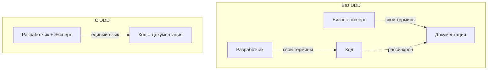
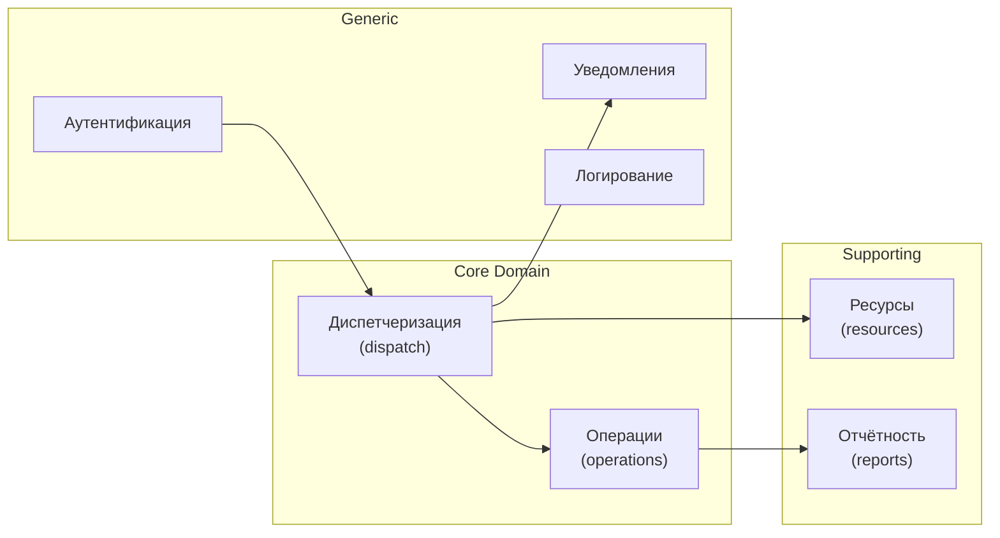
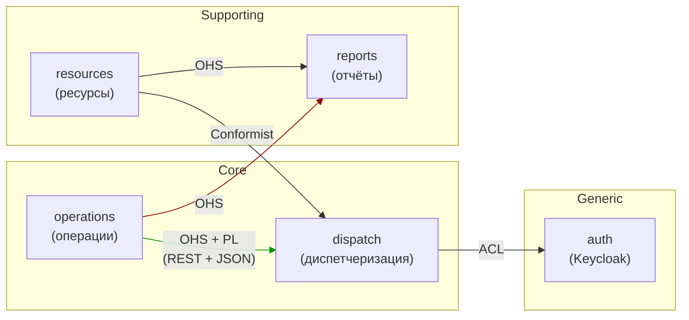

# Лекция 05. Введение в предметно-ориентированное проектирование (DDD)

> **Дисциплина:** Проектирование интернет-систем (ПИС)
> **Курс:** 3, Семестр: 6
> **Тема по учебной программе:** Тема 5 - Введение в DDD
> **ADR-диапазон:** ADR-009 - ADR-010

---

## Результаты обучения

После лекции студент сможет:

1. Объяснить **ценность DDD** и определить, когда его применение оправдано, а когда избыточно.
2. Сформулировать **единый язык (Ubiquitous Language)** для предметной области и использовать его при проектировании кода и документации.
3. Выделить **смысловое ядро (Core Domain)**, вспомогательные и общие поддомены.
4. Определить **ограниченные контексты (Bounded Contexts)** в системе и объяснить, почему одно и то же слово может означать разное в разных контекстах.
5. Построить **карту контекстов (Context Map)** и выбрать паттерн интеграции между контекстами.

---

## Пререквизиты

- Типовые решения из **лекции 04** (особенно Domain Model и Service Layer).
- Принципы дизайна из **лекции 03** (SOLID, границы модулей, feature-based packaging).
- Требования и ADR из **лекции 02**.
- Базовое понимание ООП.

---

## 1. Введение: почему DDD

На прошлых лекциях мы построили техническую основу: компоненты (01), требования (02), принципы проектирования (03), шаблоны бизнес-логики (04). Но все эти инструменты отвечают на вопрос «**как** строить систему». А с чего начинается проектирование?

С **предметной области** - с понимания бизнеса.

Представьте: вы пришли в поисково-спасательный отряд «Юго-Запад» и вам говорят: «Нам нужна система». Если вы начнёте с таблиц в БД или с REST-эндпоинтов - вы пропустите самое важное: **что именно** делает отряд, какие у них правила, какими терминами они оперируют.

**DDD (Domain-Driven Design)** - подход к проектированию, при котором:

- Структура кода **отражает** структуру бизнеса.
- Разработчики и эксперты предметной области говорят на **одном языке**.
- Сложность управляется через **разделение на контексты**, а не через «один класс на все случаи».

> **[О3] Вернон:** «DDD - это не про код. Это про то, как мы понимаем бизнес и как это понимание выражаем в коде.»

> **[О2] Clean Architecture:** доменная модель - самая **устойчивая** часть системы. Фреймворки меняются, БД мигрируют, а бизнес-правила живут годами.



---

## 2. Основные понятия и терминология

**Определения:**

- **Предметная область (Domain)** - сфера деятельности, для которой создаётся ПО. Для ПСО «Юго-Запад»: управление спасательными операциями.
- **Модель предметной области (Domain Model)** - абстракция, которая отражает ключевые понятия, правила и отношения предметной области в коде.
- **Единый язык (Ubiquitous Language)** - набор терминов, используемых **одинаково** всеми участниками: разработчиками, аналитиками, экспертами, в коде, документации, разговорах.
- **Смысловое ядро (Core Domain)** - та часть предметной области, которая даёт **конкурентное преимущество** и требует максимальных инвестиций.
- **Поддомен (Subdomain)** - часть предметной области.
  - **Core** - конкурентное преимущество.
  - **Supporting** - необходим, но не уникален.
  - **Generic** - типовой (авторизация, логирование).
- **Ограниченный контекст (Bounded Context)** - граница, внутри которой термины и модель имеют **однозначный** смысл.
- **Карта контекстов (Context Map)** - диаграмма отношений между ограниченными контекстами.

**Простой ориентир:**

- Domain → «о чём» система.
- Ubiquitous Language → «как мы называем вещи».
- Bounded Context → «где заканчивается одно значение слова и начинается другое».

**Контр-примеры:**

- «Разработчик говорит "Request", а диспетчер - "Вызов"» → нарушен единый язык.
- «Один класс `User` используется и в аутентификации, и в диспетчеризации» → смешение контекстов.

---

## 3. Единый язык (Ubiquitous Language)

### Определения Ubiquitous Language

- **Ubiquitous Language** - термины, которые используются **везде**: в разговоре с экспертом, в документации, в коде (имена классов, методов, переменных) [О3, гл. 2].
- **Языковая мозоль** - когда разработчик и эксперт используют разные слова для одного и того же понятия.

### Почему это важно

Каждый раз, когда разработчик «переводит» слова эксперта в свои термины, появляется шанс потерять смысл. Если диспетчер говорит «назначить группу на заявку», а разработчик пишет `setGroupId` - потерян бизнес-смысл: назначение - это не просто установка ID, это проверка доступности, смена статуса, уведомление.

### Пример: ПСО «Юго-Запад» - единый язык

| Термин эксперта | Термин в коде | Пояснение |
| --------------- | ------------- | --------- |
| Заявка | `Request` | Обращение о помощи |
| Группа | `Group` | Команда спасателей |
| Зона ответственности | `Zone` | Географическая зона |
| Назначить группу | `request.assign_to_group()` | Не `setGroupId`! |
| Эскалировать | `request.escalate()` | Повысить приоритет |
| Диспетчер | `Dispatcher` (роль) | Пользователь, создающий заявки |
| Координатор | `Coordinator` (роль) | Управляет несколькими зонами |
| Опция типа | `RequestType` | FIRE, FLOOD, SEARCH, MEDICAL |
| Ресурс | `Resource` | Оборудование, транспорт |
| Операция | `Operation` | Назначенная спасательная операция |

**Проверка:**

- Прочитайте код вслух на языке эксперта: «создать заявку, назначить группу, эскалировать, закрыть заявку». Если это звучит естественно - единый язык работает.

**Типичные ошибки:**

1. ❌ `setStatus("ASSIGNED")` вместо `assign_to_group()` - потерян бизнес-смысл.
2. ❌ «У нас есть `data`, `info`, `item`» - абстрактные имена без доменного значения.
3. ❌ Один термин - два значения: «Операция» в одном месте = бизнес-операция, в другом = CRUD-операция.

### Как строить единый язык на практике

1. **Проведите event storming** или интервью с экспертом → соберите термины.
2. **Запишите глоссарий** и согласуйте его с командой и экспертом.
3. **Используйте термины в коде**: имена классов, методов, переменных = слова из глоссария.
4. **Обновляйте** глоссарий по мере эволюции понимания.

---

## 4. Предметная область и поддомены

### Определения поддоменов

- **Core Domain** - часть, дающая конкурентное преимущество. Сюда направляются лучшие ресурсы [О3, гл. 2].
- **Supporting Subdomain** - необходим для работы Core, но не уникален. Можно купить / отдать на аутсорс, если нет специфики.
- **Generic Subdomain** - типовая задача, решаемая стандартным ПО (авторизация, почта, логирование).

### Пример: ПСО «Юго-Запад» - классификация поддоменов



**Пояснение к примеру:**

- **Core:** `dispatch` (приоритизация, назначение групп) и `operations` (управление операциями) - это уникальная логика ПСО. Если её написать плохо, система бесполезна.
- **Supporting:** `resources` (учёт оборудования) - нужен, но не даёт преимущества. Можно использовать Transaction Script (ADR-008).
- **Generic:** аутентификация (Keycloak / Auth0), уведомления (стандартные сервисы), логирование (ELK).

**Проверка:**

- Спросите: «Можно ли эту часть заменить готовым решением без потери бизнес-ценности?»
  - Да → Generic или Supporting.
  - Нет → Core.

**Типичные ошибки:**

1. ❌ Инвестировать в «идеальную» систему логирования, когда Core Domain не реализован.
2. ❌ Писать свой авторизационный модуль (Generic), когда есть Keycloak.
3. ❌ Отдавать Core Domain на аутсорс - потеря контроля над ключевой логикой.

---

## 5. Ограниченные контексты (Bounded Contexts)

### Определения Bounded Context

- **Bounded Context** - граница, внутри которой модель предметной области и единый язык имеют **однозначный** смысл [О3, гл. 2].
- **Два контекста** могут использовать одно и то же слово с **разным** значением. Это нормально.
- **Правило:** внутри одного контекста - одна модель, один язык, одна команда (в идеале).

### Почему одного слова недостаточно

В ПСО «Юго-Запад» слово **«Группа»** (Group) означает разное в разных контекстах:

| Контекст | Что значит «Группа» | Атрибуты |
| -------- | -------------------- | -------- |
| **dispatch** (диспетчеризация) | Ресурс, который можно **назначить** на заявку | `id`, `available`, `zone_id` |
| **operations** (операции) | Команда с **составом** и **навыками** | `id`, `members[]`, `skills[]`, `leader` |
| **hr** (кадры) | Структурная единица с **графиком** работы | `id`, `schedule`, `salary_grade` |

Если использовать один класс `Group` на все три контекста - он вырастет до 50 полей и станет неуправляемым. Поэтому в каждом контексте - **своя** модель `Group`.

### Пример: ПСО «Юго-Запад» - два контекста

```python
# dispatch/domain/group_ref.py - Group в контексте dispatch

from dataclasses import dataclass
from uuid import UUID

@dataclass(frozen=True)
class GroupRef:
    """В контексте dispatch нас интересует только доступность группы."""
    id: UUID
    available: bool
    zone_id: UUID
```

```python
# operations/domain/group.py - Group в контексте operations

from dataclasses import dataclass, field
from uuid import UUID

@dataclass
class Member:
    id: UUID
    name: str
    role: str

@dataclass
class Group:
    """В контексте operations у группы есть состав и навыки."""
    id: UUID
    name: str
    members: list[Member] = field(default_factory=list)
    leader_id: UUID | None = None

    def add_member(self, member: Member) -> None:
        if len(self.members) >= 10:
            raise ValueError("Group cannot have more than 10 members")
        self.members.append(member)

    def assign_leader(self, member_id: UUID) -> None:
        if not any(m.id == member_id for m in self.members):
            raise ValueError("Leader must be a member of the group")
        self.leader_id = member_id
```

**Пояснение к примеру:**

- В `dispatch` модель группы - **замороженный** `GroupRef` с 3 полями. Этого достаточно для диспетчеризации.
- В `operations` модель группы - **изменяемый** `Group` с составом, лидером и бизнес-правилами.
- Это **разные** классы в **разных** пакетах. Они не наследуют друг друга.

**Проверка:**

- Попробуйте объединить `GroupRef` и `Group` в один класс. Сколько `if`-ов появится? Сколько методов будут нужны одному контексту и бесполезны другому?

**Типичные ошибки:**

1. ❌ «Единая модель на всё»: один класс `Group` с 40 полями для всех контекстов.
2. ❌ Контекст = микросервис. Нет: контекст - логическая граница. Он может жить в модуле монолита.
3. ❌ Границы контекстов по техническим слоям (frontend / backend). Нет: по бизнес-смыслу.

---

## 6. Карта контекстов (Context Map)

### Определения Context Map

- **Context Map** - диаграмма, показывающая как ограниченные контексты взаимодействуют друг с другом [О3, гл. 3].
- **Upstream (U)** - контекст-поставщик данных/модели.
- **Downstream (D)** - контекст-потребитель.

### Паттерны интеграции между контекстами

| Паттерн | Upstream | Downstream | Описание |
| ------- | -------- | ---------- | -------- |
| **Shared Kernel** | A ↔ B | A ↔ B | Общий код, минимальный, согласуется двумя командами |
| **Customer–Supplier** | Supplier | Customer | Supplier учитывает нужды Customer |
| **Conformist** | U | D | Downstream принимает модель Upstream как есть |
| **Anti-Corruption Layer (ACL)** | U | D | Downstream переводит «чужую» модель в свою |
| **Open Host Service (OHS)** | U | - | Upstream публикует стабильный API для всех |
| **Published Language** | U | - | Общий формат данных (JSON Schema, Protobuf) |

### Пример: ПСО «Юго-Запад» - карта контекстов



**Пояснение к примеру:**

- `operations` → `dispatch`: Open Host Service + Published Language. Модуль operations публикует REST-эндпоинт `/api/groups/{id}/availability`. Dispatch вызывает его через порт `GroupQueryPort`.
- `resources` → `dispatch`: Conformist. Dispatch принимает модель ресурсов как есть (простые DTO).
- `dispatch` → `auth`: Anti-Corruption Layer. Auth (Keycloak) имеет свою модель пользователя (`sub`, `realm_access`). Dispatch переводит её в доменное понятие `Dispatcher` со своими правами.
- `operations`, `resources` → `reports`: Open Host Service. Отчёты потребляют данные через REST API.

### Anti-Corruption Layer: пример

```python
# dispatch/infrastructure/auth_acl.py - Anti-Corruption Layer

from dataclasses import dataclass

@dataclass(frozen=True)
class Dispatcher:
    """Доменное понятие: диспетчер с зоной ответственности."""
    user_id: str
    name: str
    zone_id: str
    can_escalate: bool

class AuthAntiCorruptionLayer:
    """Переводит 'чужую' модель Keycloak в 'нашу' модель dispatch."""

    def to_dispatcher(self, keycloak_token: dict) -> Dispatcher:
        roles = keycloak_token.get("realm_access", {}).get("roles", [])
        return Dispatcher(
            user_id=keycloak_token["sub"],
            name=keycloak_token.get("preferred_username", "unknown"),
            zone_id=keycloak_token.get("zone_id", "default"),
            can_escalate="coordinator" in roles,
        )
```

**Пояснение к примеру:**

- Keycloak возвращает `sub`, `realm_access`, `preferred_username` - это **чужой язык**.
- ACL переводит это в **наш язык**: `Dispatcher` с `zone_id` и `can_escalate`.
- Если Keycloak изменит формат токена - меняется **только** ACL, а не вся бизнес-логика.

**Проверка:**

- Замените Keycloak на другой провайдер (Auth0). Сколько файлов нужно изменить? Только `AuthAntiCorruptionLayer` - один файл.

---

## 7. Контракты интеграции контекстов

### Определения контрактов интеграции

- **Контракт интеграции** - формальное соглашение о том, какие данные контексты обмениваются: формат, версия, обратная совместимость.
- **Published Language** - общий формат данных (JSON Schema, Protobuf), не привязанный к конкретному контексту.

### Как контексты общаются в монолите

В монолитной системе (до микросервисов) контексты общаются через **внутренние порты** (интерфейсы):

```python
# operations/api/ports.py - публичный контракт модуля operations

from abc import ABC, abstractmethod
from dataclasses import dataclass
from uuid import UUID

@dataclass(frozen=True)
class GroupAvailability:
    """Published Language: DTO контракта между operations и dispatch."""
    group_id: UUID
    group_name: str
    available: bool
    zone_id: UUID

class GroupQueryPort(ABC):
    """Open Host Service: стабильный интерфейс для получения данных о группах."""

    @abstractmethod
    def find_available_in_zone(self, zone_id: UUID) -> list[GroupAvailability]:
        ...

    @abstractmethod
    def find_by_id(self, group_id: UUID) -> GroupAvailability | None:
        ...
```

```python
# dispatch/application/assign_group_use_case.py - потребитель контракта

from operations.api.ports import GroupQueryPort, GroupAvailability

class AssignGroupUseCase:
    def __init__(self, group_query: GroupQueryPort, ...) -> None:
        self._group_query = group_query

    def execute(self, request_id, zone_id) -> None:
        groups = self._group_query.find_available_in_zone(zone_id)
        if not groups:
            raise NoAvailableGroupError(zone_id)
        # выбрать ближайшую группу, назначить...
```

**Пояснение к примеру:**

- `dispatch` зависит от `operations.api.ports` - **публичного контракта**, а не от внутренней реализации.
- `GroupAvailability` - Published Language: DTO, определённый upstream-контекстом (`operations`).
- Если `operations` изменит внутреннюю модель `Group` (добавит поле `skills`) - `dispatch` не затронут, пока `GroupAvailability` не изменился.

**Проверка:**

- Добавьте поле `skills` в `operations/domain/group.py`. Ломается ли `dispatch`? Нет - контракт (`GroupAvailability`) не изменился.

**Типичные ошибки:**

1. ❌ Контексты общаются через общую таблицу в БД - нарушение границ.
2. ❌ Один контекст импортирует доменную модель другого (`from operations.domain.group import Group`) - протечка.
3. ❌ Контракт не версионируется - изменение DTO ломает потребителей.

---

## 8. Когда DDD оправдано, а когда нет

### Определения порога применимости DDD

- **Стратегическое DDD** - определение контекстов, поддоменов, карт контекстов (всегда полезно).
- **Тактическое DDD** - агрегаты, value objects, domain events (оправдано при высокой сложности домена).

### Матрица решения

| Признак | DDD оправдано | DDD избыточно |
| ------- | ------------- | ------------- |
| Бизнес-правила | Сложные, с переходами состояний | Простой CRUD |
| Язык домена | Нетривиальный, требует глоссария | Термины очевидны |
| Команда | Работает с экспертами | Solo-разработка прототипа |
| Срок жизни проекта | Годы | Одноразовый скрипт |
| Изменения | Частые, в бизнес-правилах | Редкие |

> **Правило Вернона:** если проекту не нужно «понимать» домен - не тратьте время на DDD. Но если ошибка в бизнес-правиле стоит дорого - DDD окупится.

### Пример: ПСО «Юго-Запад»

- `dispatch` + `operations` - **оправдано** тактическое DDD: сложные правила, переходы состояний, инварианты.
- `resources` - **достаточно** стратегического DDD (выделить контекст), но тактическое - избыточно.
- `auth` - **не нужно** DDD: это Generic Subdomain, берём Keycloak.

---

## 9. ADR: закрепляем решения

### ADR-009: Единый язык ПСО «Юго-Запад» фиксируется в глоссарии проекта

| Поле | Значение |
| ---- | -------- |
| **Контекст** | Разработчики используют разные термины для одних и тех же понятий (request vs вызов, assign vs setGroupId). Это приводит к ошибкам и замедляет коммуникацию. |
| **Решение** | Создать и поддерживать единый глоссарий (Ubiquitous Language) в `docs/glossary.md`. Имена классов, методов и переменных должны соответствовать глоссарию. Все новые термины согласовываются с экспертом. |
| **Альтернативы** | (a) Устное соглашение - забывается. (b) Комментарии в коде - не синхронизированы с документацией. |
| **Затрагиваемые характеристики** | Сопровождаемость ↑, Качество коммуникации ↑ |
| **Последствия** | Нужно время на создание и обновление глоссария. Окупается снижением числа ошибок. |
| **Проверка** | Code review: имена в коде соответствуют глоссарию. Новый разработчик понимает домен, прочитав `glossary.md`. |

### ADR-010: Три ограниченных контекста на старте

| Поле | Значение |
| ---- | -------- |
| **Контекст** | Система ПСО «Юго-Запад» охватывает диспетчеризацию, операции и ресурсы. Модели «Группа» и «Заявка» имеют разный смысл в разных частях системы. |
| **Решение** | Выделить 3 ограниченных контекста: `dispatch` (Core), `operations` (Core), `resources` (Supporting). Каждый контекст - отдельный пакет с собственной доменной моделью. Взаимодействие через публичные порты (`api/`). |
| **Альтернативы** | (a) Один контекст на все - проще на старте, но модель `Group` с 40 полями. (b) 5+ контекстов - преждевременная декомпозиция, overhead координации. |
| **Затрагиваемые характеристики** | Сопровождаемость ↑, Cohesion ↑, Coupling ↓ |
| **Последствия** | Маппинг между моделями контекстов. Дополнительные DTO. Приемлемо. |
| **Проверка** | Каждый контекст может быть собран и протестирован независимо. Нет циклических зависимостей между контекстами. |

---

## Типичные ошибки и антипаттерны

| № | Ошибка | Как исправить |
| - | ------ | ------------- |
| 1 | «Единая модель на всё» - один класс на все контексты | Разделить модели по контекстам |
| 2 | «DDD everywhere» - тактическое DDD для CRUD-модулей | Стратегическое DDD + Transaction Script |
| 3 | Кодовое имя не совпадает с термином эксперта | Единый язык + глоссарий |
| 4 | Bounded Context = микросервис | BC - логическая граница, может быть модулем в монолите |
| 5 | Контексты общаются через общую таблицу | Через публичные порты (api/) |
| 6 | Нет карты контекстов → неизвестно, кто от кого зависит | Построить Context Map |
| 7 | ACL не создан для внешнего сервиса | Создать ACL для перевода «чужой» модели в свою |
| 8 | Core Domain отдан на аутсорс | Core Domain - always in-house |

---

## Вопросы для самопроверки

1. Что такое DDD и в чём его главная ценность?
2. Объясните разницу между Core Domain, Supporting Subdomain и Generic Subdomain на примере ПСО «Юго-Запад».
3. Почему единый язык (Ubiquitous Language) важен? Приведите пример «языковой мозоли».
4. Что такое Bounded Context? Почему слово «Группа» означает разное в контекстах `dispatch` и `operations`?
5. Какие паттерны интеграции контекстов вы знаете? Когда уместен Anti-Corruption Layer?
6. Постройте карту контекстов для системы, в которой есть `orders`, `payments`, `shipping`.
7. Как связаны Bounded Context и feature-based packaging (лекция 03)?
8. Почему «один класс Group на 40 полей» - антипаттерн?
9. Когда тактическое DDD излишне? Приведите пример.
10. Что такое контракт интеграции контекстов? Чем Published Language отличается от внутренней модели?
11. Как ACL защищает контекст от изменений внешнего сервиса (Keycloak)?
12. Как связаны стратегическое DDD и ADR? Приведите пример ADR, который фиксирует решение о контекстах.
13. В чём разница между стратегическим и тактическим DDD?
14. Как определить, что два понятия принадлежат разным контекстам?

---

## Глоссарий

| Термин | Определение |
| ------ | ----------- |
| **DDD** | Domain-Driven Design - подход, при котором код отражает бизнес |
| **Domain** | Предметная область, для которой создаётся ПО |
| **Ubiquitous Language** | Единый язык экспертов и разработчиков |
| **Core Domain** | Часть, дающая конкурентное преимущество |
| **Supporting Subdomain** | Вспомогательный поддомен, не уникальный |
| **Generic Subdomain** | Типовой поддомен (авторизация, логирование) |
| **Bounded Context** | Граница однозначного смысла модели и языка |
| **Context Map** | Диаграмма отношений между контекстами |
| **Anti-Corruption Layer** | Перевод «чужой» модели в свою |
| **Open Host Service** | Стабильный API для внешних потребителей |
| **Published Language** | Общий формат данных (JSON, Protobuf) |
| **Conformist** | Downstream принимает модель Upstream как есть |

---

## Связь с литературной основой курса

- **Характеристики:** Сопровождаемость (maintainability) - Bounded Contexts уменьшают coupling между частями системы. Масштабируемость (scalability) - контексты можно масштабировать независимо.
- **Артефакт:** ADR-009 (единый язык, глоссарий проекта), ADR-010 (три ограниченных контекста). Карта контекстов как диаграмма. Глоссарий `docs/glossary.md`.
- **Проверка:** Code review: имена в коде = термины глоссария. Архитектурный тест: нет импортов из чужого `domain/`. Новый разработчик может объяснить домен по `glossary.md`.

---

## Список литературы

### Основная

1. **[О3]** Вернон, В. Реализация методов предметно-ориентированного проектирования. - М.: И.Д. Вильямс, 2016. - 688 с. - Разделы: Ubiquitous Language, Bounded Context, Context Map.
2. **[О2]** Мартин, Р. Чистая архитектура. - СПб.: Питер, 2018. - 352 с. - Разделы: доменная модель как устойчивое ядро.
3. **[О5]** Buenosvinos, C. et al. Domain-Driven Design in PHP. - Packt, 2017. - Разделы: стратегическое DDD.

### Дополнительная

1. **[Д1]** Вернон, В. Предметно-ориентированное проектирование: самое основное. - СПб.: Диалектика, 2019. - 160 с. - Компактное введение в DDD.
2. **FOSA** - Richards, M., Ford, N. Fundamentals of Software Architecture. - O'Reilly, 2020. - Связь архитектурных характеристик с доменом.
