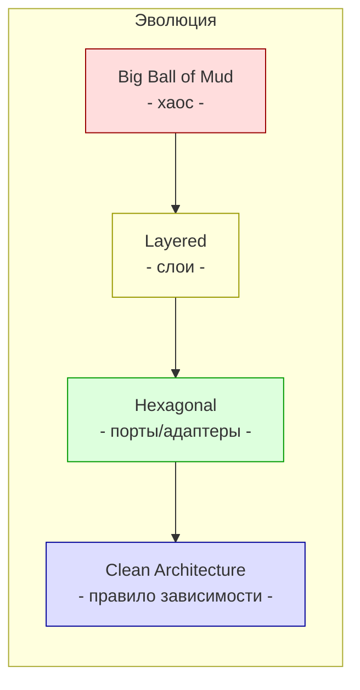
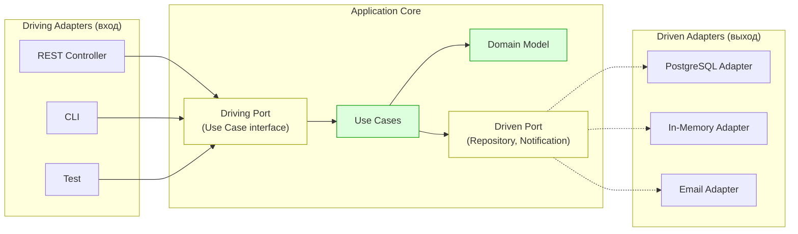

# Лекция 06. Архитектура: гексагональная, чистая, порты и адаптеры

> **Дисциплина:** Проектирование интернет-систем (ПИС)
> **Курс:** 3, Семестр: 6
> **Тема по учебной программе:** Тема 6 - Архитектура
> **ADR-диапазон:** ADR-011 - ADR-012

---

## Результаты обучения

После лекции студент сможет:

1. Объяснить, чем **«большой комок грязи»** опасен и почему послойная архитектура не всегда спасает.
2. Описать **гексагональную архитектуру** (Ports & Adapters) и показать, как она реализует принцип инверсии зависимостей.
3. Сравнить **Clean Architecture**, **Onion Architecture** и **гексагональную** - выделить общее ядро.
4. Спроектировать **порты и адаптеры** для конкретного bounded context системы ПСО «Юго-Запад».
5. Применить **API-first** подход как контрактную точку между слоями и контекстами.

---

## Пререквизиты

- DIP и порты/адаптеры на уровне принципов из **лекции 03**.
- Service Layer и Domain Model из **лекции 04**.
- Bounded Contexts из **лекции 05**.
- Базовые знания HTTP/REST.

---

## 1. Введение: эволюция архитектурных стилей

На предыдущих лекциях мы познакомились с принципами (SOLID, лекция 03), шаблонами бизнес-логики (лекция 04) и стратегическим DDD (лекция 05). Но как организовать **всю систему** целиком? Как расположить слои, чтобы бизнес-логика не зависела от БД, а контроллер - от ORM?

Представьте здание:

- **«Комок грязи»** - времянка без фундамента: всё связано со всем, любая перестройка рушит крышу.
- **Послойная архитектура** - типовой жилой дом: стены-перекрытия-крыша. Работает, но если надо заменить фундамент - придётся разбирать весь дом сверху.
- **Гексагональная / чистая** - модульное здание на свайном фундаменте: ядро (бизнес) стоит независимо, а внешние модули (фасад, инженерные сети) подключаются через стандартные разъёмы (порты).

> **[О2] Clean Architecture:** «Хорошая архитектура позволяет откладывать решения». БД, фреймворк, UI - «детали», которые можно менять, не трогая бизнес-логику.



---

## 2. Основные понятия и терминология

**Определения:**

- **Big Ball of Mud** - система без видимой архитектуры: любой модуль зависит от любого другого [FOSA].
- **Послойная архитектура (Layered)** - классическое разделение: Presentation → Business Logic → Data Access. Зависимости идут сверху вниз.
- **Гексагональная архитектура (Hexagonal / Ports & Adapters)** - Alistair Cockburn, 2005. Приложение - ядро, окружённое портами (интерфейсами). Внешние системы подключаются через адаптеры.
- **Clean Architecture** - Robert Martin [О2]. Концентрические круги: Entities → Use Cases → Interface Adapters → Frameworks. Зависимости направлены **внутрь**.
- **Onion Architecture** - Jeffrey Palermo. То же правило: core не зависит от infrastructure.
- **Порт (Port)** - интерфейс, через который ядро общается с внешним миром. **Driving port** (входящий) - вызывают извне. **Driven port** (исходящий) - ядро вызывает наружу.
- **Адаптер (Adapter)** - реализация порта для конкретной технологии.
- **API-first** - контракт API определяется **до** реализации.

**Контр-примеры:**

- «Controller → Service → Repository, но Repository возвращает ORM-модель, которая протекает в Controller» - это Layered с протечками, не гексагональная.
- «У нас порты/адаптеры, но domain импортирует SQLAlchemy» - нарушение правила зависимости.

---

## 3. «Большой комок грязи» и почему он появляется

### Определения Big Ball of Mud

- **Big Ball of Mud (BBM)** - система, в которой границы отсутствуют: контроллер обращается напрямую к БД, бизнес-логика разбросана по шаблонам страниц, SQL-запросы встроены в обработчики кнопок [FOSA, гл. 1].

### Как это выглядит

```python
# app.py - Big Ball of Mud (ВСЁ в одном файле)

from fastapi import FastAPI
import psycopg2

app = FastAPI()
conn = psycopg2.connect("dbname=pso_sw")

@app.post("/requests")
def create_request(lat: float, lon: float, type_: str, priority: int):
    # Валидация - тут
    if not (1 <= priority <= 5):
        return {"error": "bad priority"}, 400

    # SQL - тут же
    cur = conn.cursor()
    cur.execute("INSERT INTO requests ...", (lat, lon, type_, priority))
    conn.commit()

    # Уведомление - и тут
    import smtplib
    smtplib.SMTP("mail.pso-sw.by").sendmail(...)

    return {"status": "ok"}
```

**Почему это плохо:**

- Нельзя тестировать без БД и почтового сервера.
- Изменение схемы БД → правка 50 эндпоинтов.
- Невозможно переиспользовать логику (CLI, gRPC).

**Как BBM появляется:** не из злого умысла, а из «давайте быстро сделаем, потом перепишем» - но «потом» не наступает.

---

## 4. Послойная архитектура (Layered)

### Определения Layered Architecture

- **Layered Architecture** - система разделена на горизонтальные слои: Presentation → Application/Business → Data Access. Каждый слой зависит **только** от нижнего [О1, FOSA].

### Структура

```text
Presentation Layer     ← HTTP, JSON
    ↓
Business Logic Layer   ← Правила, вычисления
    ↓
Data Access Layer      ← SQL, ORM
    ↓
Database               ← PostgreSQL
```

### Плюсы и минусы

| За | Против |
| -- | ------ |
| Простота понимания | Зависимость бизнес-логики от Data Access Layer |
| Широко известна | Изменение БД тянет изменения в бизнес-слое |
| Подходит для простых систем | «Сквозная» протечка: ORM-модели поднимаются до Controller |

### Главная проблема

В классической Layered зависимость бизнес-логики направлена **вниз** - к БД. Это нарушает DIP (лекция 03): бизнес-правила зависят от деталей хранения.

```text
# Проблема классической Layered
Controller → Service → Repository → PostgreSQL
                 ↑                        ↑
           бизнес-логика          зависит от
                                  деталей хранения
```

Гексагональная архитектура решает эту проблему: **инвертирует** направление зависимости.

---

## 5. Гексагональная архитектура (Ports & Adapters)

### Определения Hexagonal Architecture

- **Hexagonal Architecture** (Alistair Cockburn, 2005) - приложение = ядро (Application Core), окружённое портами. Внешние системы подключаются через адаптеры.
- **Driving Port** (входящий, «левая сторона») - интерфейс, через который **внешний мир вызывает** ядро (например, `CreateRequestUseCase`).
- **Driven Port** (исходящий, «правая сторона») - интерфейс, через который **ядро вызывает** внешний мир (например, `RequestRepositoryPort`).
- **Driving Adapter** - реализация входа: REST Controller, CLI, gRPC handler.
- **Driven Adapter** - реализация выхода: PostgresRepository, EmailAdapter, InMemoryRepo.

### Ключевая идея

> Ядро **не знает**, кто его вызывает (REST? CLI? тест?) и куда сохраняет данные (PostgreSQL? In-Memory?). Ядро знает только **порты** (интерфейсы).



### Пример: ПСО «Юго-Запад» - dispatch как гексагон

```python
# dispatch/ports/inbound.py - Driving Port (входящий)

from abc import ABC, abstractmethod
from dataclasses import dataclass
from uuid import UUID

@dataclass(frozen=True)
class CreateRequestCommand:
    lat: float
    lon: float
    type: str
    priority: int

@dataclass(frozen=True)
class RequestResult:
    id: UUID
    status: str

class CreateRequestPort(ABC):
    """Driving port: входная точка для создания заявки."""
    @abstractmethod
    def create(self, command: CreateRequestCommand) -> RequestResult: ...
```

```python
# dispatch/ports/outbound.py - Driven Ports (исходящие)

from abc import ABC, abstractmethod
from uuid import UUID
from domain.request import Request

class RequestRepositoryPort(ABC):
    """Driven port: сохранение и чтение заявок."""
    @abstractmethod
    def save(self, request: Request) -> None: ...

    @abstractmethod
    def find_by_id(self, id: UUID) -> Request | None: ...

class NotificationPort(ABC):
    """Driven port: уведомление о событиях."""
    @abstractmethod
    def notify_new_request(self, request_id: UUID, type: str, priority: int) -> None: ...
```

```python
# dispatch/application/create_request_service.py - Use Case (реализует driving port)

from dispatch.ports.inbound import CreateRequestPort, CreateRequestCommand, RequestResult
from dispatch.ports.outbound import RequestRepositoryPort, NotificationPort
from dispatch.domain.request import Request, RequestType

class CreateRequestService(CreateRequestPort):
    """Use Case: реализует driving port, использует driven ports."""

    def __init__(self, repo: RequestRepositoryPort, notifier: NotificationPort) -> None:
        self._repo = repo
        self._notifier = notifier

    def create(self, command: CreateRequestCommand) -> RequestResult:
        request = Request(
            lat=command.lat, lon=command.lon,
            type=RequestType(command.type), priority=command.priority,
        )
        self._repo.save(request)
        self._notifier.notify_new_request(request.id, request.type.value, request.priority)
        return RequestResult(id=request.id, status=request.status.value)
```

```python
# dispatch/adapters/inbound/rest_controller.py - Driving Adapter (REST)

from fastapi import APIRouter, HTTPException
from dispatch.ports.inbound import CreateRequestPort, CreateRequestCommand

router = APIRouter(prefix="/api/requests")

def create_router(use_case: CreateRequestPort) -> APIRouter:
    @router.post("/", status_code=201)
    def create_request(lat: float, lon: float, type_: str, priority: int):
        try:
            result = use_case.create(
                CreateRequestCommand(lat=lat, lon=lon, type=type_, priority=priority)
            )
            return {"id": str(result.id), "status": result.status}
        except ValueError as e:
            raise HTTPException(400, str(e))

    return router
```

```python
# dispatch/adapters/outbound/postgres_repo.py - Driven Adapter (PostgreSQL)

from dispatch.ports.outbound import RequestRepositoryPort
from dispatch.domain.request import Request

class PostgresRequestRepository(RequestRepositoryPort):
    def __init__(self, connection) -> None:
        self._conn = connection

    def save(self, request: Request) -> None:
        with self._conn.cursor() as cur:
            cur.execute(
                "INSERT INTO requests (id, lat, lon, type, priority, status) "
                "VALUES (%s,%s,%s,%s,%s,%s)",
                (str(request.id), request.lat, request.lon,
                 request.type.value, request.priority, request.status.value),
            )
        self._conn.commit()

    def find_by_id(self, id) -> Request | None:
        ...  # SELECT + map to domain object
```

**Пояснение к примеру:**

- **Driving Port** (`CreateRequestPort`) - интерфейс, который реализует use case. Controller вызывает этот порт.
- **Driven Ports** (`RequestRepositoryPort`, `NotificationPort`) - интерфейсы, которые use case **использует**, но **не реализует**. Реализация - в адаптерах.
- **Правило зависимости:** стрелки зависимостей направлены **к ядру**. Controller зависит от порта. Адаптер зависит от порта. Ядро не зависит ни от чего внешнего.

**Проверка:**

```python
# Тест без БД, без HTTP, без email
def test_create_request():
    requests = []

    class FakeRepo(RequestRepositoryPort):
        def save(self, r): requests.append(r)
        def find_by_id(self, id): return None

    class FakeNotifier(NotificationPort):
        def notify_new_request(self, *args): pass

    service = CreateRequestService(FakeRepo(), FakeNotifier())
    result = service.create(CreateRequestCommand(lat=52.1, lon=23.7, type="FIRE", priority=1))

    assert result.status == "NEW"
    assert len(requests) == 1
```

---

## 6. Clean Architecture: концентрические круги

### Определения Clean Architecture

- **Clean Architecture** [О2] - организация системы в виде концентрических кругов. Внутренний круг - Entities (домен). Внешний - Frameworks & Drivers.
- **Dependency Rule** - зависимости направлены **только внутрь**. Внутренний круг не знает о внешнем.

### Четыре круга

```text
┌─────────────────────────────────────────┐
│  Frameworks & Drivers                    │  ← FastAPI, psycopg2, SMTP
│  ┌─────────────────────────────────┐    │
│  │  Interface Adapters              │    │  ← Controllers, Presenters, Repos
│  │  ┌─────────────────────────┐    │    │
│  │  │  Use Cases               │    │    │  ← Application Services
│  │  │  ┌─────────────────┐    │    │    │
│  │  │  │  Entities        │    │    │    │  ← Domain Model
│  │  │  └─────────────────┘    │    │    │
│  │  └─────────────────────────┘    │    │
│  └─────────────────────────────────┘    │
└─────────────────────────────────────────┘
```

### Сравнение: Hexagonal vs Clean vs Onion

| Аспект | Hexagonal | Clean Architecture | Onion |
| ------ | --------- | ------------------ | ----- |
| Автор | Cockburn | Martin [О2] | Palermo |
| Ключевая метафора | Гексагон с портами | Концентрические круги | Луковица |
| Центр | Application Core | Entities | Domain Model |
| Правило зависимости | Ядро не знает о внешнем | Зависимости внутрь | Зависимости внутрь |
| Порты/адаптеры | Явные | Implicit (Interface Adapters) | Implicit |
| **Общее ядро** | - | - | - |

> Все три архитектуры выражают одну идею: бизнес-логика не зависит от инфраструктуры.

> **Вывод:** все три архитектуры выражают **одну идею**: домен/бизнес-логика - в центре, инфраструктура - снаружи, зависимости - внутрь. Различаются терминологией и уровнем детализации.

---

## 7. Структура проекта: гексагон на практике

### Определения структуры гексагона

- **ports/** - все интерфейсы (входящие и исходящие) в одном пакете или в `inbound/` и `outbound/`.
- **adapters/** - реализации портов, разделённые по `inbound/` (REST, CLI) и `outbound/` (PostgreSQL, Email).

### Пример: ПСО «Юго-Запад» - полная структура модуля dispatch

```text
src/dispatch/
├── ports/
│   ├── inbound.py            # Driving Ports (входящие)
│   └── outbound.py           # Driven Ports (исходящие)
├── domain/
│   ├── request.py            # Entity: Request (Rich Model)
│   ├── group_ref.py          # Value Object: GroupRef
│   └── services/
│       └── escalation.py     # Domain Service
├── application/
│   ├── create_request.py     # Use Case (implements CreateRequestPort)
│   └── assign_group.py       # Use Case
├── adapters/
│   ├── inbound/
│   │   ├── rest_controller.py    # Driving Adapter: FastAPI
│   │   └── cli_handler.py        # Driving Adapter: CLI
│   └── outbound/
│       ├── postgres_repo.py      # Driven Adapter: PostgreSQL
│       ├── in_memory_repo.py     # Driven Adapter: тесты
│       └── email_adapter.py      # Driven Adapter: SMTP
└── config/
    └── dependency_injection.py   # Compose: связывание портов с адаптерами
```

### Dependency Injection: сборка гексагона

```python
# dispatch/config/dependency_injection.py

from dispatch.application.create_request import CreateRequestService
from dispatch.adapters.outbound.postgres_repo import PostgresRequestRepository
from dispatch.adapters.outbound.email_adapter import EmailNotificationAdapter

def create_request_use_case(db_connection, mail_sender) -> CreateRequestService:
    """Composition Root: связываем порты с адаптерами."""
    repo = PostgresRequestRepository(db_connection)
    notifier = EmailNotificationAdapter(mail_sender)
    return CreateRequestService(repo=repo, notifier=notifier)
```

**Пояснение к примеру:**

- **Composition Root** - единственное место, где «соединяются провода»: порт ↔ адаптер.
- В production подключается `PostgresRequestRepository`. В тестах - `InMemoryRequestRepository`.
- Ни domain, ни application не знают о конкретных адаптерах.

---

## 8. REST и DDD: API-first подход

### Определения API-first

- **API-first** - контракт (OpenAPI / AsyncAPI) определяется и согласовывается **до** написания кода.
- **Контрактный подход** - REST API как Published Language (лекция 05) между Bounded Contexts.

### Правила проектирования REST в стиле DDD

1. **Ресурс REST = агрегат или проекция**, а не таблица БД.
2. **Действия = бизнес-операции**, а не технические CRUD.
3. **DTO = Published Language**, а не внутренняя доменная модель.

```python
# Пример: REST-эндпоинты dispatch, в стиле DDD

# POST /api/requests             → CreateRequestCommand  (создание заявки)
# POST /api/requests/{id}/assign → AssignGroupCommand     (назначение группы)
# POST /api/requests/{id}/close  → CloseRequestCommand    (закрытие заявки)
# GET  /api/requests/{id}        → RequestView            (проекция для чтения)

# НЕ делаем:
# PATCH /api/requests/{id}       → SetGroupId (CRUD - теряет бизнес-смысл)
# DELETE /api/requests/{id}      → (заявки не удаляются - бизнес-правило!)
```

**Пояснение к примеру:**

- `POST /requests/{id}/assign` - бизнес-операция «назначить группу», а не `PATCH` поля `group_id`.
- `DELETE` отсутствует: в ПСО заявки не удаляются, а закрываются. Это бизнес-правило, а не техническое решение.

---

## 9. ADR: закрепляем решения

### ADR-011: Гексагональная архитектура для модулей Core Domain

| Поле | Значение |
| ---- | -------- |
| **Контекст** | Модули `dispatch` и `operations` содержат сложную бизнес-логику, которую нужно тестировать изолированно и заменять инфраструктуру без изменения домена. |
| **Решение** | Гексагональная архитектура (Ports & Adapters) для Core Domain модулей. Структура: `ports/`, `domain/`, `application/`, `adapters/`, `config/`. Dependency Rule: `domain/` и `application/` не импортируют `adapters/`. |
| **Альтернативы** | (a) Классическая Layered - проще, но бизнес-логика зависит от Data Access. (b) Clean Architecture (concentric) - эквивалентна по смыслу, выбрана гексагональная терминология как более конкретная. |
| **Затрагиваемые характеристики** | Тестируемость ↑, Сопровождаемость ↑, Переносимость ↑ |
| **Последствия** | Больше файлов и пакетов. Маппинг между Domain Model и ORM/DTO. Приемлемо для Core Domain. |
| **Проверка** | Fitness-функция: ни один файл в `domain/` и `application/` не импортирует из `adapters/`. Тест: use case проходит без БД (InMemoryRepo). |

### ADR-012: API-first контракт для межконтекстного взаимодействия

| Поле | Значение |
| ---- | -------- |
| **Контекст** | Контексты `dispatch` и `operations` обмениваются данными. Нужен стабильный контракт, который не ломается при изменении внутренней модели. |
| **Решение** | API-first: контракт (OpenAPI-спецификация или Python-интерфейс в `ports/`) определяется до реализации. DTO контракта хранится в `ports/` upstream-контекста. |
| **Альтернативы** | (a) Общая БД - coupling, нарушение границ. (b) Shared library - coupling на бинарном уровне. |
| **Затрагиваемые характеристики** | Сопровождаемость ↑, Coupling ↓, Эволюционируемость ↑ |
| **Последствия** | Необходимость версионирования контракта при breaking changes. |
| **Проверка** | Consumer-driven contract test: downstream тестирует, что upstream возвращает ожидаемые поля. |

---

## Типичные ошибки и антипаттерны

| № | Ошибка | Как исправить |
| - | ------ | ------------- |
| 1 | Domain импортирует ORM (SQLAlchemy Base) | Отдельные модели + маппинг в адаптере |
| 2 | Controller знает о БД (SQL в хэндлере) | Вынести в driven adapter через порт |
| 3 | Один «God-адаптер» на 500 строк | Разделить по driven ports |
| 4 | Порты возвращают ORM-объекты | Порты работают с доменными объектами или DTO |
| 5 | Нет Composition Root - зависимости «вручную» везде | Единая точка сборки в `config/` |
| 6 | REST API повторяет структуру таблиц БД | API отражает бизнес-операции |
| 7 | Тесты зависят от PostgreSQL/SMTP | In-Memory адаптеры для тестов |
| 8 | Слово «гексагональная» в коде, но зависимости идут наружу | Проверять import graph (fitness-функция) |

---

## Вопросы для самопроверки

1. Чем «большой комок грязи» отличается от послойной архитектуры? Почему послойная тоже может быть проблемной?
2. Объясните разницу между driving port и driven port. Приведите примеры из ПСО «Юго-Запад».
3. Сформулируйте Dependency Rule своими словами. Какой слой «не знает» о каком?
4. Чем гексагональная архитектура отличается от Clean Architecture? В чём они одинаковы?
5. Почему REST-эндпоинт `POST /requests/{id}/assign` лучше, чем `PATCH /requests/{id}` со значением `groupId`?
6. Как Composition Root связывает порты и адаптеры? Зачем он нужен?
7. Как написать unit-тест для use case без БД и без HTTP?
8. Что такое API-first подход? Как он связан с Published Language (лекция 05)?
9. Почему Domain Model не должна наследоваться от ORM-базы (например, `Base`)?
10. Как fitness-функция может проверить, что `domain/` не зависит от `adapters/`?
11. В каких случаях гексагональная архитектура **избыточна**?
12. Как гексагональная архитектура помогает заменить PostgreSQL на MongoDB без изменения бизнес-логики?
13. Сколько адаптеров может быть у одного порта? Приведите пример.
14. Как связаны Bounded Context (лекция 05) и гексагон?

---

## Глоссарий

| Термин | Определение |
| ------ | ----------- |
| **Big Ball of Mud** | Система без видимой архитектуры |
| **Layered Architecture** | Горизонтальные слои с зависимостью сверху вниз |
| **Hexagonal Architecture** | Ядро + порты + адаптеры (Cockburn) |
| **Clean Architecture** | Концентрические круги, зависимости внутрь (Martin) |
| **Onion Architecture** | Доменное ядро, зависимости внутрь (Palermo) |
| **Driving Port** | Входящий интерфейс (вызывают извне) |
| **Driven Port** | Исходящий интерфейс (ядро вызывает наружу) |
| **Driving Adapter** | REST Controller, CLI, тест |
| **Driven Adapter** | PostgresRepo, EmailAdapter, InMemoryRepo |
| **Composition Root** | Единственное место сборки зависимостей |
| **API-first** | Контракт определяется до реализации |
| **Dependency Rule** | Зависимости направлены к центру (к домену) |

---

## Связь с литературной основой курса

- **Характеристики:** Тестируемость (testability) - гексагон позволяет тестировать ядро без инфраструктуры. Сопровождаемость (maintainability) - замена адаптера не трогает бизнес-логику. Переносимость - use case работает с REST, gRPC, CLI.
- **Артефакт:** ADR-011 (гексагональная архитектура для Core Domain), ADR-012 (API-first контракт). Структура проекта `ports/ + domain/ + application/ + adapters/ + config/`. Fitness-функция: `domain/` не импортирует `adapters/`.
- **Проверка:** Unit-тест use case с InMemoryRepo (0 зависимостей от инфраструктуры). `import-linter` или AST-тест: ни один файл `domain/**/*.py` не содержит `from adapters`.

---

## Список литературы

### Основная

1. **[О2]** Мартин, Р. Чистая архитектура. - СПб.: Питер, 2018. - 352 с. - Разделы: правило зависимости, границы, порты/адаптеры.
2. **[О1]** Фаулер, М. Шаблоны корпоративных приложений. - М.: И.Д. Вильямс, 2016. - 544 с. - Разделы: Gateway, Mapper, Repository, Service Layer.

### Дополнительная

1. **FOSA** - Richards, M., Ford, N. Fundamentals of Software Architecture. - O'Reilly, 2020. - Архитектурные стили и trade-offs.
2. **[О3]** Вернон, В. Реализация методов предметно-ориентированного проектирования. - М.: И.Д. Вильямс, 2016. - Архитектура bounded context.
3. Cockburn, A. Hexagonal Architecture. - alistair.cockburn.us, 2005.
