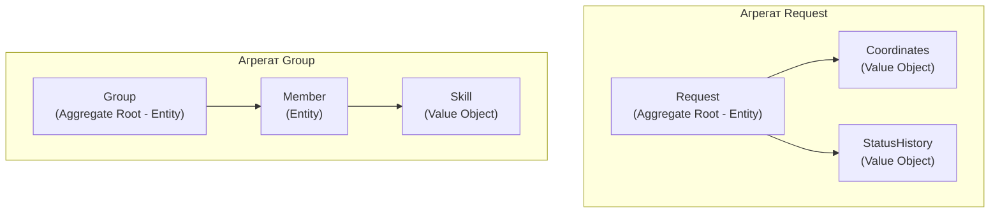
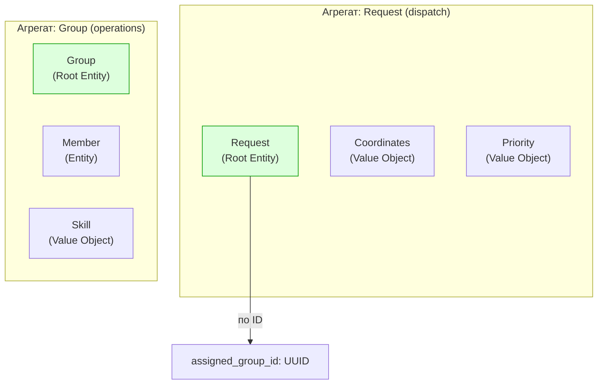

# Лекция 07. Доменные модели: сущности, объекты-значения, агрегаты

> **Дисциплина:** Проектирование интернет-систем (ПИС)
> **Курс:** 3, Семестр: 6
> **Тема по учебной программе:** Тема 7 - Доменные модели
> **ADR-диапазон:** ADR-013 - ADR-014

---

## Результаты обучения

После лекции студент сможет:

1. Различить **сущность (Entity)** и **объект-значение (Value Object)** по критерию идентичности.
2. Реализовать **богатую доменную модель** с инвариантами, защищающими корректность состояния.
3. Определить **агрегат** как кластер объектов с единой границей транзакции.
4. Применить правило **«один агрегат - одна транзакция»** и объяснить, почему это важно.
5. Сравнить **анемичную** и **богатую** (rich) модели и обосновать выбор.

---

## Пререквизиты

- Bounded Contexts и единый язык из **лекции 05**.
- Гексагональная архитектура и `domain/` слой из **лекции 06**.
- Domain Model как шаблон бизнес-логики из **лекции 04**.

---

## 1. Введение: что живёт внутри `domain/`

На лекции 06 мы создали гексагон с пакетом `domain/`. Теперь пора наполнить его жизнью. Если гексагон - это здание, то `domain/` - его несущие стены: самая стабильная часть, которая не зависит ни от БД, ни от фреймворка.

В тактическом DDD [О3] доменный слой состоит из трёх основных строительных блоков:

| Блок | Аналогия | Главный вопрос |
| ---- | -------- | -------------- |
| **Entity** | Человек с паспортом | «Кто это?» (идентичность) |
| **Value Object** | Купюра 100 рублей | «Сколько/какое?» (только значение) |
| **Aggregate** | Семья | «Что изменяется вместе?» (граница транзакции) |

> **[О3] Вернон:** «Агрегат - это кластер доменных объектов, которые могут рассматриваться как единое целое для целей изменения данных.»



---

## 2. Основные понятия и терминология

**Определения:**

- **Сущность (Entity)** - объект с **идентичностью** (ID), которая сохраняется на протяжении всей жизни. Две сущности с одинаковыми данными, но разными ID - разные объекты.
- **Объект-значение (Value Object, VO)** - объект **без идентичности**, определяемый только своими значениями. Два VO с одинаковыми данными - одинаковы. Всегда неизменяемый (immutable).
- **Агрегат (Aggregate)** - кластер сущностей и value objects с единой **границей транзакции**. Один объект - **корень агрегата (Aggregate Root)** - единственная точка доступа извне.
- **Aggregate Root** - корневая сущность, через которую проходят все изменения агрегата. Внешний код не обращается к внутренним объектам напрямую.
- **Инвариант** - правило, которое **всегда** истинно для агрегата (например, «у группы не больше 10 участников»).
- **Анемичная модель** - антипаттерн: объекты содержат данные, но бизнес-логика вынесена в «сервисы».

**Контр-примеры:**

- «Координаты (52.1, 23.7)» - нет собственного ID; это Value Object, не Entity.
- «Заявка с ID=abc-123» - даже если все поля совпадают с другой заявкой, это разные заявки; это Entity.

---

## 3. Entity: объекты с идентичностью

### Определения Entity

- **Entity** - объект, уникально идентифицируемый по ID, а не по содержимому [О3, гл. 5].
- **Равенство:** два Entity равны ⟺ их ID равны, независимо от остальных полей.
- **Жизненный цикл:** Entity создаётся, изменяет состояние, может быть «закрыта», но не «удалена» в доменном смысле.

### Пример: ПСО «Юго-Запад» - Entity `Request`

```python
# dispatch/domain/request.py - Entity (Aggregate Root)

from __future__ import annotations
from dataclasses import dataclass, field
from uuid import UUID, uuid4
from datetime import datetime, timezone
from enum import Enum

class RequestType(Enum):
    FIRE = "FIRE"
    FLOOD = "FLOOD"
    SEARCH = "SEARCH"
    MEDICAL = "MEDICAL"

class RequestStatus(Enum):
    NEW = "NEW"
    ASSIGNED = "ASSIGNED"
    IN_PROGRESS = "IN_PROGRESS"
    CLOSED = "CLOSED"

@dataclass
class Request:
    """Entity: идентифицируется по id, содержит поведение и инварианты."""

    id: UUID = field(default_factory=uuid4)
    coordinates: "Coordinates | None" = None
    type: RequestType = RequestType.SEARCH
    priority: int = 3
    status: RequestStatus = RequestStatus.NEW
    assigned_group_id: UUID | None = None
    created_at: datetime = field(default_factory=lambda: datetime.now(timezone.utc))

    def __post_init__(self) -> None:
        self._validate()

    def _validate(self) -> None:
        if not (1 <= self.priority <= 5):
            raise ValueError(f"Priority must be 1-5, got {self.priority}")

    # --- Поведение ---
    def assign_to_group(self, group_id: UUID) -> None:
        if self.status == RequestStatus.CLOSED:
            raise InvalidStateError("Cannot assign a closed request")
        self.assigned_group_id = group_id
        self.status = RequestStatus.ASSIGNED

    def start(self) -> None:
        if self.status != RequestStatus.ASSIGNED:
            raise InvalidStateError("Only assigned requests can be started")
        self.status = RequestStatus.IN_PROGRESS

    def close(self) -> None:
        if self.status == RequestStatus.CLOSED:
            raise InvalidStateError("Already closed")
        self.status = RequestStatus.CLOSED

    def escalate(self) -> None:
        if self.priority > 1:
            self.priority -= 1

    # --- Равенство по ID ---
    def __eq__(self, other: object) -> bool:
        return isinstance(other, Request) and self.id == other.id

    def __hash__(self) -> int:
        return hash(self.id)

class InvalidStateError(Exception):
    pass
```

**Пояснение к примеру:**

- `__eq__` и `__hash__` определены через `id`: два объекта `Request` с одинаковым `id` - это одна и та же заявка, даже если `priority` отличается.
- Инвариант: `priority ∈ [1, 5]` проверяется при создании.
- Переходы состояния: `NEW → ASSIGNED → IN_PROGRESS → CLOSED`. Каждый метод проверяет допустимость перехода.

**Проверка:**

```python
def test_entity_equality_by_id():
    id_ = uuid4()
    r1 = Request(id=id_, priority=1)
    r2 = Request(id=id_, priority=5)
    assert r1 == r2  # одинаковый ID → один и тот же объект
```

---

## 4. Value Object: объекты без идентичности

### Определения Value Object

- **Value Object** - объект без ID, определяемый **только** значениями своих полей [О3, гл. 6].
- **Immutable:** Value Object **не изменяется** после создания. Нужно другое значение - создайте новый объект.
- **Равенство:** два VO равны ⟺ все их поля равны.

### Зачем нужны Value Objects

1. **Типизация:** `Coordinates` вместо двух `float` - нельзя перепутать широту и долготу.
2. **Валидация:** инварианты проверяются при создании - невозможно получить невалидный VO.
3. **Самодокументирование:** код `request.coordinates` понятнее, чем `request.lat, request.lon`.

### Пример: ПСО «Юго-Запад» - Value Objects

```python
# dispatch/domain/value_objects.py - Value Objects

from dataclasses import dataclass

@dataclass(frozen=True)
class Coordinates:
    """Value Object: географические координаты."""
    lat: float
    lon: float

    def __post_init__(self) -> None:
        if not (-90 <= self.lat <= 90):
            raise ValueError(f"Latitude must be -90..90, got {self.lat}")
        if not (-180 <= self.lon <= 180):
            raise ValueError(f"Longitude must be -180..180, got {self.lon}")

@dataclass(frozen=True)
class Priority:
    """Value Object: приоритет заявки (1 - критический, 5 - низкий)."""
    value: int

    def __post_init__(self) -> None:
        if not (1 <= self.value <= 5):
            raise ValueError(f"Priority must be 1-5, got {self.value}")

    def escalated(self) -> "Priority":
        """Возвращает НОВЫЙ объект с повышенным приоритетом."""
        return Priority(max(1, self.value - 1))

    def is_critical(self) -> bool:
        return self.value == 1

@dataclass(frozen=True)
class ZoneId:
    """Value Object: идентификатор зоны (типизированная обёртка над строкой)."""
    value: str

    def __post_init__(self) -> None:
        if not self.value.strip():
            raise ValueError("ZoneId cannot be empty")
```

**Пояснение к примеру:**

- `frozen=True` делает dataclass неизменяемым: попытка `coords.lat = 99` вызовет `FrozenInstanceError`.
- `Priority.escalated()` возвращает **новый** объект, а не мутирует текущий.
- `Coordinates` - нельзя создать с `lat=999`: инвариант проверяется в `__post_init__`.

**Проверка:**

```python
def test_value_object_equality():
    c1 = Coordinates(lat=52.1, lon=23.7)
    c2 = Coordinates(lat=52.1, lon=23.7)
    assert c1 == c2  # одинаковые значения → равны

def test_priority_escalation_returns_new_object():
    p = Priority(3)
    p2 = p.escalated()
    assert p.value == 3  # оригинал не изменился
    assert p2.value == 2  # новый объект
```

**Типичные ошибки:**

1. ❌ Мутабельный VO: `coordinates.lat = 99` - нарушает неизменяемость.
2. ❌ VO с ID - это уже Entity.
3. ❌ Использовать `float` вместо `Coordinates` - потеря типизации и валидации.

---

## 5. Aggregate: граница транзакции

### Определения Aggregate

- **Aggregate** - кластер Entity и Value Objects с единой **транзакционной границей** [О3, гл. 10].
- **Aggregate Root** - единственная Entity, через которую внешний код обращается к агрегату.
- **Правило:** изменение агрегата = одна транзакция. После коммита все инварианты должны быть выполнены.
- **Ссылки между агрегатами:** только по ID (не по объектной ссылке).

### Зачем нужны агрегаты

Без границ транзакции один use case мог бы модифицировать десятки объектов в одной транзакции - это приводит к блокировкам и конфликтам. Агрегат ограничивает «радиус взрыва» одной операции.

### Пример: ПСО «Юго-Запад» - два агрегата



```python
# operations/domain/group.py - Aggregate Root

from __future__ import annotations
from dataclasses import dataclass, field
from uuid import UUID, uuid4

@dataclass(frozen=True)
class Skill:
    """Value Object: навык спасателя."""
    name: str
    level: int  # 1-5

    def __post_init__(self) -> None:
        if not (1 <= self.level <= 5):
            raise ValueError(f"Skill level must be 1-5, got {self.level}")

@dataclass
class Member:
    """Entity внутри агрегата Group."""
    id: UUID = field(default_factory=uuid4)
    name: str = ""
    skills: list[Skill] = field(default_factory=list)

    def add_skill(self, skill: Skill) -> None:
        if any(s.name == skill.name for s in self.skills):
            raise ValueError(f"Skill {skill.name} already exists")
        self.skills.append(skill)

@dataclass
class Group:
    """Aggregate Root: вся логика работы с группой проходит через этот класс."""

    id: UUID = field(default_factory=uuid4)
    name: str = ""
    members: list[Member] = field(default_factory=list)
    leader_id: UUID | None = None
    max_size: int = 10

    # --- Инварианты ---
    def _check_max_size(self) -> None:
        if len(self.members) >= self.max_size:
            raise GroupFullError(f"Group cannot have more than {self.max_size} members")

    # --- Поведение (через корень) ---
    def add_member(self, member: Member) -> None:
        """Добавить участника. Инвариант: не больше max_size."""
        self._check_max_size()
        if any(m.id == member.id for m in self.members):
            raise ValueError(f"Member {member.id} already in group")
        self.members.append(member)

    def remove_member(self, member_id: UUID) -> None:
        self.members = [m for m in self.members if m.id != member_id]
        if self.leader_id == member_id:
            self.leader_id = None

    def assign_leader(self, member_id: UUID) -> None:
        """Назначить лидера. Инвариант: лидер должен быть участником группы."""
        if not any(m.id == member_id for m in self.members):
            raise ValueError("Leader must be a member of the group")
        self.leader_id = member_id

    def is_available(self) -> bool:
        return len(self.members) > 0 and self.leader_id is not None

class GroupFullError(Exception):
    pass
```

**Пояснение к примеру:**

- `Group` - **Aggregate Root**: вся работа с `Member` проходит через методы `Group` (`add_member`, `remove_member`). Внешний код **не имеет прямого доступа** к `self.members`.
- `Member` - Entity внутри агрегата (есть `id`).
- `Skill` - Value Object (нет `id`, `frozen=True` подразумевается через неизменяемость данных).
- **Ссылка между агрегатами:** `Request.assigned_group_id: UUID` - не объект `Group`, а его ID.

**Проверка:**

```python
def test_cannot_exceed_max_group_size():
    group = Group(name="Alpha", max_size=2)
    group.add_member(Member(name="Ivan"))
    group.add_member(Member(name="Petr"))
    try:
        group.add_member(Member(name="Sergei"))
        assert False, "Expected GroupFullError"
    except GroupFullError:
        pass  # correct: max_size=2
```

---

## 6. Правила проектирования агрегатов

### Определения правил агрегатов

- **Маленькие агрегаты** - предпочтительнее больших. Чем меньше агрегат, тем меньше блокировок [О3].
- **Ссылки по ID** - агрегаты ссылаются друг на друга по ID, а не по объектной ссылке.
- **Один агрегат - одна транзакция** - в рамках одной транзакции изменяется **один** агрегат.

### Четыре правила Вернона

| № | Правило | Пояснение |
| - | ------- | --------- |
| 1 | Защищай инварианты внутри агрегата | Все бизнес-правила проверяются root-ом |
| 2 | Делай агрегаты маленькими | Меньше конфликтов при параллельных изменениях |
| 3 | Ссылайся на другие агрегаты по ID | Не загружай чужие агрегаты в память |
| 4 | Используй eventual consistency между агрегатами | Если нужно обновить два агрегата - через доменные события |

### Почему ссылки по ID

```python
# ПЛОХО: Request хранит объект Group
@dataclass
class Request:
    assigned_group: Group  # объектная ссылка → загружает весь Group со всеми Member

# ХОРОШО: Request хранит только ID
@dataclass
class Request:
    assigned_group_id: UUID | None = None  # ссылка по ID → Group загружается отдельно
```

**Пояснение к примеру:**

- При загрузке `Request` из БД вместе с ним загрузится весь `Group` со всеми `Member` и `Skill` - лавина запросов.
- Ссылка по ID: если нужны данные группы - загружаем через отдельный репозиторий.

---

## 7. Анемичная vs богатая модель

### Определения сравнения моделей

- **Анемичная модель** - объект содержит только данные (поля + геттеры/сеттеры). Вся логика - в «сервисах» снаружи [Мартин Фаулер: AnemicDomainModel - антипаттерн].
- **Богатая модель (Rich Model)** - объект содержит и данные, и поведение. Инварианты проверяются внутри объекта.

### Сравнение

```python
# --- Анемичная модель ---
@dataclass
class Request:
    id: UUID
    priority: int
    status: str
    group_id: UUID | None

# Логика - в сервисе
class RequestService:
    def assign(self, request: Request, group_id: UUID) -> None:
        if request.status == "CLOSED":
            raise ValueError("Cannot assign")
        request.group_id = group_id      # прямое изменение поля
        request.status = "ASSIGNED"       # прямое изменение поля
```

```python
# --- Богатая модель ---
@dataclass
class Request:
    id: UUID
    priority: int
    status: RequestStatus
    assigned_group_id: UUID | None

    def assign_to_group(self, group_id: UUID) -> None:
        """Бизнес-правило ВНУТРИ объекта."""
        if self.status == RequestStatus.CLOSED:
            raise InvalidStateError("Cannot assign a closed request")
        self.assigned_group_id = group_id
        self.status = RequestStatus.ASSIGNED
```

**Почему богатая модель лучше:**

- Инвариант (`status != CLOSED`) проверяется **всегда** - невозможно «забыть» проверку.
- Правило изменяется в **одном месте** (внутри Entity), а не в десяти сервисах.
- Тестируется **без инфраструктуры**: тест работает с чистым объектом.

---

## 8. Идентификация сущностей: стратегии создания ID

### Определения стратегий ID

- **UUID (v4)** - генерируется клиентом; нет зависимости от БД.
- **Auto-increment (SERIAL/BIGSERIAL)** - генерируется БД; знаем ID **только после** вставки.
- **UUID v7 / ULID** - совмещает монотонность (сортируемость) и глобальную уникальность.

### Рекомендация

Для DDD-агрегатов: **UUID v4 или v7**, генерируемый в домене (не в БД). Это позволяет:

- Создавать объект **до** сохранения.
- Публиковать доменное событие с ID **до** записи в БД.
- Не зависеть от конкретной СУБД.

```python
from uuid import uuid4

class Request:
    def __init__(self, ...) -> None:
        self.id = uuid4()  # ID генерируется в домене, а не в БД
```

---

## 9. ADR: закрепляем решения

### ADR-013: Агрегаты Request и Group как единицы транзакции

| Поле | Значение |
| ---- | -------- |
| **Контекст** | В ПСО «Юго-Запад» заявка (Request) и группа (Group) - ключевые понятия с собственными инвариантами. Нужно определить границы транзакций. |
| **Решение** | `Request` - агрегат в контексте `dispatch` (root entity). `Group` - агрегат в контексте `operations` (root entity, содержит Member). Ссылка между ними - по ID. Одна транзакция = один агрегат. |
| **Альтернативы** | (a) Один большой агрегат Request+Group - больше блокировок, сложнее. (b) Request без агрегатной границы - инварианты не защищены. |
| **Затрагиваемые характеристики** | Согласованность данных ↑, Масштабируемость ↑, Сопровождаемость ↑ |
| **Последствия** | Нет каскадных обновлений между агрегатами в одной транзакции. Согласование - через доменные события (лекция 10). |
| **Проверка** | Unit-тест: инварианты агрегата всегда выполнены после любой операции. Integration-тест: одна транзакция обновляет только один агрегат. |

### ADR-014: Value Objects для Coordinates и Priority

| Поле | Значение |
| ---- | -------- |
| **Контекст** | Координаты и приоритет - часто используемые понятия. Примитивные типы (`float`, `int`) не обеспечивают валидацию и типизацию. |
| **Решение** | Координаты → `Coordinates` (frozen dataclass с валидацией). Приоритет → `Priority` (frozen dataclass, `escalated()` возвращает новый объект). |
| **Альтернативы** | Использовать примитивы (`float`, `int`) - проще, но нет валидации при создании, легко перепутать lat/lon. |
| **Затрагиваемые характеристики** | Корректность ↑, Самодокументирование ↑ |
| **Последствия** | Маппинг VO ↔ примитивы при сериализации/десериализации (ORM, JSON). |
| **Проверка** | Тест: создание `Coordinates(lat=999, lon=0)` бросает `ValueError`. Тест: `Priority.escalated()` не мутирует оригинал. |

---

## Типичные ошибки и антипаттерны

| № | Ошибка | Как исправить |
| - | ------ | ------------- |
| 1 | Анемичная модель: данные без поведения | Перенести бизнес-правила в Entity |
| 2 | Слишком большой агрегат (Request + Group + Zone) | Разделить: один агрегат = одна бизнес-единица |
| 3 | Ссылка по объекту между агрегатами | Ссылка по ID (`assigned_group_id: UUID`) |
| 4 | Мутабельный Value Object | `frozen=True` (dataclass) |
| 5 | Value Object с ID | Это Entity, не VO |
| 6 | Внешний код обходит Aggregate Root | Все операции - через корень агрегата |
| 7 | Два агрегата в одной транзакции | Одна транзакция = один агрегат |
| 8 | `float` вместо `Coordinates`, `int` вместо `Priority` | Создать Value Objects с валидацией |

---

## Вопросы для самопроверки

1. Чем Entity отличается от Value Object? Приведите по два примера из ПСО «Юго-Запад».
2. Почему `Coordinates` - Value Object, а `Request` - Entity?
3. Что такое Aggregate Root? Зачем нужен единственный «вход» в агрегат?
4. Объясните правило «один агрегат - одна транзакция». Что делать, если нужно обновить два агрегата?
5. Почему ссылка между агрегатами должна быть по ID, а не по объекту?
6. Чем анемичная модель хуже богатой? Приведите пример миграции от анемичной к богатой.
7. Как Value Object `Priority` реализует операцию `escalated()` без мутации?
8. Почему `frozen=True` важен для Value Objects?
9. Назовите 4 правила проектирования агрегатов по Вернону.
10. Как связаны Aggregate и Bounded Context?
11. Как выбрать между UUID и auto-increment для идентификации сущностей?
12. Что произойдёт, если внешний код напрямую модифицирует `group.members.append(member)` в обход `group.add_member()`?
13. Как протестировать инвариант «max 10 участников в группе» без БД?
14. Как агрегаты связаны с границами транзакции в PostgreSQL?

---

## Глоссарий

| Термин | Определение |
| ------ | ----------- |
| **Entity** | Объект с идентичностью (ID) |
| **Value Object** | Объект без ID, определяемый значениями, неизменяемый |
| **Aggregate** | Кластер объектов с единой границей транзакции |
| **Aggregate Root** | Корневая сущность - единственная точка доступа |
| **Инвариант** | Правило, всегда истинное для агрегата |
| **Анемичная модель** | Объект без поведения (антипаттерн) |
| **Rich Model** | Объект с данными, поведением и инвариантами |
| **Frozen dataclass** | Неизменяемый dataclass (для Value Objects) |
| **Eventual Consistency** | Согласованность между агрегатами «со временем» |
| **Aggregate Reference by ID** | Ссылка между агрегатами через UUID |

---

## Связь с литературной основой курса

- **Характеристики:** Корректность (correctness) - инварианты защищают валидность данных. Сопровождаемость (maintainability) - поведение рядом с данными. Тестируемость - rich model тестируется без БД.
- **Артефакт:** ADR-013 (Request и Group как агрегаты), ADR-014 (Coordinates и Priority как VO). Доменные классы `Request`, `Group`, `Coordinates`, `Priority`.
- **Проверка:** Unit-тесты инвариантов (priority range, max group size, state transitions). Тест: `Request.__eq__` через ID, `Coordinates.__eq__` через значения.

---

## Список литературы

### Основная

1. **[О3]** Вернон, В. Реализация методов предметно-ориентированного проектирования. - М.: И.Д. Вильямс, 2016. - 688 с. - Разделы: Entity, Value Object, Aggregate.
2. **[О2]** Мартин, Р. Чистая архитектура. - СПб.: Питер, 2018. - 352 с. - Разделы: Entities как центр архитектуры.
3. **[О5]** Buenosvinos, C. et al. Domain-Driven Design in PHP. - Packt, 2017. - Разделы: тактическое DDD.

### Дополнительная

1. **[Д1]** Вернон, В. Предметно-ориентированное проектирование: самое основное. - СПб.: Диалектика, 2019. - 160 с.
2. Fowler, M. AnemicDomainModel (bliki). - martinfowler.com.
