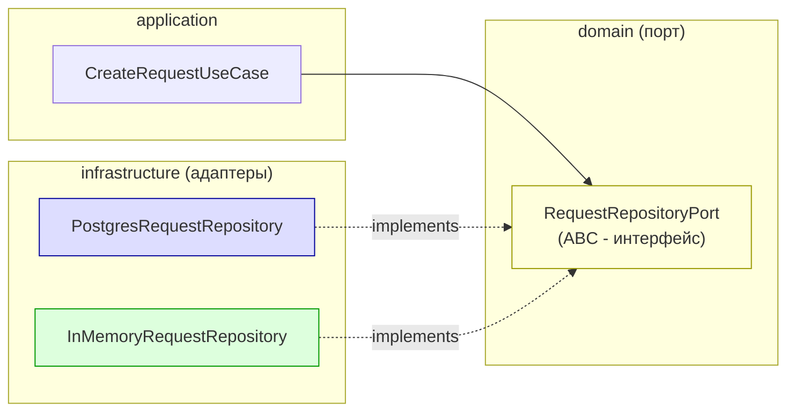
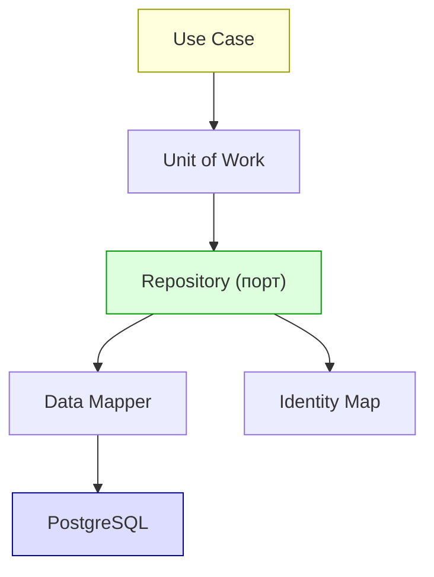

# Лекция 08. Репозитории: инверсия зависимостей, коллекция доменных объектов, транзакции

> **Дисциплина:** Проектирование интернет-систем (ПИС)
> **Курс:** 3, Семестр: 6
> **Тема по учебной программе:** Тема 8 - Репозитории
> **ADR-диапазон:** ADR-015 - ADR-016

---

## Результаты обучения

После лекции студент сможет:

1. Объяснить, почему **порт репозитория** определяется в домене, а адаптер - в инфраструктуре.
2. Спроектировать интерфейс `Repository` как **коллекцию агрегатов** (add / get / remove).
3. Реализовать **In-Memory** репозиторий для unit-тестирования без БД.
4. Реализовать **PostgreSQL** адаптер репозитория с правильным маппингом домен ↔ таблица.
5. Описать роль **Unit of Work** и принцип «один агрегат - одна транзакция».

---

## Пререквизиты

- Aggregate Root и границы транзакции из **лекции 07** (Request, Group).
- Порты и адаптеры из **лекции 06** (`RequestRepositoryPort` - driven port).
- Dependency Inversion Principle из **лекции 03** (SOLID).

---

## 1. Введение: зачем нужен Repository

На лекции 06 мы ввели **driven port** `RequestRepositoryPort`. На лекции 07 построили агрегаты `Request` и `Group`. Теперь ключевой вопрос: **как сохранять и восстанавливать агрегаты**, не загрязняя домен деталями хранилища?

Repository - это паттерн, который притворяется **коллекцией**. Доменный код думает: «я кладу объект в коллекцию и достаю по ID». Он не знает, что за «коллекцией» - PostgreSQL, Redis или файл.

> **[О3] Вернон:** «Репозиторий предоставляет иллюзию коллекции объектов в памяти, скрывая механизм персистенции.»



---

## 2. Основные понятия и терминология

**Определения:**

- **Repository** - паттерн, который инкапсулирует логику доступа к данным и представляет коллекцию агрегатов [О1, Фаулер; О3, Вернон].
- **Repository Port** - абстрактный интерфейс (ABC), определённый в `domain/`. Домен зависит **только** от порта.
- **Repository Adapter** - конкретная реализация порта (PostgreSQL, In-Memory, Redis), живёт в `infrastructure/`.
- **Unit of Work** - паттерн, объединяющий изменения нескольких объектов в одну транзакцию [О1].
- **Identity Map** - кэш загруженных объектов: один и тот же ID → один и тот же объект [О1].
- **Data Mapper** - паттерн маппинга доменного объекта на структуру хранилища (таблицы БД) [О1].

**Контр-примеры:**

- DAO (Data Access Object) - более низкоуровневый: оперирует строками/записями, а не доменными объектами. Repository оперирует **агрегатами**.
- Active Record - объект сам знает, как себя сохранить. Нарушает DIP: домен зависит от БД.

---

## 3. Repository как порт в гексагональной архитектуре

### Где живёт интерфейс?

Ключевое правило: **интерфейс репозитория - в домене**, реализация - в инфраструктуре. Это прямое следствие Dependency Inversion Principle (лекция 03):

```text
domain/
  ports/
    request_repository_port.py     ← ABC (интерфейс)
infrastructure/
  adapters/
    postgres_request_repository.py ← реализация PostgreSQL
    in_memory_request_repository.py ← реализация для тестов
```

### Пример: ПСО «Юго-Запад» - порт репозитория

```python
# dispatch/domain/ports/request_repository_port.py - Port (ABC)

from abc import ABC, abstractmethod
from uuid import UUID
from dispatch.domain.request import Request

class RequestRepositoryPort(ABC):
    """Порт: коллекция агрегатов Request.

    Домен видит только этот интерфейс.
    Конкретная реализация (PostgreSQL, In-Memory)
    подключается через Composition Root.
    """

    @abstractmethod
    def add(self, request: Request) -> None:
        """Добавить новый агрегат в коллекцию."""
        ...

    @abstractmethod
    def get_by_id(self, request_id: UUID) -> Request | None:
        """Получить агрегат по ID (или None, если не найден)."""
        ...

    @abstractmethod
    def save(self, request: Request) -> None:
        """Сохранить изменения в существующем агрегате."""
        ...

    @abstractmethod
    def remove(self, request_id: UUID) -> None:
        """Удалить агрегат из коллекции."""
        ...

    @abstractmethod
    def find_by_status(self, status: str) -> list[Request]:
        """Найти агрегаты по статусу."""
        ...
```

**Пояснение к примеру:**

- `add` / `get_by_id` / `save` / `remove` - классические операции «коллекции».
- `find_by_status` - доменный запрос, важный для бизнеса (например, «все новые заявки»).
- Никакого SQL, никаких `session`, никакого `psycopg2` - чистый доменный контракт.

---

## 4. In-Memory репозиторий: тестирование без БД

### Зачем In-Memory

Unit-тесты домена должны работать **без инфраструктуры**: без БД, без сети, без Docker. In-Memory репозиторий - простой `dict`, который реализует порт.

### Пример: ПСО «Юго-Запад» - In-Memory адаптер

```python
# dispatch/infrastructure/adapters/in_memory_request_repository.py

from uuid import UUID
from dispatch.domain.request import Request
from dispatch.domain.ports.request_repository_port import RequestRepositoryPort

class InMemoryRequestRepository(RequestRepositoryPort):
    """Адаптер: репозиторий на основе dict (для тестов)."""

    def __init__(self) -> None:
        self._storage: dict[UUID, Request] = {}

    def add(self, request: Request) -> None:
        if request.id in self._storage:
            raise ValueError(f"Request {request.id} already exists")
        self._storage[request.id] = request

    def get_by_id(self, request_id: UUID) -> Request | None:
        return self._storage.get(request_id)

    def save(self, request: Request) -> None:
        if request.id not in self._storage:
            raise ValueError(f"Request {request.id} not found")
        self._storage[request.id] = request

    def remove(self, request_id: UUID) -> None:
        self._storage.pop(request_id, None)

    def find_by_status(self, status: str) -> list[Request]:
        return [r for r in self._storage.values() if r.status.value == status]
```

**Пояснение к примеру:**

- `_storage: dict[UUID, Request]` - вся «база данных» в памяти.
- Реализует **тот же контракт**, что и PostgreSQL-адаптер.
- Тесты работают мгновенно, без Docker, без миграций.

### Тест с In-Memory

```python
# tests/unit/test_create_request.py

from uuid import uuid4
from dispatch.domain.request import Request, RequestType, RequestStatus
from dispatch.infrastructure.adapters.in_memory_request_repository import (
    InMemoryRequestRepository,
)

def test_add_and_retrieve_request():
    repo = InMemoryRequestRepository()
    request = Request(type=RequestType.FIRE, priority=1)

    repo.add(request)
    found = repo.get_by_id(request.id)

    assert found is not None
    assert found.id == request.id
    assert found.type == RequestType.FIRE

def test_save_updates_existing_request():
    repo = InMemoryRequestRepository()
    request = Request(type=RequestType.FLOOD, priority=3)
    repo.add(request)

    request.assign_to_group(uuid4())
    repo.save(request)

    found = repo.get_by_id(request.id)
    assert found is not None
    assert found.status == RequestStatus.ASSIGNED

def test_find_by_status():
    repo = InMemoryRequestRepository()
    r1 = Request(type=RequestType.FIRE, priority=1)
    r2 = Request(type=RequestType.FLOOD, priority=2)
    repo.add(r1)
    repo.add(r2)

    r1.assign_to_group(uuid4())
    repo.save(r1)

    new_requests = repo.find_by_status("NEW")
    assert len(new_requests) == 1
    assert new_requests[0].id == r2.id
```

---

## 5. PostgreSQL-адаптер: реальная персистенция

### Принцип маппинга

Доменный объект `Request` (с Enum, Value Objects, поведением) ≠ строка таблицы. Адаптер «переводит» между двумя мирами:

```text
Request (domain)          ←→          requests (таблица)
─────────────────                     ──────────────────
id: UUID                              id UUID PRIMARY KEY
coordinates: Coordinates              lat DOUBLE, lon DOUBLE
type: RequestType (Enum)              type VARCHAR(20)
priority: int                         priority INT
status: RequestStatus (Enum)          status VARCHAR(20)
assigned_group_id: UUID | None        assigned_group_id UUID NULL
created_at: datetime                  created_at TIMESTAMPTZ
```

### Пример: ПСО «Юго-Запад» - PostgreSQL адаптер

```python
# dispatch/infrastructure/adapters/postgres_request_repository.py

from uuid import UUID
from datetime import datetime, timezone
import psycopg2
from psycopg2.extras import DictCursor

from dispatch.domain.request import Request, RequestType, RequestStatus
from dispatch.domain.value_objects import Coordinates
from dispatch.domain.ports.request_repository_port import RequestRepositoryPort

class PostgresRequestRepository(RequestRepositoryPort):
    """Адаптер: репозиторий Request на PostgreSQL."""

    def __init__(self, connection) -> None:
        self._conn = connection

    # --- Маппинг: таблица → домен ---
    def _row_to_entity(self, row: dict) -> Request:
        coords = None
        if row["lat"] is not None and row["lon"] is not None:
            coords = Coordinates(lat=row["lat"], lon=row["lon"])

        return Request(
            id=row["id"],
            coordinates=coords,
            type=RequestType(row["type"]),
            priority=row["priority"],
            status=RequestStatus(row["status"]),
            assigned_group_id=row["assigned_group_id"],
            created_at=row["created_at"],
        )

    # --- Операции ---
    def add(self, request: Request) -> None:
        lat = request.coordinates.lat if request.coordinates else None
        lon = request.coordinates.lon if request.coordinates else None
        with self._conn.cursor() as cur:
            cur.execute(
                """
                INSERT INTO requests (id, lat, lon, type, priority, status,
                                      assigned_group_id, created_at)
                VALUES (%s, %s, %s, %s, %s, %s, %s, %s)
                """,
                (
                    str(request.id),
                    lat,
                    lon,
                    request.type.value,
                    request.priority,
                    request.status.value,
                    str(request.assigned_group_id)
                    if request.assigned_group_id
                    else None,
                    request.created_at,
                ),
            )

    def get_by_id(self, request_id: UUID) -> Request | None:
        with self._conn.cursor(cursor_factory=DictCursor) as cur:
            cur.execute("SELECT * FROM requests WHERE id = %s", (str(request_id),))
            row = cur.fetchone()
            return self._row_to_entity(dict(row)) if row else None

    def save(self, request: Request) -> None:
        lat = request.coordinates.lat if request.coordinates else None
        lon = request.coordinates.lon if request.coordinates else None
        with self._conn.cursor() as cur:
            cur.execute(
                """
                UPDATE requests
                SET lat = %s, lon = %s, type = %s, priority = %s, status = %s,
                    assigned_group_id = %s
                WHERE id = %s
                """,
                (
                    lat,
                    lon,
                    request.type.value,
                    request.priority,
                    request.status.value,
                    str(request.assigned_group_id)
                    if request.assigned_group_id
                    else None,
                    str(request.id),
                ),
            )

    def remove(self, request_id: UUID) -> None:
        with self._conn.cursor() as cur:
            cur.execute("DELETE FROM requests WHERE id = %s", (str(request_id),))

    def find_by_status(self, status: str) -> list[Request]:
        with self._conn.cursor(cursor_factory=DictCursor) as cur:
            cur.execute("SELECT * FROM requests WHERE status = %s", (status,))
            return [self._row_to_entity(dict(row)) for row in cur.fetchall()]
```

**Пояснение к примеру:**

- `_row_to_entity` - **Data Mapper**: строка → доменный объект. Здесь происходит «перевод» между двумя мирами.
- Value Object `Coordinates` «раскладывается» в два столбца `lat`, `lon` при записи и «собирается» обратно при чтении.
- Enum `RequestType.FIRE` → строка `"FIRE"` в БД.
- Адаптер реализует **тот же ABC**, что и In-Memory. Доменный код не знает, какой адаптер используется.

---

## 6. Composition Root: связывание порта с адаптером

### Где происходит выбор адаптера?

В **Composition Root** (лекция 06) - модуль, который собирает зависимости при старте приложения:

```python
# dispatch/config/dependency_injection.py - Composition Root

import os
import psycopg2
from dispatch.domain.ports.request_repository_port import RequestRepositoryPort
from dispatch.infrastructure.adapters.postgres_request_repository import (
    PostgresRequestRepository,
)
from dispatch.infrastructure.adapters.in_memory_request_repository import (
    InMemoryRequestRepository,
)
from dispatch.application.create_request_use_case import CreateRequestUseCase

def build_create_request_use_case() -> CreateRequestUseCase:
    """Фабрика: собирает use case с нужным адаптером."""
    repo: RequestRepositoryPort

    if os.getenv("TESTING") == "1":
        repo = InMemoryRequestRepository()
    else:
        conn = psycopg2.connect(os.getenv("DATABASE_URL", ""))
        repo = PostgresRequestRepository(conn)

    return CreateRequestUseCase(repo=repo)
```

**Пояснение к примеру:**

- `CreateRequestUseCase` принимает `RequestRepositoryPort` - абстракцию.
- Composition Root **решает**, какой адаптер подставить.
- В тестах: `InMemoryRequestRepository`. В проде: `PostgresRequestRepository`.

---

## 7. Unit of Work и управление транзакциями

### Проблема

Один use case может модифицировать агрегат и отправить уведомление. Что, если запись в БД прошла, а уведомление - нет? Нужна **единая транзакция**.

### Unit of Work

**Unit of Work** [О1] - паттерн, который:

1. Отслеживает изменённые объекты.
2. Коммитит все изменения **одной транзакцией**.
3. Откатывает при ошибке.

### Простая реализация через контекстный менеджер

```python
# dispatch/domain/ports/unit_of_work_port.py - Port

from abc import ABC, abstractmethod
from dispatch.domain.ports.request_repository_port import RequestRepositoryPort

class UnitOfWorkPort(ABC):
    """Порт: единица работы - оборачивает транзакцию."""

    requests: RequestRepositoryPort

    @abstractmethod
    def __enter__(self) -> "UnitOfWorkPort":
        ...

    @abstractmethod
    def __exit__(self, exc_type, exc_val, exc_tb) -> None:
        ...

    @abstractmethod
    def commit(self) -> None:
        ...

    @abstractmethod
    def rollback(self) -> None:
        ...
```

```python
# dispatch/infrastructure/adapters/postgres_unit_of_work.py - Adapter

import psycopg2
from dispatch.domain.ports.unit_of_work_port import UnitOfWorkPort
from dispatch.infrastructure.adapters.postgres_request_repository import (
    PostgresRequestRepository,
)

class PostgresUnitOfWork(UnitOfWorkPort):
    """Адаптер UoW: управляет транзакцией PostgreSQL."""

    def __init__(self, dsn: str) -> None:
        self._dsn = dsn

    def __enter__(self) -> "PostgresUnitOfWork":
        self._conn = psycopg2.connect(self._dsn)
        self._conn.autocommit = False
        self.requests = PostgresRequestRepository(self._conn)
        return self

    def __exit__(self, exc_type, exc_val, exc_tb) -> None:
        if exc_type:
            self.rollback()
        self._conn.close()

    def commit(self) -> None:
        self._conn.commit()

    def rollback(self) -> None:
        self._conn.rollback()
```

### Использование в use case

```python
# dispatch/application/create_request_use_case.py - Use Case с UoW

from dataclasses import dataclass
from dispatch.domain.request import Request, RequestType
from dispatch.domain.value_objects import Coordinates
from dispatch.domain.ports.unit_of_work_port import UnitOfWorkPort

@dataclass
class CreateRequestCommand:
    lat: float
    lon: float
    type: str
    priority: int

class CreateRequestUseCase:
    def __init__(self, uow: UnitOfWorkPort) -> None:
        self._uow = uow

    def execute(self, cmd: CreateRequestCommand) -> str:
        with self._uow as uow:
            request = Request(
                coordinates=Coordinates(lat=cmd.lat, lon=cmd.lon),
                type=RequestType(cmd.type),
                priority=cmd.priority,
            )
            uow.requests.add(request)
            uow.commit()
            return str(request.id)
```

**Пояснение к примеру:**

- `with self._uow as uow:` - открывает транзакцию.
- `uow.commit()` - фиксирует изменения.
- Если исключение - `__exit__` откатывает транзакцию.
- Домен не знает про PostgreSQL - работает с абстрактным `UnitOfWorkPort`.

### In-Memory UoW для тестов

```python
# dispatch/infrastructure/adapters/in_memory_unit_of_work.py

from dispatch.domain.ports.unit_of_work_port import UnitOfWorkPort
from dispatch.infrastructure.adapters.in_memory_request_repository import (
    InMemoryRequestRepository,
)

class InMemoryUnitOfWork(UnitOfWorkPort):
    """Тестовый UoW: без реальных транзакций."""

    def __init__(self) -> None:
        self.requests = InMemoryRequestRepository()
        self.committed = False

    def __enter__(self) -> "InMemoryUnitOfWork":
        return self

    def __exit__(self, exc_type, exc_val, exc_tb) -> None:
        if exc_type:
            self.rollback()

    def commit(self) -> None:
        self.committed = True

    def rollback(self) -> None:
        self.committed = False
```

```python
# tests/unit/test_create_request_use_case.py

from dispatch.application.create_request_use_case import (
    CreateRequestUseCase,
    CreateRequestCommand,
)
from dispatch.infrastructure.adapters.in_memory_unit_of_work import InMemoryUnitOfWork

def test_create_request_commits_transaction():
    uow = InMemoryUnitOfWork()
    use_case = CreateRequestUseCase(uow=uow)

    request_id = use_case.execute(
        CreateRequestCommand(lat=52.1, lon=23.7, type="FIRE", priority=1)
    )

    assert uow.committed is True
    assert uow.requests.get_by_id(request_id) is not None  # type: ignore[arg-type]
```

---

## 8. Паттерны Фаулера: Repository, Data Mapper, Identity Map, Unit of Work

### Сводная таблица паттернов [О1]

| Паттерн | Задача | Где живёт |
| ------- | ------ | --------- |
| **Repository** | Коллекция агрегатов (add/get/remove) | Порт - `domain/`, адаптер - `infrastructure/` |
| **Data Mapper** | Маппинг домен ↔ таблица | Внутри адаптера (`_row_to_entity`) |
| **Identity Map** | Кэш: один ID → один объект в рамках запроса | Внутри UoW / ORM Session |
| **Unit of Work** | Одна транзакция на use case | Порт - `domain/`, адаптер - `infrastructure/` |



---

## 9. Правила проектирования Repository

### 9.1. Один репозиторий - один агрегат

Repository работает с **Aggregate Root**. Не с Entity внутри агрегата, не с Value Object.

```python
# ПРАВИЛЬНО
class RequestRepositoryPort(ABC):
    def get_by_id(self, request_id: UUID) -> Request | None: ...

# НЕПРАВИЛЬНО - Member не является Aggregate Root
class MemberRepositoryPort(ABC):
    def get_by_id(self, member_id: UUID) -> Member | None: ...
```

`Member` - часть агрегата `Group`. Доступ к `Member` - только через `GroupRepositoryPort.get_by_id(group_id)`.

### 9.2. Repository не содержит бизнес-логику

```python
# НЕПРАВИЛЬНО - логика в репозитории
class RequestRepository:
    def assign_to_group(self, request_id, group_id):
        request = self.get_by_id(request_id)
        request.assigned_group_id = group_id  # бизнес-логика!
        self.save(request)

# ПРАВИЛЬНО - логика в домене, репозиторий только сохраняет
class AssignRequestUseCase:
    def execute(self, request_id, group_id):
        request = self.repo.get_by_id(request_id)
        request.assign_to_group(group_id)  # бизнес-логика в Entity
        self.repo.save(request)
```

### 9.3. Интерфейс репозитория - в домене

Домен определяет **контракт** (какие операции нужны). Инфраструктура реализует.

### 9.4. Не возвращайте ORM-объекты из репозитория

```python
# НЕПРАВИЛЬНО - утечка инфраструктуры
def get_by_id(self, id: UUID) -> RequestORM:  # ORM-модель!
    return session.query(RequestORM).get(id)

# ПРАВИЛЬНО - возвращаем доменный объект
def get_by_id(self, id: UUID) -> Request | None:  # доменная Entity
    row = session.query(RequestORM).get(str(id))
    return self._to_entity(row) if row else None
```

---

## 10. ADR: закрепляем решения

### ADR-015: Repository Port в домене, адаптеры в инфраструктуре

| Поле | Значение |
| ---- | -------- |
| **Контекст** | Доменный код (Entity, use cases) не должен зависеть от конкретной БД. Нужен интерфейс для персистенции агрегатов. |
| **Решение** | `RequestRepositoryPort` (ABC) - в `dispatch/domain/ports/`. Адаптеры `PostgresRequestRepository` и `InMemoryRequestRepository` - в `dispatch/infrastructure/adapters/`. Связывание - в Composition Root. |
| **Альтернативы** | (a) Active Record (Request сам себя сохраняет) - нарушает DIP, домен зависит от БД. (b) DAO без абстракции - нет подмены для тестов. |
| **Затрагиваемые характеристики** | Тестируемость ↑, Сопровождаемость ↑, Переносимость ↑ |
| **Последствия** | Маппинг домен ↔ таблица: адаптер содержит `_row_to_entity` / параметризованный SQL. При смене СУБД меняется только адаптер. |
| **Проверка** | Unit-тесты use cases с `InMemoryRequestRepository` - без БД. Integration-тест с `PostgresRequestRepository` - с реальной БД (testcontainers). |

### ADR-016: Unit of Work для управления транзакциями

| Поле | Значение |
| ---- | -------- |
| **Контекст** | Use case может создать агрегат и отправить событие. Всё должно быть в одной транзакции или не произойти вовсе. |
| **Решение** | `UnitOfWorkPort` (ABC) - в `domain/ports/`. `PostgresUnitOfWork` - в `infrastructure/`. UoW содержит свойство `requests: RequestRepositoryPort`. Use case работает через `with uow:`. |
| **Альтернативы** | (a) Репозиторий сам управляет транзакциями (commit в каждом методе) - нет атомарности на уровне use case. (b) Декоратор транзакций - скрывает транзакционную логику, сложнее отладке. |
| **Затрагиваемые характеристики** | Согласованность ↑, Тестируемость ↑ |
| **Последствия** | Каждый use case явно вызывает `uow.commit()`. `InMemoryUnitOfWork` позволяет проверить, что `commit()` был вызван. |
| **Проверка** | Тест: `uow.committed is True` после `execute()`. Тест: при исключении - rollback, данные не сохранены. |

---

## Типичные ошибки и антипаттерны

| № | Ошибка | Как исправить |
| - | ------ | ------------- |
| 1 | Интерфейс репозитория в `infrastructure/` | Переместить в `domain/ports/` |
| 2 | Репозиторий для Entity внутри агрегата | Один репозиторий = один Aggregate Root |
| 3 | Бизнес-логика в репозитории (`assign_to_group`) | Логику - в Entity, в репозитории - только CRUD |
| 4 | Возврат ORM-модели вместо доменного объекта | Маппинг `_row_to_entity` внутри адаптера |
| 5 | Автоматический `commit()` в каждом методе | Используйте Unit of Work: commit на уровне use case |
| 6 | Отсутствие In-Memory адаптера | Создать для unit-тестов (dict-based) |
| 7 | SQL-запросы в use case | SQL - только внутри адаптера |
| 8 | Active Record (Entity.save()) | Repository Port + DIP |

---

## Вопросы для самопроверки

1. Почему интерфейс `RequestRepositoryPort` определяется в `domain/`, а не в `infrastructure/`?
2. Чем Repository отличается от DAO?
3. Почему Repository работает с Aggregate Root, а не с любой Entity?
4. Объясните роль `_row_to_entity` в PostgreSQL-адаптере. К какому паттерну Фаулера это относится?
5. Как In-Memory репозиторий помогает тестированию? Приведите пример теста.
6. Что такое Unit of Work? Зачем он нужен, если Repository уже умеет `save()`?
7. Что произойдёт, если use case бросит исключение внутри `with uow:`?
8. Как Composition Root связывает порт с адаптером? Покажите на примере.
9. Почему Active Record нарушает Dependency Inversion Principle?
10. Как протестировать, что транзакция была зафиксирована (`committed`)?
11. Что такое Identity Map и когда он полезен?
12. Почему нельзя возвращать ORM-объекты из репозитория?
13. Как добавить второй репозиторий (`GroupRepositoryPort`) в Unit of Work?
14. Почему «один агрегат - одна транзакция» (правило из лекции 07) и Unit of Work не противоречат друг другу?

---

## Глоссарий

| Термин | Определение |
| ------ | ----------- |
| **Repository** | Коллекция агрегатов с операциями add/get/save/remove |
| **Repository Port** | ABC интерфейс репозитория в domain/ |
| **Repository Adapter** | Реализация порта (PostgreSQL, In-Memory) в infrastructure/ |
| **Unit of Work** | Единица работы - одна транзакция на use case |
| **Data Mapper** | Маппинг доменного объекта ↔ таблица БД |
| **Identity Map** | Кэш: один ID → один объект в рамках запроса |
| **Active Record** | Антипаттерн в DDD: Entity сама себя сохраняет |
| **DAO** | Data Access Object - низкоуровневый доступ к записям |
| **Composition Root** | Модуль, связывающий порты с адаптерами при старте |

---

## Связь с литературной основой курса

- **Характеристики:** Тестируемость (In-Memory адаптер), Сопровождаемость (DIP), Переносимость (замена СУБД - только адаптер), Согласованность (Unit of Work).
- **Артефакт:** ADR-015 (Repository Port/Adapter), ADR-016 (Unit of Work). Файлы: `request_repository_port.py`, `postgres_request_repository.py`, `in_memory_request_repository.py`, `unit_of_work_port.py`.
- **Проверка:** Unit-тесты с InMemoryRequestRepository (no DB). Integration-тесты с PostgresRequestRepository (testcontainers). Тест: `uow.committed is True`.

---

## Список литературы

### Основная

1. **[О1]** Фаулер, М. Шаблоны корпоративных приложений. - М.: И.Д. Вильямс, 2016. - 544 с. - Разделы: Repository, Data Mapper, Unit of Work, Identity Map.
2. **[О3]** Вернон, В. Реализация методов предметно-ориентированного проектирования. - М.: И.Д. Вильямс, 2016. - 688 с. - Разделы: Repository, Aggregate persistence.
3. **[О5]** Buenosvinos, C. et al. Domain-Driven Design in PHP. - Packt, 2017. - Разделы: Repository, Data Mapper.
4. **[О6]** Куликов, С. С. Тестирование веб-ориентированных приложений. - Минск: БГУИР, 2017. - Разделы: тестовые репозитории.

### Дополнительная

1. **[Д1]** Вернон, В. Предметно-ориентированное проектирование: самое основное. - СПб.: Диалектика, 2019. - 160 с.
2. **[О2]** Мартин, Р. Чистая архитектура. - СПб.: Питер, 2018. - 352 с. - Разделы: границы, тестируемость.
