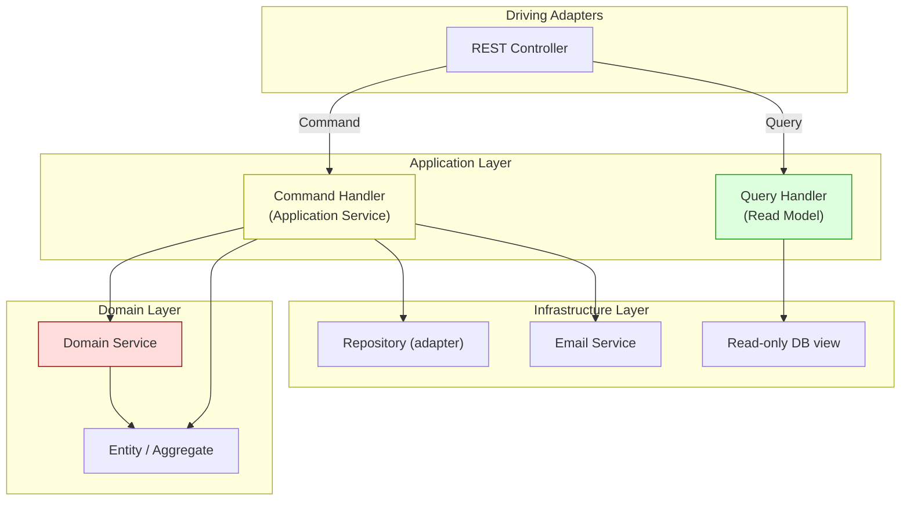
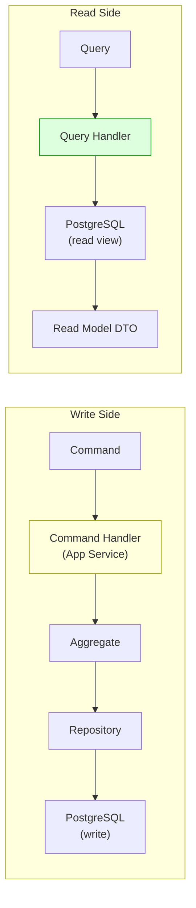

# Лекция 09. Сервисы: Application, Domain, Infrastructure и CQRS

> **Дисциплина:** Проектирование интернет-систем (ПИС)
> **Курс:** 3, Семестр: 6
> **Тема по учебной программе:** Тема 9 - Сервисы
> **ADR-диапазон:** ADR-017 - ADR-018

---

## Результаты обучения

После лекции студент сможет:

1. Различить три типа сервисов: **Application**, **Domain**, **Infrastructure**.
2. Реализовать **Application Service** как оркестратор use case (Command/Query).
3. Объяснить, когда бизнес-логика выносится в **Domain Service**, а когда остаётся в Entity.
4. Применить **CQRS** - разделить модели записи и чтения.
5. Описать роль **Infrastructure Service** и его отличие от адаптера.

---

## Пререквизиты

- UoW и Repository из **лекции 08** (`UnitOfWorkPort`, `RequestRepositoryPort`).
- Rich Domain Model из **лекции 07** (`Request`, `Group` с поведением).
- Гексагональная архитектура из **лекции 06** (driving/driven ports).

---

## 1. Введение: кто оркестрирует сценарий?

На лекции 07 мы наполнили домен поведением (`Request.assign_to_group`, `Group.add_member`). На лекции 08 научились сохранять агрегаты через Repository и Unit of Work. Но кто **координирует** эти шаги?

Пример use case «Назначить группу на заявку»:

1. Загрузить `Request` из репозитория.
2. Загрузить `Group` из другого репозитория.
3. Проверить доступность группы.
4. Вызвать `request.assign_to_group(group.id)`.
5. Сохранить `Request`.
6. Зафиксировать транзакцию.

Эта **оркестрация** - задача Application Service. Он **не содержит бизнес-логику**, а лишь вызывает доменные методы в правильном порядке.

> **[О3] Вернон:** «Сервисы приложения - тонкие. Они транслируют внешние запросы в вызовы доменных объектов.»

---

## 2. Основные понятия и терминология

**Определения:**

- **Application Service (Сервис приложения)** - координирует use case: загружает агрегаты, вызывает доменные методы, сохраняет результат, управляет транзакцией. Не содержит бизнес-логику.
- **Domain Service (Доменный сервис)** - содержит бизнес-логику, которая **не принадлежит одному агрегату**: например, проверка совместимости группы с типом заявки.
- **Infrastructure Service (Инфраструктурный сервис)** - реализует технические задачи: отправка email, генерация PDF, обращение к внешнему API.
- **Command** - запрос на изменение состояния (создать, обновить, удалить). Не возвращает данных.
- **Query** - запрос на чтение данных. Не изменяет состояние.
- **CQRS (Command Query Responsibility Segregation)** - разделение моделей записи и чтения [О4, Ричардсон].



---

## 3. Application Service: оркестратор use case

### Принципы

1. **Тонкий:** Application Service - «дирижёр», а не «солист». Вся бизнес-логика - в Entity / Domain Service.
2. **Один use case - один метод** (или один Command Handler).
3. **Управляет транзакцией** через Unit of Work.
4. **Не зависит от HTTP / gRPC** - принимает Command DTO, возвращает результат.

### Пример: ПСО «Юго-Запад» - Application Service

```python
# dispatch/application/commands.py - Commands (DTO)

from dataclasses import dataclass
from uuid import UUID

@dataclass(frozen=True)
class CreateRequestCommand:
    """Команда: создать новую заявку."""
    lat: float
    lon: float
    type: str
    priority: int

@dataclass(frozen=True)
class AssignGroupCommand:
    """Команда: назначить группу на заявку."""
    request_id: UUID
    group_id: UUID

@dataclass(frozen=True)
class EscalateRequestCommand:
    """Команда: повысить приоритет заявки."""
    request_id: UUID
```

```python
# dispatch/application/assign_group_handler.py - Application Service

from dispatch.application.commands import AssignGroupCommand
from dispatch.domain.ports.unit_of_work_port import UnitOfWorkPort
from dispatch.domain.services.group_availability_service import (
    GroupAvailabilityService,
)

class AssignGroupHandler:
    """Application Service: оркестрирует назначение группы на заявку."""

    def __init__(
        self,
        uow: UnitOfWorkPort,
        availability: GroupAvailabilityService,
    ) -> None:
        self._uow = uow
        self._availability = availability

    def handle(self, cmd: AssignGroupCommand) -> None:
        with self._uow as uow:
            # 1. Загрузить агрегат
            request = uow.requests.get_by_id(cmd.request_id)
            if request is None:
                raise ValueError(f"Request {cmd.request_id} not found")

            # 2. Проверить доступность (Domain Service)
            if not self._availability.is_group_available(cmd.group_id):
                raise ValueError(f"Group {cmd.group_id} is not available")

            # 3. Вызвать доменный метод (бизнес-логика - в Entity)
            request.assign_to_group(cmd.group_id)

            # 4. Сохранить
            uow.requests.save(request)
            uow.commit()
```

**Пояснение к примеру:**

- `AssignGroupHandler` - Application Service. Он **координирует** шаги, но не проверяет бизнес-правила.
- `request.assign_to_group(group_id)` - бизнес-логика в Entity (`Request`).
- `self._availability.is_group_available(group_id)` - бизнес-логика, которая не принадлежит одному агрегату → Domain Service.
- Транзакция: `with self._uow as uow:` + `uow.commit()`.

### Тест Application Service

```python
# tests/unit/test_assign_group_handler.py

from uuid import uuid4
from dispatch.domain.request import Request, RequestType, RequestStatus
from dispatch.application.commands import AssignGroupCommand
from dispatch.application.assign_group_handler import AssignGroupHandler
from dispatch.infrastructure.adapters.in_memory_unit_of_work import InMemoryUnitOfWork

class FakeAvailability:
    def __init__(self, available: bool = True) -> None:
        self._available = available

    def is_group_available(self, group_id) -> bool:
        return self._available

def test_assign_group_successfully():
    uow = InMemoryUnitOfWork()
    request = Request(type=RequestType.FIRE, priority=1)
    uow.requests.add(request)

    handler = AssignGroupHandler(uow=uow, availability=FakeAvailability(True))
    group_id = uuid4()

    handler.handle(AssignGroupCommand(request_id=request.id, group_id=group_id))

    updated = uow.requests.get_by_id(request.id)
    assert updated is not None
    assert updated.status == RequestStatus.ASSIGNED
    assert updated.assigned_group_id == group_id
    assert uow.committed is True

def test_assign_group_unavailable_raises_error():
    uow = InMemoryUnitOfWork()
    request = Request(type=RequestType.FIRE, priority=1)
    uow.requests.add(request)

    handler = AssignGroupHandler(uow=uow, availability=FakeAvailability(False))

    try:
        handler.handle(
            AssignGroupCommand(request_id=request.id, group_id=uuid4())
        )
        assert False, "Expected ValueError"
    except ValueError as e:
        assert "not available" in str(e)
```

---

## 4. Domain Service: бизнес-логика между агрегатами

### Когда нужен Domain Service

| Ситуация | Где логика |
| -------- | ---------- |
| Правило принадлежит одному агрегату | Entity / Aggregate Root |
| Правило использует данные нескольких агрегатов | **Domain Service** |
| Правило требует вычисления, не связанного с конкретным агрегатом | **Domain Service** |

### Пример: ПСО «Юго-Запад» - Domain Service

```python
# dispatch/domain/services/group_availability_service.py - Domain Service

from uuid import UUID
from dispatch.domain.ports.group_query_port import GroupQueryPort

class GroupAvailabilityService:
    """Domain Service: проверяет доступность группы для назначения.

    Эта логика не принадлежит ни Request, ни Group -
    она связывает два контекста (dispatch ↔ operations).
    """

    def __init__(self, group_query: GroupQueryPort) -> None:
        self._group_query = group_query

    def is_group_available(self, group_id: UUID) -> bool:
        """Группа доступна, если она существует, имеет лидера
        и не превышает допустимую нагрузку."""
        availability = self._group_query.get_availability(group_id)
        if availability is None:
            return False
        return availability.has_leader and availability.active_operations < 3
```

```python
# dispatch/domain/ports/group_query_port.py - Port (driven)

from abc import ABC, abstractmethod
from dataclasses import dataclass
from uuid import UUID

@dataclass(frozen=True)
class GroupAvailability:
    """VO: снимок доступности группы (из контекста operations)."""
    group_id: UUID
    has_leader: bool
    active_operations: int

class GroupQueryPort(ABC):
    """Порт: запрос данных о группе из контекста operations."""

    @abstractmethod
    def get_availability(self, group_id: UUID) -> GroupAvailability | None:
        ...
```

**Пояснение к примеру:**

- `GroupAvailabilityService` живёт в `dispatch/domain/services/` - это **доменный** сервис.
- Он зависит от `GroupQueryPort` (порт, не конкретная реализация).
- Правило «группа доступна, если есть лидер и менее 3 активных операций» - бизнес-правило, но не принадлежит ни `Request`, ни `Group`.

### Domain Service vs Application Service

| Критерий | Application Service | Domain Service |
| -------- | ------------------- | -------------- |
| Содержит бизнес-логику? | Нет | **Да** |
| Управляет транзакцией? | **Да** (через UoW) | Нет |
| Зависит от Repository? | Да (через UoW) | Нет (через порт) |
| Где живёт? | `application/` | `domain/services/` |
| Пример | `AssignGroupHandler` | `GroupAvailabilityService` |

---

## 5. Infrastructure Service: технические детали

### Когда нужен Infrastructure Service

Infrastructure Service реализует **технические задачи**, которые не относятся к бизнес-логике:

- Отправка email/SMS.
- Генерация PDF-отчёта.
- Вызов внешнего API (погода, геокодинг).
- Публикация сообщений в очередь.

### Пример: ПСО «Юго-Запад» - Infrastructure Service

```python
# dispatch/domain/ports/notification_port.py - Port

from abc import ABC, abstractmethod

class NotificationPort(ABC):
    """Порт: отправка уведомлений."""

    @abstractmethod
    def send(self, recipient: str, message: str) -> None:
        ...
```

```python
# dispatch/infrastructure/services/email_notification_service.py - Adapter

import smtplib
from dispatch.domain.ports.notification_port import NotificationPort

class EmailNotificationService(NotificationPort):
    """Infrastructure Service: отправка email через SMTP."""

    def __init__(self, smtp_host: str, smtp_port: int) -> None:
        self._host = smtp_host
        self._port = smtp_port

    def send(self, recipient: str, message: str) -> None:
        with smtplib.SMTP(self._host, self._port) as server:
            server.sendmail("noreply@pso-sw.by", recipient, message)
```

```python
# dispatch/infrastructure/services/fake_notification_service.py - Test double

from dispatch.domain.ports.notification_port import NotificationPort

class FakeNotificationService(NotificationPort):
    """Тестовая заглушка: запоминает отправленные уведомления."""

    def __init__(self) -> None:
        self.sent: list[tuple[str, str]] = []

    def send(self, recipient: str, message: str) -> None:
        self.sent.append((recipient, message))
```

**Пояснение к примеру:**

- `NotificationPort` - порт в `domain/`.
- `EmailNotificationService` - инфраструктурный сервис в `infrastructure/services/`.
- `FakeNotificationService` - тестовый дублёр, позволяет проверить, что уведомление было «отправлено».

---

## 6. CQRS: разделение команд и запросов

### Проблема

Одна модель используется и для записи (сложная валидация, переходы состояния), и для чтения (плоский список для UI). Это приводит к:

- Сложным запросам с JOIN через ORM.
- Медленным ответам: ORM загружает полный граф объектов.
- Компромиссам: модель «не оптимальна ни для чего».

### Решение: CQRS

**Command** (запись) и **Query** (чтение) - **разные модели**:

| Аспект | Write (Command) | Read (Query) |
| ------ | --------------- | ------------ |
| Модель | Rich Domain (Entity, Aggregate) | Flat DTO (read model) |
| Хранилище | Через Repository + UoW | Прямой SQL / View / отдельная таблица |
| Валидация | Полная (инварианты) | Нет (только фильтрация) |
| Пример | `AssignGroupHandler` | `RequestListQueryHandler` |



### Пример: ПСО «Юго-Запад» - Query side

```python
# dispatch/application/queries.py - Query DTOs

from dataclasses import dataclass
from uuid import UUID

@dataclass(frozen=True)
class GetRequestByIdQuery:
    request_id: UUID

@dataclass(frozen=True)
class ListNewRequestsQuery:
    limit: int = 50
```

```python
# dispatch/application/read_models.py - Read Model DTOs

from dataclasses import dataclass
from uuid import UUID
from datetime import datetime

@dataclass(frozen=True)
class RequestReadModel:
    """Плоский DTO для чтения: не Entity, без поведения."""
    id: UUID
    lat: float | None
    lon: float | None
    type: str
    priority: int
    status: str
    assigned_group_name: str | None
    created_at: datetime
```

```python
# dispatch/infrastructure/query_handlers/request_query_handler.py

from dispatch.application.queries import ListNewRequestsQuery
from dispatch.application.read_models import RequestReadModel

class RequestQueryHandler:
    """Query Handler: читает непосредственно из БД, минуя доменную модель."""

    def __init__(self, connection) -> None:
        self._conn = connection

    def list_new_requests(self, query: ListNewRequestsQuery) -> list[RequestReadModel]:
        with self._conn.cursor() as cur:
            cur.execute(
                """
                SELECT r.id, r.lat, r.lon, r.type, r.priority, r.status,
                       g.name AS group_name, r.created_at
                FROM requests r
                LEFT JOIN groups g ON g.id = r.assigned_group_id
                WHERE r.status = 'NEW'
                ORDER BY r.priority ASC, r.created_at ASC
                LIMIT %s
                """,
                (query.limit,),
            )
            rows = cur.fetchall()
            return [
                RequestReadModel(
                    id=row[0],
                    lat=row[1],
                    lon=row[2],
                    type=row[3],
                    priority=row[4],
                    status=row[5],
                    assigned_group_name=row[6],
                    created_at=row[7],
                )
                for row in rows
            ]
```

**Пояснение к примеру:**

- `RequestQueryHandler` живёт в `infrastructure/` - он использует SQL напрямую.
- Возвращает `RequestReadModel` - плоский DTO, не доменный объект.
- Не проходит через Repository / UoW - чтение не изменяет состояние.
- JOIN с `groups` - допустимо на read side (на write side - ссылка по ID).

---

## 7. Полная картина: слои и сервисы

### Структура проекта (dispatch-модуль)

```text
dispatch/
├── domain/
│   ├── request.py              # Entity (Aggregate Root)
│   ├── value_objects.py         # Coordinates, Priority, ZoneId
│   ├── ports/
│   │   ├── request_repository_port.py  # Repository Port
│   │   ├── group_query_port.py         # Inter-context query Port
│   │   ├── notification_port.py        # Notification Port
│   │   └── unit_of_work_port.py        # UoW Port
│   └── services/
│       └── group_availability_service.py  # Domain Service
├── application/
│   ├── commands.py              # Command DTOs
│   ├── queries.py               # Query DTOs
│   ├── read_models.py           # Read Model DTOs
│   ├── assign_group_handler.py  # Command Handler (App Service)
│   └── create_request_handler.py
├── infrastructure/
│   ├── adapters/
│   │   ├── postgres_request_repository.py
│   │   ├── in_memory_request_repository.py
│   │   ├── postgres_unit_of_work.py
│   │   └── in_memory_unit_of_work.py
│   ├── services/
│   │   ├── email_notification_service.py
│   │   └── fake_notification_service.py
│   └── query_handlers/
│       └── request_query_handler.py
└── config/
    └── dependency_injection.py   # Composition Root
```

---

## 8. ADR: закрепляем решения

### ADR-017: Application Services как единственные оркестраторы use cases

| Поле | Значение |
| ---- | -------- |
| **Контекст** | Use case «назначить группу» требует координации: загрузка агрегатов, вызов доменных методов, сохранение, транзакция. Нужен чёткий «дирижёр». |
| **Решение** | Каждый use case - отдельный Application Service (Command Handler). Принимает Command DTO, работает через UoW, не содержит бизнес-логику. Domain Service - для кросс-агрегатной бизнес-логики. |
| **Альтернативы** | (a) Логика в контроллере - нарушает SRP, не тестируется без HTTP. (b) Один «God Service» на весь контекст - нарушает SRP. |
| **Затрагиваемые характеристики** | Тестируемость ↑, Сопровождаемость ↑ |
| **Последствия** | Один класс = один use case. Может быть много файлов в `application/`. Тесты работают без HTTP. |
| **Проверка** | Тест: `AssignGroupHandler` с `InMemoryUnitOfWork` + `FakeAvailability`. |

### ADR-018: CQRS для разделения записи и чтения

| Поле | Значение |
| ---- | -------- |
| **Контекст** | UI требует плоские списки с JOIN (заявки + имя группы). Доменная модель оптимизирована для записи (инварианты, переходы). Чтение через ORM - неэффективно. |
| **Решение** | Write side: Command → Command Handler → Domain Model → Repository → DB. Read side: Query → Query Handler → прямой SQL → Read Model DTO. |
| **Альтернативы** | (a) Единая модель для чтения/записи - компромисс, медленные отчёты. (b) Полная CQRS с отдельной read DB - преждевременная оптимизация для текущего масштаба. |
| **Затрагиваемые характеристики** | Производительность чтения ↑, Сложность ↑ (два пути данных) |
| **Последствия** | Query handlers - в `infrastructure/query_handlers/`. Read models - плоские DTO в `application/read_models.py`. При изменении схемы БД - обновить и write adapter, и query handler. |
| **Проверка** | Performance-тест: query handler отвечает < 50ms на 1000 записей. Тест: command handler и query handler работают независимо. |

---

## Типичные ошибки и антипаттерны

| № | Ошибка | Как исправить |
| - | ------ | ------------- |
| 1 | Бизнес-логика в Application Service | Перенести в Entity или Domain Service |
| 2 | Domain Service управляет транзакцией | Транзакция - только в Application Service (через UoW) |
| 3 | Один «God Service» на весь контекст | Один класс = один use case |
| 4 | Query через ORM с lazy loading | Query Handler с прямым SQL для read side |
| 5 | Application Service зависит от HTTP | Принимает Command DTO, а не `HttpRequest` |
| 6 | Нет отдельных Read Model DTO | `RequestReadModel` - плоский DTO для UI |
| 7 | Infrastructure Service без порта | Порт в `domain/`, реализация в `infrastructure/` |
| 8 | Domain Service с зависимостью от БД | Domain Service зависит только от портов |

---

## Вопросы для самопроверки

1. Чем Application Service отличается от Domain Service? Приведите примеры из ПСО «Юго-Запад».
2. Почему Application Service **не** содержит бизнес-логику?
3. Что такое Command? Чем он отличается от Query?
4. Объясните CQRS. Почему write side и read side используют разные модели?
5. Когда бизнес-логика выносится в Domain Service, а когда остаётся в Entity?
6. Как тестировать Application Service без БД и HTTP?
7. Где живёт Query Handler? Почему он в `infrastructure/`, а не в `application/`?
8. Что такое Read Model DTO? Чем отличается от Entity?
9. Как Infrastructure Service (email) подключается через Composition Root?
10. Почему «один класс = один use case» - хорошая практика?
11. Как Domain Service `GroupAvailabilityService` взаимодействует с другим Bounded Context?
12. Что произойдёт, если Application Service не вызовет `uow.commit()`?
13. Приведите пример Infrastructure Service из ПСО «Юго-Запад».
14. Как CQRS связана с eventual consistency и доменными событиями (лекция 10)?

---

## Глоссарий

| Термин | Определение |
| ------ | ----------- |
| **Application Service** | Тонкий оркестратор use case, не содержит бизнес-логику |
| **Domain Service** | Бизнес-логика, не принадлежащая одному агрегату |
| **Infrastructure Service** | Техническая реализация (email, PDF, внешний API) |
| **Command** | Запрос на изменение состояния |
| **Query** | Запрос на чтение данных |
| **CQRS** | Разделение моделей записи и чтения |
| **Command Handler** | Application Service, обрабатывающий Command |
| **Query Handler** | Обработчик запроса, читает из БД напрямую |
| **Read Model** | Плоский DTO для чтения, без поведения |

---

## Связь с литературной основой курса

- **Характеристики:** Тестируемость (Application Service без HTTP/DB), Производительность (CQRS - read side оптимизирован), Сопровождаемость (один use case = один файл).
- **Артефакт:** ADR-017 (Application Services), ADR-018 (CQRS). Файлы: `commands.py`, `queries.py`, `read_models.py`, `assign_group_handler.py`, `request_query_handler.py`, `group_availability_service.py`.
- **Проверка:** Unit-тесты Application Service с InMemoryUnitOfWork + Fake doubles. Performance-тест query handler.

---

## Список литературы

### Основная

1. **[О3]** Вернон, В. Реализация методов предметно-ориентированного проектирования. - М.: И.Д. Вильямс, 2016. - 688 с. - Разделы: Application Services, Domain Services.
2. **[О4]** Ричардсон, К. Микросервисы. Паттерны разработки и рефакторинга. - СПб.: Питер, 2019. - 544 с. - Разделы: CQRS.
3. **[О5]** Buenosvinos, C. et al. Domain-Driven Design in PHP. - Packt, 2017. - Разделы: Application Services, CQRS.

### Дополнительная

1. **[Д1]** Вернон, В. Предметно-ориентированное проектирование: самое основное. - СПб.: Диалектика, 2019. - 160 с.
2. **[О2]** Мартин, Р. Чистая архитектура. - СПб.: Питер, 2018. - 352 с. - Разделы: Use Cases как центр приложения.
3. **[О1]** Фаулер, М. Шаблоны корпоративных приложений. - М.: И.Д. Вильямс, 2016. - 544 с. - Разделы: Service Layer, Unit of Work.
