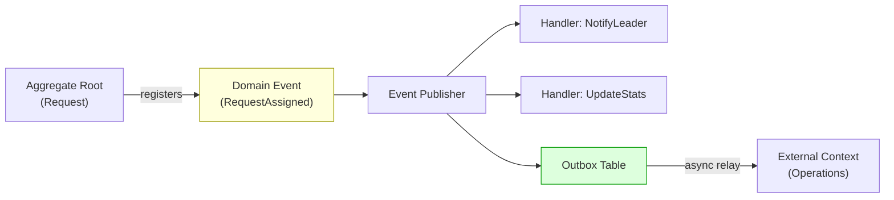
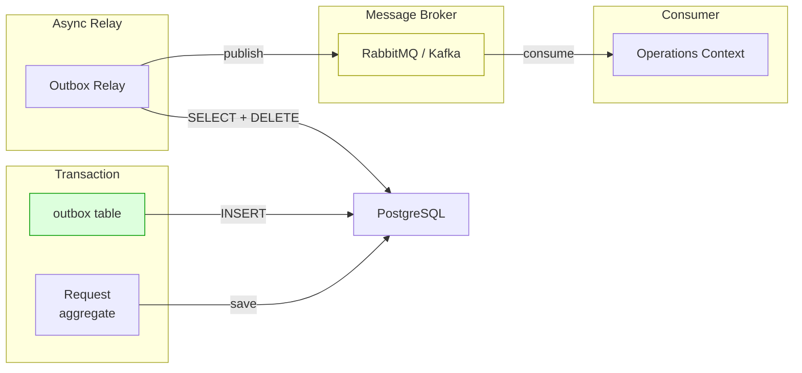

# Лекция 10. Доменные события и порождение событий

> **Дисциплина:** Проектирование интернет-систем (ПИС)
> **Курс:** 3, Семестр: 6
> **Тема по учебной программе:** Тема 10 - Доменные события и порождение событий
> **ADR-диапазон:** ADR-019 - ADR-020

---

## Результаты обучения

После лекции студент сможет:

1. Определить **доменное событие** и объяснить, чем оно отличается от технического события.
2. Реализовать паттерн **публикация/подписка** для доменных событий в рамках одного процесса.
3. Объяснить роль **Outbox-паттерна** для надёжной доставки событий между контекстами.
4. Описать основы **Event Sourcing** и его отличие от классического CRUD.
5. Применить доменные события для **eventual consistency** между агрегатами.

---

## Пререквизиты

- Application Service и UoW из **лекции 08–09** (транзакция = одна единица работы).
- Агрегаты и правило «один агрегат - одна транзакция» из **лекции 07**.
- Bounded Contexts и карта контекстов из **лекции 05** (ACL, OHS).

---

## 1. Введение: зачем нужны доменные события

На лекции 07 мы установили правило: **один агрегат - одна транзакция**. Но бизнес-процесс часто затрагивает несколько агрегатов или даже контекстов:

- Заявка назначена на группу → нужно уведомить лидера группы.
- Группа сформирована → нужно обновить статистику зоны.
- Заявка закрыта → нужно создать запись в отчёте.

Как координировать эти шаги **без нарушения границ транзакции**? Ответ: **доменные события**.

> **[О3] Вернон:** «Доменное событие - это что-то, что произошло в домене и что представляет интерес для других частей системы.»

---

## 2. Основные понятия и терминология

**Определения:**

- **Доменное событие (Domain Event)** - объект, описывающий факт, который **уже произошёл** в домене. Неизменяемый, в прошедшем времени (`RequestAssigned`, не `AssignRequest`).
- **Публикатор (Publisher)** - компонент, который рассылает события подписчикам.
- **Подписчик (Subscriber / Handler)** - компонент, который реагирует на событие.
- **Outbox** - таблица-очередь: событие сохраняется в той же транзакции, что и агрегат, а затем асинхронно доставляется потребителям.
- **Inbox** - таблица-приёмник на стороне подписчика для идемпотентной обработки.
- **Event Sourcing** - модель хранения: вместо текущего состояния сохраняется **последовательность событий**.
- **Eventual Consistency** - согласованность «со временем»: после события подписчик обновит своё состояние, но не мгновенно.



---

## 3. Доменное событие: модель и конвенции

### Конвенции именования

- **Имя:** прошедшее время + описание факта: `RequestCreated`, `GroupAssigned`, `RequestEscalated`.
- **Поля:** только данные, необходимые подписчику. Не весь агрегат.
- **Неизменяемость:** `frozen=True` (dataclass).
- **Идентификатор:** `event_id: UUID` - для идемпотентности.

### Пример: ПСО «Юго-Запад» - доменные события

```python
# dispatch/domain/events.py - Domain Events

from __future__ import annotations
from dataclasses import dataclass, field
from datetime import datetime, timezone
from uuid import UUID, uuid4

@dataclass(frozen=True)
class DomainEvent:
    """Базовый класс доменного события."""
    event_id: UUID = field(default_factory=uuid4)
    occurred_at: datetime = field(
        default_factory=lambda: datetime.now(timezone.utc)
    )

@dataclass(frozen=True)
class RequestCreated(DomainEvent):
    """Факт: создана новая заявка."""
    request_id: UUID = field(default_factory=uuid4)
    request_type: str = ""
    priority: int = 3

@dataclass(frozen=True)
class RequestAssigned(DomainEvent):
    """Факт: заявка назначена на группу."""
    request_id: UUID = field(default_factory=uuid4)
    group_id: UUID = field(default_factory=uuid4)

@dataclass(frozen=True)
class RequestClosed(DomainEvent):
    """Факт: заявка закрыта."""
    request_id: UUID = field(default_factory=uuid4)

@dataclass(frozen=True)
class RequestEscalated(DomainEvent):
    """Факт: приоритет заявки повышен."""
    request_id: UUID = field(default_factory=uuid4)
    new_priority: int = 1
```

**Пояснение к примеру:**

- `DomainEvent` - базовый класс с `event_id` (для идемпотентности) и `occurred_at` (для хронологии).
- Каждое событие содержит **минимум данных** - только то, что нужно подписчикам.
- `frozen=True` - события неизменяемы: факт нельзя «отредактировать».

---

## 4. Регистрация событий в агрегате

### Подход: агрегат собирает события

Агрегат **регистрирует** события при изменении состояния. Application Service **извлекает** их после операции и публикует.

```python
# dispatch/domain/request.py - Aggregate Root с событиями

from __future__ import annotations
from dataclasses import dataclass, field
from uuid import UUID, uuid4
from datetime import datetime, timezone
from enum import Enum
from dispatch.domain.events import (
    DomainEvent,
    RequestCreated,
    RequestAssigned,
    RequestClosed,
    RequestEscalated,
)

class RequestType(Enum):
    FIRE = "FIRE"
    FLOOD = "FLOOD"
    SEARCH = "SEARCH"
    MEDICAL = "MEDICAL"

class RequestStatus(Enum):
    NEW = "NEW"
    ASSIGNED = "ASSIGNED"
    IN_PROGRESS = "IN_PROGRESS"
    CLOSED = "CLOSED"

@dataclass
class Request:
    """Aggregate Root: регистрирует доменные события."""

    id: UUID = field(default_factory=uuid4)
    type: RequestType = RequestType.SEARCH
    priority: int = 3
    status: RequestStatus = RequestStatus.NEW
    assigned_group_id: UUID | None = None
    created_at: datetime = field(default_factory=lambda: datetime.now(timezone.utc))
    _events: list[DomainEvent] = field(default_factory=list, repr=False)

    def __post_init__(self) -> None:
        if not (1 <= self.priority <= 5):
            raise ValueError(f"Priority must be 1-5, got {self.priority}")

    # --- Сбор событий ---
    @property
    def events(self) -> list[DomainEvent]:
        """Список зарегистрированных событий (read-only)."""
        return list(self._events)

    def clear_events(self) -> None:
        """Очистить события после публикации."""
        self._events.clear()

    def _register(self, event: DomainEvent) -> None:
        self._events.append(event)

    # --- Фабричный метод ---
    @classmethod
    def create(
        cls, type: RequestType, priority: int
    ) -> Request:
        """Создать заявку и зарегистрировать событие RequestCreated."""
        request = cls(type=type, priority=priority)
        request._register(
            RequestCreated(
                request_id=request.id,
                request_type=type.value,
                priority=priority,
            )
        )
        return request

    # --- Поведение ---
    def assign_to_group(self, group_id: UUID) -> None:
        if self.status == RequestStatus.CLOSED:
            raise InvalidStateError("Cannot assign a closed request")
        self.assigned_group_id = group_id
        self.status = RequestStatus.ASSIGNED
        self._register(RequestAssigned(request_id=self.id, group_id=group_id))

    def close(self) -> None:
        if self.status == RequestStatus.CLOSED:
            raise InvalidStateError("Already closed")
        self.status = RequestStatus.CLOSED
        self._register(RequestClosed(request_id=self.id))

    def escalate(self) -> None:
        if self.priority > 1:
            self.priority -= 1
            self._register(
                RequestEscalated(request_id=self.id, new_priority=self.priority)
            )

    def __eq__(self, other: object) -> bool:
        return isinstance(other, Request) and self.id == other.id

    def __hash__(self) -> int:
        return hash(self.id)

class InvalidStateError(Exception):
    pass
```

**Пояснение к примеру:**

- `_events: list[DomainEvent]` - внутренний список зарегистрированных событий.
- `_register()` - добавляет событие после каждого значимого изменения.
- `clear_events()` - вызывается **после публикации** (чтобы не публиковать дважды).
- Фабричный метод `create()` - регистрирует `RequestCreated` при создании.

---

## 5. Публикация событий: в Application Service

### Простой Event Publisher

```python
# dispatch/domain/ports/event_publisher_port.py - Port

from abc import ABC, abstractmethod
from dispatch.domain.events import DomainEvent

class EventPublisherPort(ABC):
    """Порт: публикация доменных событий."""

    @abstractmethod
    def publish(self, events: list[DomainEvent]) -> None:
        ...
```

```python
# dispatch/infrastructure/adapters/in_process_event_publisher.py - Adapter

from typing import Callable
from dispatch.domain.events import DomainEvent
from dispatch.domain.ports.event_publisher_port import EventPublisherPort

class InProcessEventPublisher(EventPublisherPort):
    """Адаптер: публикация событий внутри процесса (синхронно)."""

    def __init__(self) -> None:
        self._handlers: dict[type, list[Callable]] = {}

    def subscribe(self, event_type: type, handler: Callable) -> None:
        self._handlers.setdefault(event_type, []).append(handler)

    def publish(self, events: list[DomainEvent]) -> None:
        for event in events:
            for handler in self._handlers.get(type(event), []):
                handler(event)
```

### Application Service с публикацией

```python
# dispatch/application/create_request_handler.py

from dispatch.application.commands import CreateRequestCommand
from dispatch.domain.request import Request, RequestType
from dispatch.domain.ports.unit_of_work_port import UnitOfWorkPort
from dispatch.domain.ports.event_publisher_port import EventPublisherPort

class CreateRequestHandler:
    """Application Service: создать заявку и опубликовать события."""

    def __init__(self, uow: UnitOfWorkPort, publisher: EventPublisherPort) -> None:
        self._uow = uow
        self._publisher = publisher

    def handle(self, cmd: CreateRequestCommand) -> str:
        with self._uow as uow:
            # 1. Создать агрегат (фабричный метод регистрирует событие)
            request = Request.create(
                type=RequestType(cmd.type),
                priority=cmd.priority,
            )

            # 2. Сохранить
            uow.requests.add(request)
            uow.commit()

            # 3. Опубликовать события
            self._publisher.publish(request.events)
            request.clear_events()

            return str(request.id)
```

**Пояснение к примеру:**

- События публикуются **после commit** - гарантируем, что агрегат сохранён.
- `request.clear_events()` - очищаем, чтобы избежать повторной публикации.

---

## 6. Обработчики событий (Subscribers)

### Пример: ПСО «Юго-Запад» - обработчики

```python
# dispatch/application/event_handlers.py - Subscribers

from dispatch.domain.events import RequestAssigned, RequestCreated
from dispatch.domain.ports.notification_port import NotificationPort

class NotifyLeaderOnAssignment:
    """Подписчик: уведомить лидера группы при назначении заявки."""

    def __init__(self, notification: NotificationPort) -> None:
        self._notification = notification

    def __call__(self, event: RequestAssigned) -> None:
        self._notification.send(
            recipient=f"leader-{event.group_id}@pso-sw.by",
            message=f"Заявка {event.request_id} назначена на вашу группу.",
        )

class LogRequestCreation:
    """Подписчик: записать лог при создании заявки."""

    def __call__(self, event: RequestCreated) -> None:
        print(
            f"[LOG] Request created: id={event.request_id}, "
            f"type={event.request_type}, priority={event.priority}"
        )
```

### Регистрация подписчиков в Composition Root

```python
# dispatch/config/dependency_injection.py - фрагмент

from dispatch.infrastructure.adapters.in_process_event_publisher import (
    InProcessEventPublisher,
)
from dispatch.application.event_handlers import (
    NotifyLeaderOnAssignment,
    LogRequestCreation,
)
from dispatch.domain.events import RequestAssigned, RequestCreated

def build_event_publisher(notification_port) -> InProcessEventPublisher:
    publisher = InProcessEventPublisher()
    publisher.subscribe(RequestAssigned, NotifyLeaderOnAssignment(notification_port))
    publisher.subscribe(RequestCreated, LogRequestCreation())
    return publisher
```

---

## 7. Outbox: надёжная доставка между контекстами

### Проблема

`InProcessEventPublisher` работает **внутри одного процесса**. Но что, если подписчик - в другом Bounded Context (отдельный сервис)?

Два риска:

1. **Потеря события:** commit прошёл, но сообщение в очередь не отправлено (сбой сети).
2. **Дублирование:** сообщение отправлено, но commit не прошёл.

### Outbox-паттерн [О4]

Решение: сохранять событие в **ту же транзакцию**, что и агрегат. Отдельный процесс (relay) читает Outbox и отправляет в очередь.



### Пример: Outbox-таблица

```python
# SQL: миграция для outbox
"""
CREATE TABLE outbox (
    id          UUID PRIMARY KEY DEFAULT gen_random_uuid(),
    event_type  VARCHAR(100) NOT NULL,
    payload     JSONB NOT NULL,
    created_at  TIMESTAMPTZ NOT NULL DEFAULT now(),
    published   BOOLEAN NOT NULL DEFAULT FALSE
);
"""
```

```python
# dispatch/infrastructure/adapters/outbox_event_publisher.py

import json
from uuid import UUID
from dispatch.domain.events import DomainEvent
from dispatch.domain.ports.event_publisher_port import EventPublisherPort

class OutboxEventPublisher(EventPublisherPort):
    """Адаптер: записывает события в outbox-таблицу (та же транзакция)."""

    def __init__(self, connection) -> None:
        self._conn = connection

    def publish(self, events: list[DomainEvent]) -> None:
        with self._conn.cursor() as cur:
            for event in events:
                cur.execute(
                    """
                    INSERT INTO outbox (event_type, payload)
                    VALUES (%s, %s)
                    """,
                    (
                        type(event).__name__,
                        json.dumps(self._serialize(event)),
                    ),
                )

    def _serialize(self, event: DomainEvent) -> dict:
        from dataclasses import asdict
        data = asdict(event)
        # UUID → str для JSON
        for key, value in data.items():
            if isinstance(value, UUID):
                data[key] = str(value)
        return data
```

**Пояснение к примеру:**

- `outbox` таблица: `event_type`, `payload` (JSON), `published` (флаг).
- `OutboxEventPublisher` использует **ту же connection**, что и UoW → одна транзакция.
- Relay-процесс (cron / background worker) периодически читает `published = FALSE`, отправляет в очередь, помечает `published = TRUE`.

---

## 8. Event Sourcing: обзор

### Идея

Вместо хранения **текущего состояния** (`UPDATE requests SET status = 'CLOSED'`) сохраняем **последовательность событий**:

```text
1. RequestCreated(id=abc, type=FIRE, priority=1)
2. RequestAssigned(id=abc, group_id=xyz)
3. RequestEscalated(id=abc, new_priority=1)  - нет, уже 1
4. RequestClosed(id=abc)
```

Текущее состояние **вычисляется** путём «проигрывания» всех событий.

### Плюсы и минусы

| Плюс | Минус |
| ---- | ----- |
| Полная история изменений | Сложность реализации |
| Аудит из коробки | Запросы: нужны проекции (CQRS) |
| Можно «перемотать» состояние | Миграция событий (versioning) |
| Идеальная совместимость с CQRS | Порог входа для команды |

### Когда применять Event Sourcing

- Аудит и compliance обязательны (финансы, медицина).
- Нужна история всех изменений.
- Доменные события - ключевая часть бизнес-логики.

**В ПСО «Юго-Запад»** Event Sourcing - обзорная тема. Мы используем **доменные события + Outbox** без полного ES.

---

## 9. Тестирование доменных событий

```python
# tests/unit/test_request_events.py

from uuid import uuid4
from dispatch.domain.request import Request, RequestType
from dispatch.domain.events import RequestCreated, RequestAssigned, RequestClosed

def test_create_registers_event():
    request = Request.create(type=RequestType.FIRE, priority=1)
    events = request.events

    assert len(events) == 1
    assert isinstance(events[0], RequestCreated)
    assert events[0].request_id == request.id
    assert events[0].request_type == "FIRE"

def test_assign_registers_event():
    request = Request.create(type=RequestType.FLOOD, priority=2)
    request.clear_events()  # очистить RequestCreated

    group_id = uuid4()
    request.assign_to_group(group_id)

    events = request.events
    assert len(events) == 1
    assert isinstance(events[0], RequestAssigned)
    assert events[0].group_id == group_id

def test_close_registers_event():
    request = Request.create(type=RequestType.SEARCH, priority=3)
    request.assign_to_group(uuid4())
    request.clear_events()

    request.close()

    events = request.events
    assert len(events) == 1
    assert isinstance(events[0], RequestClosed)

def test_clear_events():
    request = Request.create(type=RequestType.FIRE, priority=1)
    assert len(request.events) == 1

    request.clear_events()
    assert len(request.events) == 0
```

---

## 10. ADR: закрепляем решения

### ADR-019: Доменные события для eventual consistency между агрегатами

| Поле | Значение |
| ---- | -------- |
| **Контекст** | Бизнес-процесс «назначение группы» затрагивает два контекста (dispatch и operations). Правило «один агрегат - одна транзакция» запрещает обновлять оба в одной транзакции. |
| **Решение** | Агрегат регистрирует доменные события (`_register()`). Application Service публикует их после commit. Подписчики реагируют асинхронно. Согласованность - eventual. |
| **Альтернативы** | (a) Двухфазный коммит (2PC) - сложен, медленный. (b) Синхронный вызов между контекстами - нарушает автономность. |
| **Затрагиваемые характеристики** | Автономность ↑, Масштабируемость ↑, Сложность ↑ |
| **Последствия** | Подписчики должны быть идемпотентными (event_id). UI может показывать «устаревшее» состояние на короткое время. |
| **Проверка** | Тест: `request.events` содержит ожидаемые события. Integration-тест: подписчик вызывается после публикации. |

### ADR-020: Outbox-паттерн для надёжной доставки событий

| Поле | Значение |
| ---- | -------- |
| **Контекст** | При публикации событий во внешнюю очередь (RabbitMQ) возможна потеря: commit прошёл, но publish - нет. |
| **Решение** | Событие записывается в таблицу `outbox` в той же транзакции, что и агрегат. Relay-процесс асинхронно отправляет события в очередь. |
| **Альтернативы** | (a) Publish перед commit - можно потерять при rollback. (b) Change Data Capture (Debezium) - мощнее, но сложнее в эксплуатации. |
| **Затрагиваемые характеристики** | Надёжность ↑, Consistency ↑ |
| **Последствия** | Нужен relay-процесс и мониторинг outbox. Событие может быть доставлено **at-least-once** → подписчик должен быть идемпотентным. |
| **Проверка** | Тест: после commit строка появляется в outbox. Тест: relay помечает `published = TRUE` после успешной отправки. |

---

## Типичные ошибки и антипаттерны

| № | Ошибка | Как исправить |
| - | ------ | ------------- |
| 1 | Событие мутабельное | `frozen=True` для всех DomainEvent |
| 2 | Событие в настоящем времени (`AssignRequest`) | Прошедшее время: `RequestAssigned` |
| 3 | Публикация до commit | Публикация **после** commit |
| 4 | Всё состояние агрегата в событии | Минимум данных: только ID + необходимые поля |
| 5 | Подписчик не идемпотентен | Проверка `event_id` (Inbox) |
| 6 | Синхронный вызов между контекстами | Асинхронная доставка через события |
| 7 | Нет outbox при межконтекстной доставке | Outbox-паттерн |
| 8 | Event Sourcing «потому что модно» | ES - для конкретных требований (аудит, история) |

---

## Вопросы для самопроверки

1. Что такое доменное событие? Чем отличается от команды?
2. Почему доменные события именуются в прошедшем времени?
3. Как агрегат регистрирует события? Покажите на примере `Request`.
4. Когда Application Service публикует события - до или после commit? Почему?
5. Что такое Outbox-паттерн? Какую проблему он решает?
6. Что такое eventual consistency? Почему это приемлемо для ПСО «Юго-Запад»?
7. Что такое Event Sourcing? Чем отличается от «события + CRUD»?
8. Когда стоит применять Event Sourcing, а когда - нет?
9. Как обеспечить идемпотентность подписчика?
10. Что такое relay-процесс в Outbox?
11. Как тестировать, что агрегат зарегистрировал правильные события?
12. Чем `InProcessEventPublisher` отличается от `OutboxEventPublisher`?
13. Как связаны доменные события и правило «один агрегат - одна транзакция»?
14. Назовите 3 события из ПСО «Юго-Запад» и их подписчиков.

---

## Глоссарий

| Термин | Определение |
| ------ | ----------- |
| **Domain Event** | Факт, произошедший в домене (прошедшее время, immutable) |
| **Publisher** | Компонент, рассылающий события подписчикам |
| **Subscriber** | Обработчик, реагирующий на событие |
| **Outbox** | Таблица-очередь для надёжной доставки событий |
| **Inbox** | Таблица-приёмник для идемпотентной обработки |
| **Event Sourcing** | Хранение последовательности событий вместо текущего состояния |
| **Eventual Consistency** | Согласованность «со временем» между агрегатами/контекстами |
| **Relay** | Фоновый процесс, пересылающий события из Outbox в очередь |
| **At-least-once delivery** | Гарантия: событие доставлено хотя бы один раз |

---

## Связь с литературной основой курса

- **Характеристики:** Надёжность (Outbox), Масштабируемость (event-driven decoupling), Автономность контекстов (eventual consistency), Аудит (Event Sourcing).
- **Артефакт:** ADR-019 (доменные события для eventual consistency), ADR-020 (Outbox-паттерн). Файлы: `events.py`, `event_publisher_port.py`, `in_process_event_publisher.py`, `outbox_event_publisher.py`, `event_handlers.py`.
- **Проверка:** Unit-тесты: `request.events` содержит ожидаемые события. Integration-тест: подписчик вызывается. Outbox-тест: строка в таблице после commit.

---

## Список литературы

### Основная

1. **[О3]** Вернон, В. Реализация методов предметно-ориентированного проектирования. - М.: И.Д. Вильямс, 2016. - 688 с. - Разделы: Domain Events, Event-Driven.
2. **[О4]** Ричардсон, К. Микросервисы. Паттерны разработки и рефакторинга. - СПб.: Питер, 2019. - 544 с. - Разделы: Transactional Outbox, Event Sourcing.
3. **[О5]** Buenosvinos, C. et al. Domain-Driven Design in PHP. - Packt, 2017. - Разделы: Domain Events.

### Дополнительная

1. **[Д1]** Вернон, В. Предметно-ориентированное проектирование: самое основное. - СПб.: Диалектика, 2019. - 160 с.
2. **[О2]** Мартин, Р. Чистая архитектура. - СПб.: Питер, 2018. - 352 с. - Разделы: границы и событийная архитектура.
