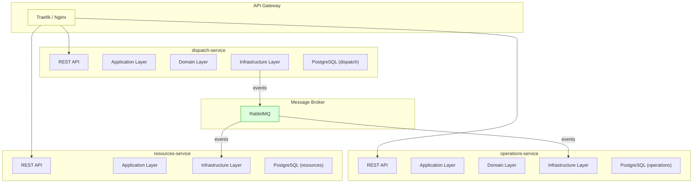
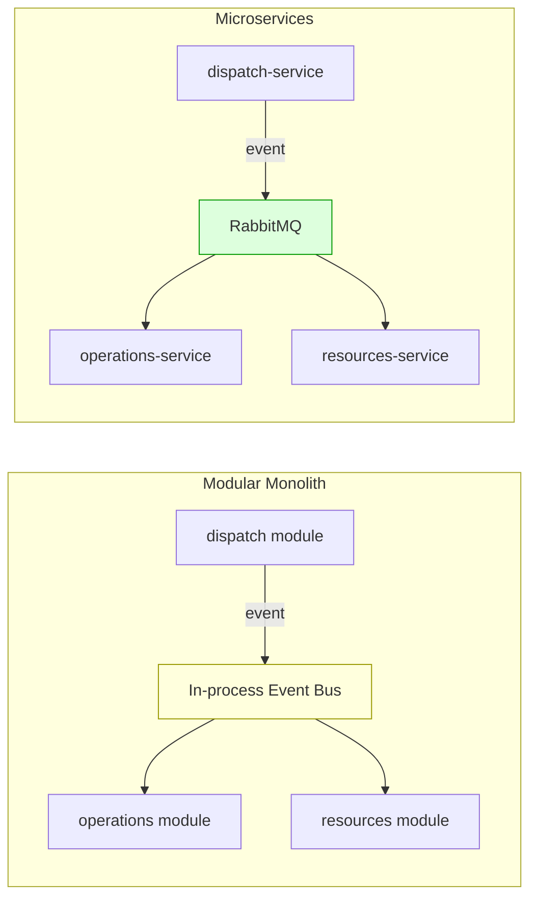

# Лекция 11. Микросервисная архитектура: декомпозиция, API, версионирование

> **Дисциплина:** Проектирование интернет-систем (ПИС)
> **Курс:** 3, Семестр: 6
> **Тема по учебной программе:** Тема 11 - Микросервисная архитектура
> **ADR-диапазон:** ADR-021 - ADR-022

---

## Результаты обучения

После лекции студент сможет:

1. Дать определение микросервисной архитектуры и назвать её ключевые свойства.
2. Применить **стратегии декомпозиции** (по поддоменам, по Bounded Contexts).
3. Определить **API и границы сервиса**: что выставлять наружу, а что скрывать.
4. Объяснить **версионирование контрактов** и стратегии обратной совместимости.
5. Сравнить монолит и микросервисы, обосновать выбор для конкретного контекста.

---

## Пререквизиты

- Bounded Contexts и карта контекстов из **лекции 05** (dispatch, operations, resources).
- Доменные события и Outbox из **лекции 10** (межконтекстная коммуникация).
- Гексагональная архитектура из **лекции 06** (порты и адаптеры).

---

## 1. Введение: от модулей к сервисам

В лекциях 05–10 мы проектировали систему ПСО «Юго-Запад» как **модульный монолит**: три Bounded Context (`dispatch`, `operations`, `resources`) живут в одном процессе, общаются через порты и события. Теперь - следующий шаг: **микросервисы**.

Микросервисы - это не цель, а **инструмент**. Решение о декомпозиции должно быть обосновано характеристиками (масштабируемость, независимость развёртывания, автономность команд).

> **[О4] Ричардсон:** «Микросервисная архитектура структурирует приложение как набор слабо связанных сервисов, каждый из которых реализует конкретную бизнес-способность.»

---

## 2. Основные понятия и терминология

**Определения:**

- **Микросервис** - небольшой автономный сервис, реализующий одну бизнес-способность, развёртываемый независимо.
- **Бизнес-способность (Business Capability)** - то, что организация **делает** (например, «управление заявками», «управление группами»).
- **Декомпозиция** - разделение системы на сервисы по определённому критерию.
- **API Gateway** - единая точка входа для клиентов; маршрутизирует запросы к нужным сервисам [О4].
- **Контракт (Contract)** - соглашение между сервисами о формате запросов/ответов.
- **Обратная совместимость (Backward Compatibility)** - новая версия API не ломает существующих потребителей.
- **Модульный монолит** - монолит с чёткими границами модулей (промежуточный шаг к микросервисам).

---

## 3. Стратегии декомпозиции

### 3.1. По поддоменам (Subdomain Decomposition)

Каждый поддомен (лекция 05) → отдельный сервис:

| Поддомен | Тип | Сервис |
| -------- | --- | ------ |
| Dispatch (диспетчеризация) | Core | `dispatch-service` |
| Operations (управление операциями) | Core | `operations-service` |
| Resources (управление ресурсами) | Supporting | `resources-service` |
| Identity (аутентификация) | Generic | Keycloak (готовое решение) |

### 3.2. По Bounded Contexts

Bounded Context = сервис. Это **рекомендуемый** подход для DDD-систем [О4]:



### 3.3. Правила декомпозиции

| Правило | Пояснение |
| ------- | --------- |
| **Один сервис = один Bounded Context** | Не делить BC на несколько сервисов |
| **Своя БД у каждого сервиса** | Database per service - нет общих таблиц |
| **Взаимодействие через API / события** | Не через общую БД |
| **Независимое развёртывание** | Деплой одного сервиса не требует деплоя других |
| **Автономная команда** | Одна команда может развивать сервис без координации |

---

## 4. API и границы сервиса

### 4.1. Что выставлять наружу

Сервис **выставляет только необходимые операции**. Внутренняя структура (Entity, Repository, события) скрыта.

```python
# dispatch-service: REST API (driving adapter) - FastAPI

from fastapi import FastAPI, HTTPException
from pydantic import BaseModel
from uuid import UUID

app = FastAPI(title="Dispatch Service", version="1.0.0")

class CreateRequestDTO(BaseModel):
    lat: float
    lon: float
    type: str
    priority: int

class RequestResponseDTO(BaseModel):
    id: UUID
    type: str
    priority: int
    status: str

@app.post("/api/v1/requests", response_model=RequestResponseDTO, status_code=201)
def create_request(dto: CreateRequestDTO):
    """Создать новую заявку."""
    # Делегируем в Application Service (Command Handler)
    from dispatch.config.dependency_injection import get_create_request_handler
    handler = get_create_request_handler()
    request_id = handler.handle(
        CreateRequestCommand(
            lat=dto.lat, lon=dto.lon, type=dto.type, priority=dto.priority
        )
    )
    return RequestResponseDTO(
        id=request_id, type=dto.type, priority=dto.priority, status="NEW"
    )

@app.get("/api/v1/requests/{request_id}", response_model=RequestResponseDTO)
def get_request(request_id: UUID):
    """Получить заявку по ID."""
    from dispatch.config.dependency_injection import get_request_query_handler
    handler = get_request_query_handler()
    result = handler.get_by_id(request_id)
    if result is None:
        raise HTTPException(status_code=404, detail="Request not found")
    return result
```

### 4.2. Контракт между сервисами

Dispatch-service нуждается в данных о группе из operations-service. **Контракт** - то, о чём договорились:

```python
# Контракт: operations-service предоставляет endpoint
# GET /api/v1/groups/{group_id}/availability
# Response: { "group_id": UUID, "has_leader": bool, "active_operations": int }
```

```python
# dispatch-service: адаптер для вызова operations-service

import httpx
from uuid import UUID
from dispatch.domain.ports.group_query_port import GroupQueryPort, GroupAvailability

class HttpGroupQueryAdapter(GroupQueryPort):
    """Infrastructure adapter: запрос к operations-service по HTTP."""

    def __init__(self, base_url: str) -> None:
        self._base_url = base_url

    def get_availability(self, group_id: UUID) -> GroupAvailability | None:
        url = f"{self._base_url}/api/v1/groups/{group_id}/availability"
        response = httpx.get(url, timeout=5.0)
        if response.status_code == 404:
            return None
        response.raise_for_status()
        data = response.json()
        return GroupAvailability(
            group_id=data["group_id"],
            has_leader=data["has_leader"],
            active_operations=data["active_operations"],
        )
```

**Пояснение к примеру:**

- `HttpGroupQueryAdapter` - **driven adapter**, реализует `GroupQueryPort` (ABC из domain/).
- Домен dispatch не знает, что данные приходят по HTTP - он работает с абстракцией.
- В тестах: `FakeGroupQueryAdapter` (как в лекции 09).

---

## 5. Версионирование контрактов

### Проблема

Сервис-потребитель использует API v1. Сервис-поставщик хочет изменить формат ответа. Как не сломать потребителя?

### Стратегии версионирования

| Стратегия | Пример | Плюсы | Минусы |
| --------- | ------ | ----- | ------ |
| **URL-версионирование** | `/api/v1/requests` | Простота, явность | Дублирование маршрутов |
| **Header-версионирование** | `Accept: application/vnd.pso.v2+json` | Чистые URL | Сложнее тестировать |
| **Query-параметр** | `/api/requests?version=2` | Простота | Менее стандартно |

### Рекомендация для ПСО «Юго-Запад»

**URL-версионирование** (`/api/v1/...`, `/api/v2/...`) - самое простое и явное для учебного проекта.

### Правила обратной совместимости

1. **Добавление поля** - безопасно (новые потребители видят, старые игнорируют).
2. **Удаление поля** - ломает (старые потребители ожидают его).
3. **Переименование поля** - ломает.
4. **Изменение типа** - ломает.

```python
# v1: { "id": "abc", "type": "FIRE", "priority": 1, "status": "NEW" }
# v2: добавлено поле "zone_id" (БЕЗОПАСНО)
# v2: { "id": "abc", "type": "FIRE", "priority": 1, "status": "NEW", "zone_id": "z1" }
```

---

## 6. Монолит vs Микросервисы: когда что

### Сравнение

| Критерий | Монолит | Микросервисы |
| -------- | ------- | ------------ |
| Развёртывание | Всё вместе | Каждый сервис отдельно |
| Масштабирование | Вся система | По сервисам |
| Согласованность | Транзакции ACID | Eventual Consistency |
| Сложность | Код | Инфраструктура |
| Команды | Одна большая | Маленькие автономные |
| Тестирование | Проще E2E | Сложнее E2E, проще unit |
| Отказоустойчивость | Один сбой → всё падает | Изоляция сбоев |

### Промежуточный шаг: модульный монолит



**Рекомендация:** начинайте с **модульного монолита**. Если нужна независимость развёртывания или масштабирование отдельного модуля - извлекайте в сервис.

---

## 7. Database per Service

### Правило

Каждый сервис владеет **своей БД**. Другие сервисы не имеют доступа к чужим таблицам.

```text
dispatch-service   → dispatch_db (PostgreSQL)
operations-service → operations_db (PostgreSQL)
resources-service  → resources_db (PostgreSQL)
```

### Почему

- **Автономность:** изменение схемы dispatch_db не ломает operations-service.
- **Масштабирование:** dispatch_db может быть на отдельном сервере.
- **Изоляция:** один сервис не читает «чужие» данные напрямую.

### Как получить данные из другого сервиса?

1. **Синхронный вызов:** HTTP / gRPC (лекция 12).
2. **Асинхронные события:** Outbox → RabbitMQ → подписчик (лекция 10).
3. **CQRS read model:** подписчик строит локальную проекцию из событий (лекция 09).

---

## 8. API Gateway

### Зачем

Клиент (мобильное приложение, SPA) не должен знать адреса всех сервисов. API Gateway - единая точка входа:

- **Маршрутизация:** `/api/v1/requests` → dispatch-service.
- **Аутентификация:** проверка JWT-токена (Keycloak).
- **Rate limiting:** защита от DDoS.
- **Агрегация:** один запрос клиента → несколько запросов к сервисам.

### Пример: Traefik (docker-compose)

```yaml
# docker-compose.yml (фрагмент)
services:
  traefik:
    image: traefik:v3.0
    command:
      - "--api.insecure=true"
      - "--providers.docker=true"
    ports:
      - "80:80"
      - "8080:8080"  # dashboard
    volumes:
      - /var/run/docker.sock:/var/run/docker.sock

  dispatch-service:
    build: ./dispatch
    labels:
      - "traefik.http.routers.dispatch.rule=PathPrefix(`/api/v1/requests`)"
      - "traefik.http.services.dispatch.loadbalancer.server.port=8000"

  operations-service:
    build: ./operations
    labels:
      - "traefik.http.routers.operations.rule=PathPrefix(`/api/v1/groups`)"
      - "traefik.http.services.operations.loadbalancer.server.port=8001"
```

---

## 9. ADR: закрепляем решения

### ADR-021: Декомпозиция по Bounded Contexts

| Поле | Значение |
| ---- | -------- |
| **Контекст** | Система ПСО «Юго-Запад» имеет три Bounded Contexts: dispatch, operations, resources. Каждый контекст развивается независимо, имеет отдельную модель. |
| **Решение** | Каждый Bounded Context - отдельный сервис (`dispatch-service`, `operations-service`, `resources-service`). Своя БД у каждого (Database per Service). Взаимодействие через REST API и доменные события (Outbox + RabbitMQ). |
| **Альтернативы** | (a) Модульный монолит (проще, но нет независимого масштабирования). (b) Декомпозиция по техническим слоям (API-сервис + DB-сервис) - нарушает автономность. |
| **Затрагиваемые характеристики** | Масштабируемость ↑, Независимость развёртывания ↑, Операционная сложность ↑ |
| **Последствия** | Нужен API Gateway, message broker, мониторинг каждого сервиса. Согласованность - eventual. |
| **Проверка** | Contract-тест: dispatch-service ↔ operations-service. E2E-тест: создание заявки → назначение группы → закрытие. |

### ADR-022: URL-версионирование API

| Поле | Значение |
| ---- | -------- |
| **Контекст** | API сервисов будет эволюционировать. Нужна стратегия, которая не ломает существующих потребителей. |
| **Решение** | URL-версионирование: `/api/v1/...`. При несовместимых изменениях - `/api/v2/...`. Старая версия поддерживается минимум 1 релизный цикл. |
| **Альтернативы** | (a) Header-версионирование - сложнее для студентов. (b) Без версионирования - ломающие изменения без предупреждения. |
| **Затрагиваемые характеристики** | Совместимость ↑, Простота ↑ |
| **Последствия** | Дублирование маршрутов при наличии v1 и v2. Нужна документация миграции. |
| **Проверка** | Contract-тест: v1 endpoints продолжают работать после деплоя v2. |

---

## Типичные ошибки и антипаттерны

| № | Ошибка | Как исправить |
| - | ------ | ------------- |
| 1 | Микросервисы «потому что модно» | Обоснуйте характеристиками (масштабируемость, автономность) |
| 2 | Общая БД у нескольких сервисов | Database per Service |
| 3 | Синхронные цепочки вызовов (A→B→C→D) | Событийная архитектура, Saga (лекция 13) |
| 4 | Слишком мелкие сервисы (nano-сервисы) | Один сервис = один Bounded Context |
| 5 | Нет API Gateway | Добавить Traefik / Nginx / Kong |
| 6 | Нет версионирования API | URL-версионирование (`/api/v1/...`) |
| 7 | Удаление поля без deprecation | Добавить `deprecated` + миграция |
| 8 | Shared domain library между сервисами | Каждый сервис - своя модель (Bounded Context) |

---

## Вопросы для самопроверки

1. Дайте определение микросервисной архитектуры. Какие ключевые свойства?
2. Чем декомпозиция по поддоменам отличается от декомпозиции по техническим слоям?
3. Почему один сервис = один Bounded Context?
4. Что такое Database per Service? Какие последствия?
5. Как dispatch-service получает данные о группе из operations-service?
6. Что такое API Gateway? Какие задачи решает?
7. Объясните URL-версионирование. Приведите пример обратно-совместимого изменения.
8. Назовите 3 критерия, когда стоит переходить от монолита к микросервисам.
9. Что такое модульный монолит? Чем отличается от микросервисов?
10. Как обеспечить согласованность данных между сервисами без общей транзакции?
11. Почему синхронные цепочки вызовов (A→B→C) - антипаттерн?
12. Как тестировать контракт между двумя сервисами?
13. Что такое contract-тест?
14. Как `HttpGroupQueryAdapter` реализует DIP между dispatch и operations?

---

## Глоссарий

| Термин | Определение |
| ------ | ----------- |
| **Микросервис** | Автономный сервис, реализующий одну бизнес-способность |
| **Business Capability** | Бизнес-способность организации |
| **API Gateway** | Единая точка входа для клиентов |
| **Database per Service** | Каждый сервис владеет своей БД |
| **Контракт** | Соглашение о формате взаимодействия |
| **Обратная совместимость** | Новая версия не ломает существующих потребителей |
| **Contract Test** | Тест, проверяющий соблюдение контракта |
| **Модульный монолит** | Монолит с чёткими границами модулей |

---

## Связь с литературной основой курса

- **Характеристики:** Масштабируемость (по сервисам), Независимость развёртывания, Автономность команд, Отказоустойчивость (изоляция сбоев). Операционная сложность ↑ - компромисс.
- **Артефакт:** ADR-021 (декомпозиция по BC), ADR-022 (URL-версионирование). Docker-compose с Traefik, `HttpGroupQueryAdapter`, REST API (FastAPI).
- **Проверка:** Contract-тесты, E2E-тесты, мониторинг каждого сервиса.

---

## Список литературы

### Основная

1. **[О4]** Ричардсон, К. Микросервисы. Паттерны разработки и рефакторинга. - СПб.: Питер, 2019. - 544 с. - Разделы: Decomposition, API Gateway, Database per Service.
2. **[О3]** Вернон, В. Реализация методов предметно-ориентированного проектирования. - М.: И.Д. Вильямс, 2016. - 688 с. - Разделы: Bounded Context как граница сервиса.
3. **[О2]** Мартин, Р. Чистая архитектура. - СПб.: Питер, 2018. - 352 с. - Разделы: границы контекстов → границы сервисов.

### Дополнительная

1. **[Д5]** Атчисон, Л. Масштабирование приложений. - СПб.: Питер, 2018. - 256 с. - Разделы: масштабирование на уровне инфраструктуры.
2. Richards, M., Ford, N. Fundamentals of Software Architecture. - O'Reilly, 2020. - Разделы: архитектурные стили, microservices trade-offs.
