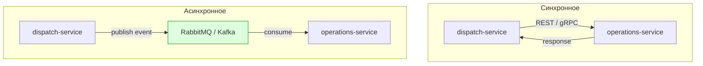

# Лекция 12. Межпроцессное взаимодействие: REST, gRPC, messaging, Protobuf

> **Дисциплина:** Проектирование интернет-систем (ПИС)
> **Курс:** 3, Семестр: 6
> **Тема по учебной программе:** Тема 12 - Межпроцессное взаимодействие
> **ADR-диапазон:** ADR-023 - ADR-024

---

## Результаты обучения

После лекции студент сможет:

1. Сравнить **синхронные** (REST, gRPC) и **асинхронные** (messaging) стили взаимодействия.
2. Спроектировать **REST API** с учётом принципов DDD и HATEOAS (обзор).
3. Описать **gRPC**: `.proto`-файл, генерация кода, streaming.
4. Объяснить роль **message broker** (RabbitMQ/Kafka) и паттерны обмена сообщениями.
5. Документировать контракты с помощью **OpenAPI** и **AsyncAPI** (обзор).

---

## Пререквизиты

- Микросервисная архитектура из **лекции 11** (dispatch-service, operations-service, API Gateway).
- Доменные события и Outbox из **лекции 10** (публикация событий).
- Контракт `GroupQueryPort` из **лекции 09** (межконтекстный запрос).

---

## 1. Введение: как сервисы общаются

На лекции 11 мы выделили три сервиса: `dispatch-service`, `operations-service`, `resources-service`. Теперь ключевой вопрос: **как они обмениваются данными**?

Два фундаментальных стиля:

| Стиль | Когда | Пример |
| ----- | ----- | ------ |
| **Синхронный** | Нужен **немедленный** ответ | dispatch → operations: «Группа доступна?» |
| **Асинхронный** | Ответ **не нужен** немедленно | dispatch → RabbitMQ → operations: «Заявка назначена» |

> **[О4] Ричардсон:** «Выбор стиля взаимодействия - одно из ключевых архитектурных решений при проектировании микросервисов.»



---

## 2. Основные понятия и терминология

**Определения:**

- **REST (Representational State Transfer)** - архитектурный стиль: ресурсы + HTTP-методы (GET, POST, PUT, DELETE) + JSON.
- **gRPC (Google Remote Procedure Call)** - фреймворк для RPC: Protobuf-схема, HTTP/2, генерация кода [protobuf.dev].
- **Protocol Buffers (Protobuf)** - бинарный формат сериализации с `.proto`-схемой.
- **Message Broker** - посредник для асинхронной доставки сообщений (RabbitMQ, Apache Kafka).
- **OpenAPI (Swagger)** - спецификация для документирования REST API.
- **AsyncAPI** - спецификация для документирования асинхронных API (события, очереди).
- **GraphQL** - язык запросов к API: клиент запрашивает только нужные поля (обзор).

---

## 3. REST: ресурсно-ориентированный стиль

### Принципы REST

1. **Ресурсы:** `/api/v1/requests`, `/api/v1/groups/{id}`.
2. **HTTP-методы:** `GET` (чтение), `POST` (создание), `PUT` (обновление), `DELETE` (удаление).
3. **Stateless:** каждый запрос содержит всю информацию (JWT-токен).
4. **Коды ответа:** `201 Created`, `404 Not Found`, `422 Unprocessable Entity`.

### REST и DDD: ресурсы vs агрегаты

REST-ресурсы **не обязаны повторять** структуру агрегатов. API - это **контракт для клиента**, а не проекция доменной модели:

| Агрегат (домен) | REST-ресурс (API) |
| --------------- | ----------------- |
| `Request` (Entity + Coordinates + Priority) | `POST /api/v1/requests` (плоский JSON) |
| `Group` (Entity + Member + Skill) | `GET /api/v1/groups/{id}` (без внутренних Entity) |
| `Request.assign_to_group()` (метод) | `POST /api/v1/requests/{id}/assign` (действие) |

### Пример: ПСО «Юго-Запад» - REST API (FastAPI)

```python
# dispatch-service/api/routes.py - REST endpoints

from fastapi import APIRouter, HTTPException
from pydantic import BaseModel, Field
from uuid import UUID
from datetime import datetime

router = APIRouter(prefix="/api/v1")

# --- DTO (контракт) ---

class CreateRequestBody(BaseModel):
    lat: float = Field(..., ge=-90, le=90)
    lon: float = Field(..., ge=-180, le=180)
    type: str = Field(..., pattern="^(FIRE|FLOOD|SEARCH|MEDICAL)$")
    priority: int = Field(..., ge=1, le=5)

class RequestResponse(BaseModel):
    id: UUID
    lat: float | None
    lon: float | None
    type: str
    priority: int
    status: str
    created_at: datetime

class AssignGroupBody(BaseModel):
    group_id: UUID

# --- Endpoints ---

@router.post("/requests", response_model=RequestResponse, status_code=201)
def create_request(body: CreateRequestBody):
    """Создать новую заявку."""
    handler = get_create_request_handler()  # из Composition Root
    result = handler.handle(body)
    return result

@router.get("/requests/{request_id}", response_model=RequestResponse)
def get_request(request_id: UUID):
    """Получить заявку по ID."""
    result = get_query_handler().get_by_id(request_id)
    if result is None:
        raise HTTPException(404, "Request not found")
    return result

@router.post("/requests/{request_id}/assign", status_code=204)
def assign_group(request_id: UUID, body: AssignGroupBody):
    """Назначить группу на заявку."""
    handler = get_assign_group_handler()
    handler.handle(request_id=request_id, group_id=body.group_id)

@router.get("/requests", response_model=list[RequestResponse])
def list_requests(status: str | None = None, limit: int = 50):
    """Список заявок (с фильтрацией по статусу)."""
    return get_query_handler().list_requests(status=status, limit=limit)
```

**Пояснение к примеру:**

- Pydantic `BaseModel` - валидация входных данных на уровне API (Field с ge/le, pattern).
- Контроллер **тонкий**: делегирует в Application Service.
- `/requests/{id}/assign` - действие, не CRUD. Это допустимо в REST, когда операция - не просто обновление.

---

## 4. gRPC: высокопроизводительный RPC

### Что такое gRPC

gRPC - фреймворк для удалённых вызовов процедур на базе HTTP/2 и Protobuf:

- **Protobuf-схема (`.proto`)** - определяет сервисы и сообщения.
- **Генерация кода** - из `.proto` генерируются классы на Python, Java, Go и др.
- **HTTP/2** - мультиплексирование, бинарный формат, streaming.

### Когда gRPC лучше REST

| Критерий | REST (JSON) | gRPC (Protobuf) |
| -------- | ----------- | --------------- |
| Формат | Текстовый (JSON) | Бинарный (Protobuf) |
| Производительность | Средняя | **Высокая** (в 5-10× меньше payload) |
| Streaming | Нет (нативно) | **Да** (unary, server, client, bidirectional) |
| Генерация кода | Нет | **Да** (из `.proto`) |
| Браузеры | **Да** (нативно) | Ограниченно (gRPC-Web) |
| Документация | OpenAPI (Swagger) | `.proto`-файл = документация |

### Пример: ПСО «Юго-Запад» - `.proto`-файл

```protobuf
// dispatch/proto/dispatch.proto

syntax = "proto3";

package dispatch;

// Сервис диспетчеризации
service DispatchService {
  // Создать заявку
  rpc CreateRequest (CreateRequestProto) returns (RequestProto);
  // Получить заявку по ID
  rpc GetRequest (GetRequestProto) returns (RequestProto);
  // Назначить группу
  rpc AssignGroup (AssignGroupProto) returns (EmptyProto);
  // Стриминг: поток новых заявок
  rpc StreamNewRequests (EmptyProto) returns (stream RequestProto);
}

message CreateRequestProto {
  double lat = 1;
  double lon = 2;
  string type = 3;
  int32 priority = 4;
}

message GetRequestProto {
  string request_id = 1;
}

message AssignGroupProto {
  string request_id = 1;
  string group_id = 2;
}

message RequestProto {
  string id = 1;
  double lat = 2;
  double lon = 3;
  string type = 4;
  int32 priority = 5;
  string status = 6;
  string created_at = 7;
}

message EmptyProto {}
```

### Генерация Python-кода

```bash
python -m grpc_tools.protoc \
  -I dispatch/proto \
  --python_out=dispatch/generated \
  --grpc_python_out=dispatch/generated \
  dispatch/proto/dispatch.proto
```

### gRPC-сервер (Python)

```python
# dispatch-service/grpc_server.py - gRPC server

import grpc
from concurrent import futures
from dispatch.generated import dispatch_pb2, dispatch_pb2_grpc

class DispatchServicer(dispatch_pb2_grpc.DispatchServiceServicer):
    """gRPC-сервер: реализация сервиса DispatchService."""

    def __init__(self, create_handler, query_handler, assign_handler):
        self._create = create_handler
        self._query = query_handler
        self._assign = assign_handler

    def CreateRequest(self, request, context):
        result = self._create.handle(request)
        return dispatch_pb2.RequestProto(
            id=str(result.id),
            lat=result.lat or 0,
            lon=result.lon or 0,
            type=result.type,
            priority=result.priority,
            status=result.status,
            created_at=str(result.created_at),
        )

    def GetRequest(self, request, context):
        result = self._query.get_by_id(request.request_id)
        if result is None:
            context.abort(grpc.StatusCode.NOT_FOUND, "Request not found")
        return dispatch_pb2.RequestProto(
            id=str(result.id),
            type=result.type,
            priority=result.priority,
            status=result.status,
        )

def serve():
    server = grpc.server(futures.ThreadPoolExecutor(max_workers=10))
    dispatch_pb2_grpc.add_DispatchServiceServicer_to_server(
        DispatchServicer(...), server
    )
    server.add_insecure_port("[::]:50051")
    server.start()
    server.wait_for_termination()
```

### gRPC-клиент (Python)

```python
# operations-service/adapters/grpc_dispatch_client.py

import grpc
from dispatch.generated import dispatch_pb2, dispatch_pb2_grpc

class GrpcDispatchClient:
    """gRPC-клиент: operations-service запрашивает dispatch-service."""

    def __init__(self, host: str = "dispatch-service:50051") -> None:
        self._channel = grpc.insecure_channel(host)
        self._stub = dispatch_pb2_grpc.DispatchServiceStub(self._channel)

    def get_request(self, request_id: str):
        response = self._stub.GetRequest(
            dispatch_pb2.GetRequestProto(request_id=request_id)
        )
        return response
```

---

## 5. Messaging: асинхронное взаимодействие

### Когда использовать messaging

- Отправитель **не ждёт ответа** (fire-and-forget).
- Нужна **развязка** во времени (sender и receiver могут работать в разное время).
- Нужна **надёжность** (broker сохраняет сообщение, пока consumer не обработает).
- **Масштабирование** consumers (несколько инстансов обрабатывают очередь).

### RabbitMQ vs Apache Kafka

| Критерий | RabbitMQ | Apache Kafka |
| -------- | -------- | ------------ |
| Модель | Queue (push) | Log (pull) |
| Гарантия доставки | At-least-once | At-least-once, exactly-once (transactions) |
| Хранение | Удаляется после consume | Хранится заданное время (дни/недели) |
| Масштаб | Средний | **Очень высокий** (миллионы msg/s) |
| Сложность | Проще | Сложнее в операциях |
| Use case | Задачи, events | Event streaming, logs, CQRS projections |

### Пример: ПСО «Юго-Запад» - RabbitMQ (pika)

```python
# dispatch-service/infrastructure/adapters/rabbitmq_event_publisher.py

import json
import pika
from dispatch.domain.events import DomainEvent
from dispatch.domain.ports.event_publisher_port import EventPublisherPort

class RabbitMQEventPublisher(EventPublisherPort):
    """Адаптер: публикация событий в RabbitMQ."""

    def __init__(self, amqp_url: str, exchange: str = "domain_events") -> None:
        self._connection = pika.BlockingConnection(
            pika.URLParameters(amqp_url)
        )
        self._channel = self._connection.channel()
        self._channel.exchange_declare(exchange=exchange, exchange_type="topic")
        self._exchange = exchange

    def publish(self, events: list[DomainEvent]) -> None:
        for event in events:
            routing_key = f"dispatch.{type(event).__name__}"
            body = json.dumps(self._serialize(event))
            self._channel.basic_publish(
                exchange=self._exchange,
                routing_key=routing_key,
                body=body.encode(),
                properties=pika.BasicProperties(
                    content_type="application/json",
                    delivery_mode=2,  # persistent
                ),
            )

    def _serialize(self, event: DomainEvent) -> dict:
        from dataclasses import asdict
        from uuid import UUID
        data = asdict(event)
        for key, value in data.items():
            if isinstance(value, UUID):
                data[key] = str(value)
        return data
```

```python
# operations-service/infrastructure/consumers/request_event_consumer.py

import json
import pika

def consume_events(amqp_url: str, exchange: str = "domain_events"):
    """Consumer: слушает события от dispatch-service."""
    connection = pika.BlockingConnection(pika.URLParameters(amqp_url))
    channel = connection.channel()
    channel.exchange_declare(exchange=exchange, exchange_type="topic")

    result = channel.queue_declare(queue="operations_events", durable=True)
    channel.queue_bind(
        exchange=exchange,
        queue="operations_events",
        routing_key="dispatch.#",  # все события dispatch
    )

    def callback(ch, method, properties, body):
        event_data = json.loads(body)
        print(f"[operations] Received event: {event_data}")
        # Обработка события...
        ch.basic_ack(delivery_tag=method.delivery_tag)

    channel.basic_consume(queue="operations_events", on_message_callback=callback)
    print("[operations] Waiting for events...")
    channel.start_consuming()
```

**Пояснение к примеру:**

- `RabbitMQEventPublisher` реализует тот же `EventPublisherPort` (ABC), что и `InProcessEventPublisher` и `OutboxEventPublisher`.
- Routing key: `dispatch.RequestAssigned` - topic-based routing.
- Consumer: `basic_ack` - ручное подтверждение обработки (at-least-once).

---

## 6. Protobuf и схемы данных

### Зачем Protobuf

- **Типизация:** схема определяет типы полей → ошибки обнаруживаются при компиляции.
- **Производительность:** бинарный формат в 5-10× компактнее JSON.
- **Эволюция:** добавлять поля без ломающих изменений (поля по номерам).
- **Кодогенерация:** из одного `.proto` - код на Python, Java, Go, C#, TypeScript.

### Правила эволюции `.proto`

| Действие | Безопасно? |
| -------- | ---------- |
| Добавить новое поле (новый номер) | Да |
| Удалить поле (зарезервировать номер) | Да (с `reserved`) |
| Переименовать поле | Да (имя - для кода, номер - для wire) |
| Изменить тип поля | **Нет** (ломающее) |
| Повторно использовать номер поля | **Нет** (ломающее) |

```protobuf
// Эволюция: добавили zone_id в v2 (безопасно)
message RequestProto {
  string id = 1;
  double lat = 2;
  double lon = 3;
  string type = 4;
  int32 priority = 5;
  string status = 6;
  string created_at = 7;
  string zone_id = 8;       // NEW in v2 - old clients ignore it
}
```

---

## 7. Документирование контрактов

### OpenAPI (для REST)

```yaml
# dispatch-service/openapi.yaml (фрагмент)
openapi: "3.0.3"
info:
  title: Dispatch Service API
  version: "1.0.0"
paths:
  /api/v1/requests:
    post:
      summary: Создать заявку
      requestBody:
        required: true
        content:
          application/json:
            schema:
              $ref: "#/components/schemas/CreateRequest"
      responses:
        "201":
          description: Заявка создана
          content:
            application/json:
              schema:
                $ref: "#/components/schemas/Request"
components:
  schemas:
    CreateRequest:
      type: object
      required: [lat, lon, type, priority]
      properties:
        lat: { type: number, minimum: -90, maximum: 90 }
        lon: { type: number, minimum: -180, maximum: 180 }
        type: { type: string, enum: [FIRE, FLOOD, SEARCH, MEDICAL] }
        priority: { type: integer, minimum: 1, maximum: 5 }
    Request:
      type: object
      properties:
        id: { type: string, format: uuid }
        type: { type: string }
        priority: { type: integer }
        status: { type: string }
```

### AsyncAPI (для messaging)

```yaml
# dispatch-service/asyncapi.yaml (фрагмент)
asyncapi: "2.6.0"
info:
  title: Dispatch Events
  version: "1.0.0"
channels:
  dispatch.RequestAssigned:
    publish:
      summary: Заявка назначена на группу
      message:
        payload:
          type: object
          properties:
            event_id: { type: string, format: uuid }
            request_id: { type: string, format: uuid }
            group_id: { type: string, format: uuid }
            occurred_at: { type: string, format: date-time }
```

---

## 8. Сводная таблица: выбор протокола

| Критерий | REST | gRPC | Messaging |
| -------- | ---- | ---- | --------- |
| **Стиль** | Синхронный | Синхронный | Асинхронный |
| **Формат** | JSON (текст) | Protobuf (бинарный) | JSON / Protobuf |
| **Браузер** | Да | Ограниченно | Нет |
| **Streaming** | Нет | Да | Да (по природе) |
| **Performance** | Средняя | Высокая | Зависит от broker |
| **Schema** | OpenAPI | `.proto` | AsyncAPI |
| **Coupling** | Средний | Средний | **Низкий** |
| **Use case** | Public API, CRUD | Inter-service, high-perf | Events, decoupling |

### Рекомендация для ПСО «Юго-Запад»

- **REST** - для public API (клиентское приложение → API Gateway).
- **gRPC** - для inter-service синхронных вызовов (dispatch → operations).
- **RabbitMQ** - для доменных событий (dispatch → operations, dispatch → resources).

---

## 9. ADR: закрепляем решения

### ADR-023: REST для public API, gRPC для inter-service

| Поле | Значение |
| ---- | -------- |
| **Контекст** | Клиентское приложение (SPA/мобильное) обращается к системе. Сервисы общаются между собой. Нужны два разных протокола. |
| **Решение** | Public API: REST (FastAPI, JSON, OpenAPI). Inter-service synchronous: gRPC (Protobuf, HTTP/2). Документация: OpenAPI для REST, `.proto` для gRPC. |
| **Альтернативы** | (a) REST для всего - проще, но медленнее для inter-service. (b) gRPC для всего - сложнее для браузеров. (c) GraphQL - мощнее для сложных запросов, но выше порог входа. |
| **Затрагиваемые характеристики** | Производительность inter-service ↑ (gRPC), Доступность клиента ↑ (REST), Сложность ↑ (два протокола) |
| **Последствия** | Нужна генерация gRPC-кода в CI/CD. REST и gRPC endpoints могут использовать одни и те же Application Services. |
| **Проверка** | Contract-тест REST (OpenAPI). Contract-тест gRPC (`.proto` compatibility check). |

### ADR-024: RabbitMQ для асинхронного обмена событиями

| Поле | Значение |
| ---- | -------- |
| **Контекст** | Доменные события (RequestAssigned, RequestClosed) должны доставляться из dispatch в operations и resources. Синхронный вызов нарушает автономность. |
| **Решение** | RabbitMQ как message broker. Topic exchange. Routing key: `<context>.<EventType>`. Consumer с ack (at-least-once). AsyncAPI для документации. |
| **Альтернативы** | (a) Apache Kafka - мощнее для streaming, но сложнее в операциях для учебного проекта. (b) In-process event bus - не работает в микросервисной архитектуре. |
| **Затрагиваемые характеристики** | Развязка ↑, Надёжность ↑, Масштабируемость consumers ↑ |
| **Последствия** | Нужен запущенный RabbitMQ (Docker). Consumer должен быть идемпотентным. Мониторинг очередей. |
| **Проверка** | Integration-тест: publish event → consume event → verify side effect. Мониторинг: queue depth < threshold. |

---

## Типичные ошибки и антипаттерны

| № | Ошибка | Как исправить |
| - | ------ | ------------- |
| 1 | Только REST для inter-service (медленно) | gRPC для высокочастотных вызовов |
| 2 | Отсутствие schema (нет `.proto`, нет OpenAPI) | Документировать контракты |
| 3 | Синхронный вызов для событий (coupling) | Messaging (RabbitMQ) |
| 4 | Нет retry/timeout при HTTP-вызовах | `httpx.get(url, timeout=5.0)` + retry |
| 5 | Общий формат события (Protobuf) без версионирования | Зарезервировать номера полей, добавлять новые |
| 6 | Consumer без ack (потеря сообщений) | `basic_ack` после успешной обработки |
| 7 | GraphQL «потому что модно» | Обоснуйте: сложные иерархические запросы |
| 8 | Streaming без backpressure | gRPC flow control / Kafka consumer groups |

---

## Вопросы для самопроверки

1. Чем синхронное взаимодействие отличается от асинхронного? Приведите примеры из ПСО.
2. Когда выбрать REST, а когда gRPC? Приведите критерии.
3. Что такое Protobuf? Почему он компактнее JSON?
4. Как описать сервис в `.proto`-файле? Покажите на примере `DispatchService`.
5. Что такое streaming в gRPC? Приведите use case `StreamNewRequests`.
6. Зачем нужен message broker? Чем RabbitMQ отличается от Kafka?
7. Что такое topic exchange в RabbitMQ?
8. Как обеспечить at-least-once delivery при messaging?
9. Что такое OpenAPI? Как FastAPI автоматически генерирует документацию?
10. Что такое AsyncAPI? Для чего используется?
11. Как эволюционировать `.proto`-схему без ломающих изменений?
12. Почему RabbitMQ рекомендован для ПСО, а не Kafka?
13. Как `RabbitMQEventPublisher` реализует тот же порт, что и `InProcessEventPublisher`?
14. Как тестировать межсервисное взаимодействие (contract tests)?

---

## Глоссарий

| Термин | Определение |
| ------ | ----------- |
| **REST** | Архитектурный стиль: ресурсы + HTTP + JSON |
| **gRPC** | Фреймворк RPC на базе Protobuf + HTTP/2 |
| **Protobuf** | Бинарный формат сериализации с `.proto`-схемой |
| **Message Broker** | Посредник для асинхронной доставки сообщений |
| **RabbitMQ** | Message broker с моделью очередей (push) |
| **Kafka** | Распределённый лог с моделью pull |
| **OpenAPI** | Спецификация документирования REST API |
| **AsyncAPI** | Спецификация документирования асинхронных API |
| **Topic Exchange** | Тип exchange в RabbitMQ: routing по шаблону |
| **Streaming** | Непрерывный поток данных (gRPC server/client/bidirectional) |

---

## Связь с литературной основой курса

- **Характеристики:** Производительность (gRPC для inter-service), Развязка (messaging), Наблюдаемость (contract documentation), Масштабируемость (consumer groups).
- **Артефакт:** ADR-023 (REST + gRPC), ADR-024 (RabbitMQ). Файлы: `dispatch.proto`, `openapi.yaml`, `asyncapi.yaml`, `rabbitmq_event_publisher.py`, `grpc_server.py`, REST routes.
- **Проверка:** Contract-тесты (OpenAPI, `.proto`). Integration-тесты: publish → consume → verify. Performance-тест: gRPC latency < REST latency для inter-service.

---

## Список литературы

### Основная

1. **[О4]** Ричардсон, К. Микросервисы. Паттерны разработки и рефакторинга. - СПб.: Питер, 2019. - 544 с. - Разделы: Inter-process Communication, API Gateway, Messaging.
2. **[О5]** Buenosvinos, C. et al. Domain-Driven Design in PHP. - Packt, 2017. - Разделы: Messaging и интеграция контекстов.

### Дополнительная

1. **[Д5]** Атчисон, Л. Масштабирование приложений. - СПб.: Питер, 2018. - 256 с. - Разделы: кэширование, CDN, очереди.
2. Protocol Buffers Documentation - protobuf.dev.
3. OpenAPI Specification - swagger.io/specification.
4. AsyncAPI Specification - asyncapi.com.
5. gRPC Documentation - grpc.io/docs.
