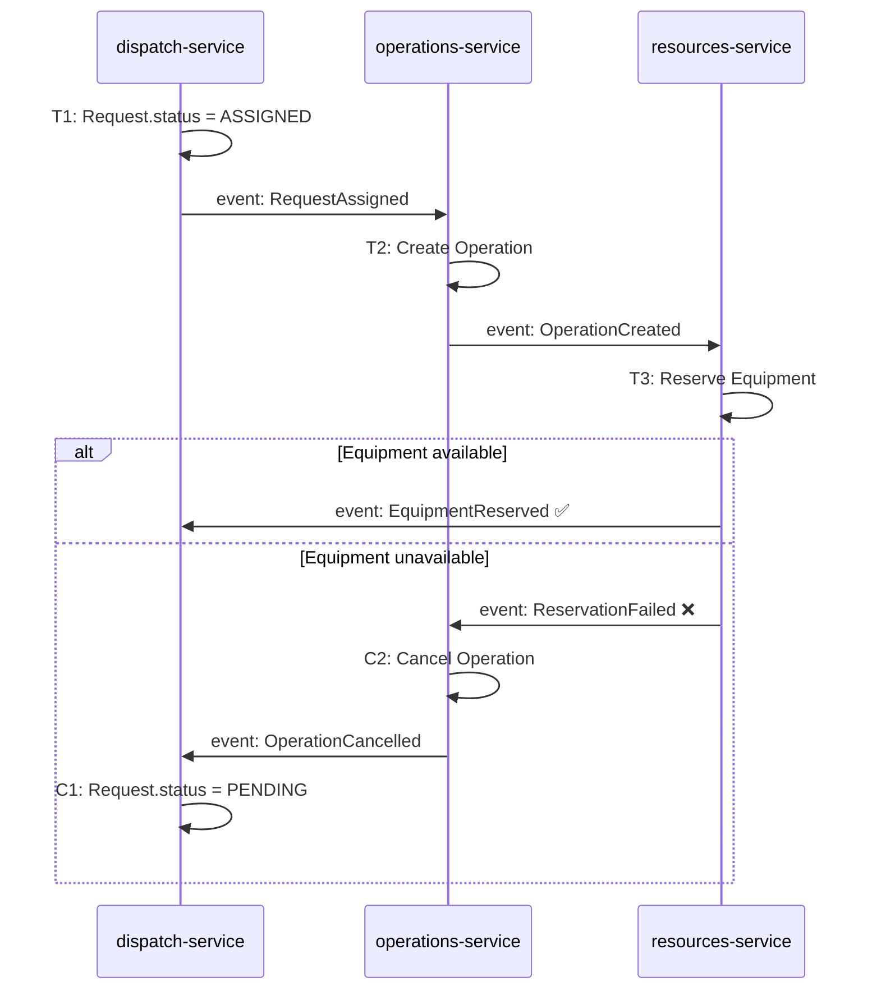
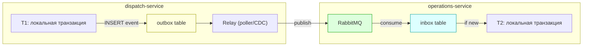

# Лекция 13. Повествования (саги): координация транзакций в микросервисах

> **Дисциплина:** Проектирование интернет-систем (ПИС)
> **Курс:** 3, Семестр: 6
> **Тема по учебной программе:** Тема 13 - Повествования (саги)
> **ADR-диапазон:** ADR-025 - ADR-026

---

## Результаты обучения

После лекции студент сможет:

1. Объяснить, почему **распределённые транзакции** (2PC) не подходят для микросервисов.
2. Определить **сагу** как последовательность локальных транзакций с компенсирующими действиями.
3. Сравнить **хореографию** и **оркестрацию** саг.
4. Спроектировать сагу для сквозного примера ПСО «Юго-Запад».
5. Реализовать **Outbox/Inbox** для надёжной доставки шагов саги.

---

## Пререквизиты

- Микросервисная архитектура из **лекции 11** (dispatch, operations, resources - три сервиса).
- Межпроцессное взаимодействие из **лекции 12** (REST, gRPC, RabbitMQ).
- Доменные события и Outbox из **лекции 10** (EventPublisherPort, OutboxEventPublisher).
- CQRS из **лекции 09** (команды и обработчики).

---

## 1. Введение: проблема распределённых транзакций

### Почему не ACID?

В монолите мы оборачиваем бизнес-операцию в **одну** транзакцию БД: либо всё прошло, либо ничего. В микросервисной архитектуре каждый сервис имеет **свою** БД (Database per Service, ADR-021). Одна бизнес-операция затрагивает несколько сервисов - и **единой транзакции нет**.

**Пример ПСО:** «Назначить группу на заявку» - это не одна операция. Это:

1. `dispatch-service`: обновить статус заявки → `ASSIGNED`
2. `operations-service`: создать операцию (Operation) для группы
3. `resources-service`: зарезервировать оборудование для операции

Если шаг 3 провалится (оборудования нет), шаги 1 и 2 уже зафиксированы. Данные рассогласованы.

### Двухфазный коммит (2PC) - почему не работает

| Проблема | Последствие |
| -------- | ----------- |
| **Координатор - точка отказа** | Если координатор недоступен - все участники блокированы |
| **Блокировка ресурсов** | Пока 2PC ждёт ответов, строки заблокированы → низкая производительность |
| **Гомогенность** | Требует одной СУБД или XA-транзакций - несовместимо с Database per Service |
| **Latency** | Два раунда сетевых вызовов перед commit |

> **[О4] Ричардсон:** «Двухфазный коммит не подходит для микросервисов из-за синхронного координатора, блокировок и требования гомогенной инфраструктуры.»

### Решение - сага

**Сага** - последовательность **локальных транзакций**, каждая из которых:

- Выполняется **одним** сервисом в **своей** БД.
- При успехе публикует **событие** (или ответ), запускающее следующий шаг.
- При неудаче вызывает **компенсирующее действие** для отмены предыдущих шагов.



---

## 2. Основные понятия и терминология

**Определения:**

- **Сага (Saga)** - паттерн управления распределёнными транзакциями: цепочка локальных транзакций с компенсирующими действиями ([О4] Ричардсон).
- **Локальная транзакция (Ti)** - ACID-транзакция одного сервиса.
- **Компенсирующее действие (Ci)** - действие, отменяющее эффект Ti. **Не** классический rollback - это новая операция.
- **Хореография (Choreography)** - каждый участник саги слушает события и решает сам, что делать.
- **Оркестрация (Orchestration)** - центральный **оркестратор** управляет порядком шагов.
- **Pivot Transaction** - точка невозврата: после неё компенсация невозможна.
- **Идемпотентность** - повторное выполнение даёт тот же результат (важно для retry).

---

## 3. Хореография: каждый сервис решает сам

### Принцип

Нет центрального координатора. Каждый сервис:

1. Выполняет свою локальную транзакцию.
2. Публикует событие (через RabbitMQ/Outbox).
3. Другие сервисы подписаны на события и реагируют.

### Пример: ПСО «Юго-Запад» - сага назначения группы (хореография)

```python
# dispatch-service/application/assign_group_handler.py

from dispatch.domain.request import Request
from dispatch.domain.ports.request_repository_port import RequestRepositoryPort
from dispatch.domain.ports.event_publisher_port import EventPublisherPort
from dispatch.domain.ports.unit_of_work_port import UnitOfWorkPort

class AssignGroupHandler:
    """Шаг T1 саги: назначить группу на заявку."""

    def __init__(
        self,
        repo: RequestRepositoryPort,
        uow: UnitOfWorkPort,
        publisher: EventPublisherPort,
    ) -> None:
        self._repo = repo
        self._uow = uow
        self._publisher = publisher

    def handle(self, request_id, group_id) -> None:
        with self._uow:
            request = self._repo.get_by_id(request_id)
            request.assign_to_group(group_id)  # status → ASSIGNED, регистрирует RequestAssigned
            self._repo.save(request)
            self._uow.commit()
        # Публикация ПОСЛЕ commit
        self._publisher.publish(request.events)
        request.clear_events()
```

```python
# operations-service/application/event_handlers.py

from operations.domain.operation import Operation
from operations.domain.ports.operation_repository_port import OperationRepositoryPort
from operations.domain.ports.event_publisher_port import EventPublisherPort

class OnRequestAssigned:
    """Шаг T2 саги: создать операцию при назначении заявки."""

    def __init__(
        self,
        repo: OperationRepositoryPort,
        publisher: EventPublisherPort,
    ) -> None:
        self._repo = repo
        self._publisher = publisher

    def handle(self, event: dict) -> None:
        operation = Operation.create(
            request_id=event["request_id"],
            group_id=event["group_id"],
        )
        self._repo.save(operation)
        self._publisher.publish(operation.events)
        operation.clear_events()
```

```python
# resources-service/application/event_handlers.py

from resources.domain.ports.equipment_repository_port import EquipmentRepositoryPort
from resources.domain.ports.event_publisher_port import EventPublisherPort
from resources.domain.events import EquipmentReserved, ReservationFailed

class OnOperationCreated:
    """Шаг T3 саги: зарезервировать оборудование."""

    def __init__(
        self,
        repo: EquipmentRepositoryPort,
        publisher: EventPublisherPort,
    ) -> None:
        self._repo = repo
        self._publisher = publisher

    def handle(self, event: dict) -> None:
        equipment = self._repo.find_available(event["group_id"])
        if equipment:
            equipment.reserve(event["request_id"])
            self._repo.save(equipment)
            self._publisher.publish([EquipmentReserved(
                request_id=event["request_id"],
                equipment_id=equipment.id,
            )])
        else:
            # Компенсация: оборудования нет → откат
            self._publisher.publish([ReservationFailed(
                request_id=event["request_id"],
                reason="No available equipment",
            )])
```

```python
# operations-service/application/compensation_handlers.py

class OnReservationFailed:
    """Компенсация C2: отменить операцию."""

    def __init__(self, repo, publisher) -> None:
        self._repo = repo
        self._publisher = publisher

    def handle(self, event: dict) -> None:
        operation = self._repo.find_by_request_id(event["request_id"])
        if operation:
            operation.cancel()
            self._repo.save(operation)
            self._publisher.publish(operation.events)  # OperationCancelled
            operation.clear_events()
```

```python
# dispatch-service/application/compensation_handlers.py

class OnOperationCancelled:
    """Компенсация C1: вернуть заявку в PENDING."""

    def __init__(self, repo, uow) -> None:
        self._repo = repo
        self._uow = uow

    def handle(self, event: dict) -> None:
        with self._uow:
            request = self._repo.get_by_id(event["request_id"])
            request.rollback_assignment()  # status → PENDING
            self._repo.save(request)
            self._uow.commit()
```

**Пояснение к примеру:**

- Каждый handler выполняет **одну** локальную транзакцию.
- Компенсирующие действия - **новые** операции (не ROLLBACK!): `operation.cancel()`, `request.rollback_assignment()`.
- Событие публикуется **после** commit (at-least-once), как в лекции 10.

### Плюсы и минусы хореографии

| Плюсы | Минусы |
| ----- | ------ |
| Простая реализация (нет оркестратора) | Логика размазана по сервисам |
| Слабое зацепление | Сложно отследить ход саги |
| Масштабируемость | Циклические зависимости событий |

---

## 4. Оркестрация: центральный координатор

### Принцип оркестрации

**Оркестратор** - объект (обычно в Application Layer), который знает порядок шагов и управляет сагой. Он отправляет команды участникам и обрабатывает ответы.

### Пример: ПСО «Юго-Запад» - SagaOrchestrator

```python
# dispatch-service/application/sagas/assign_group_saga.py

from enum import Enum
from dataclasses import dataclass, field
from uuid import UUID, uuid4

class SagaState(Enum):
    STARTED = "STARTED"
    OPERATION_CREATED = "OPERATION_CREATED"
    EQUIPMENT_RESERVED = "EQUIPMENT_RESERVED"
    COMPLETED = "COMPLETED"
    COMPENSATING = "COMPENSATING"
    FAILED = "FAILED"

@dataclass
class AssignGroupSaga:
    """Оркестратор саги назначения группы."""

    saga_id: UUID = field(default_factory=uuid4)
    request_id: UUID = field(default=None)
    group_id: UUID = field(default=None)
    state: SagaState = SagaState.STARTED

    def next_command(self) -> dict | None:
        """Определить следующую команду по текущему состоянию."""
        match self.state:
            case SagaState.STARTED:
                return {
                    "type": "CreateOperation",
                    "target": "operations-service",
                    "payload": {
                        "request_id": str(self.request_id),
                        "group_id": str(self.group_id),
                    },
                }
            case SagaState.OPERATION_CREATED:
                return {
                    "type": "ReserveEquipment",
                    "target": "resources-service",
                    "payload": {
                        "request_id": str(self.request_id),
                        "group_id": str(self.group_id),
                    },
                }
            case SagaState.EQUIPMENT_RESERVED:
                self.state = SagaState.COMPLETED
                return None  # Сага завершена
            case _:
                return None

    def on_success(self, step: str) -> None:
        """Обработать успешный ответ от участника."""
        match step:
            case "CreateOperation":
                self.state = SagaState.OPERATION_CREATED
            case "ReserveEquipment":
                self.state = SagaState.EQUIPMENT_RESERVED

    def on_failure(self, step: str) -> list[dict]:
        """Вернуть компенсирующие команды при неудаче."""
        self.state = SagaState.COMPENSATING
        compensations = []
        match step:
            case "ReserveEquipment":
                compensations.append({
                    "type": "CancelOperation",
                    "target": "operations-service",
                    "payload": {"request_id": str(self.request_id)},
                })
                compensations.append({
                    "type": "RollbackAssignment",
                    "target": "dispatch-service",
                    "payload": {"request_id": str(self.request_id)},
                })
            case "CreateOperation":
                compensations.append({
                    "type": "RollbackAssignment",
                    "target": "dispatch-service",
                    "payload": {"request_id": str(self.request_id)},
                })
        self.state = SagaState.FAILED
        return compensations
```

```python
# dispatch-service/application/sagas/saga_executor.py

class SagaExecutor:
    """Исполнитель саги: отправляет команды и обрабатывает ответы."""

    def __init__(self, command_sender, saga_repo) -> None:
        self._sender = command_sender
        self._saga_repo = saga_repo

    def start(self, saga) -> None:
        """Запустить сагу: отправить первую команду."""
        self._saga_repo.save(saga)
        command = saga.next_command()
        if command:
            self._sender.send(command)

    def handle_reply(self, saga_id, step: str, success: bool) -> None:
        """Обработать ответ от участника."""
        saga = self._saga_repo.get_by_id(saga_id)
        if success:
            saga.on_success(step)
            next_cmd = saga.next_command()
            if next_cmd:
                self._sender.send(next_cmd)
        else:
            compensations = saga.on_failure(step)
            for comp in compensations:
                self._sender.send(comp)
        self._saga_repo.save(saga)
```

**Пояснение к примеру:**

- `AssignGroupSaga` - **конечный автомат** (state machine), явно описывающий все переходы.
- `next_command()` - определяет, что делать дальше, на основе текущего состояния.
- `on_failure()` - возвращает компенсирующие команды **в обратном порядке**.
- `SagaExecutor` - generic: может выполнять любую сагу.

### Плюсы и минусы оркестрации

| Плюсы | Минусы |
| ----- | ------ |
| Логика саги в одном месте | Оркестратор - потенциальная «God class» |
| Легко отследить ход выполнения | Сильнее зацепление (оркестратор знает о всех участниках) |
| Проще тестировать (один объект) | Риск «умного» оркестратора (бизнес-логика в нём) |

---

## 5. Хореография vs оркестрация: когда что

| Критерий | Хореография | Оркестрация |
| -------- | ----------- | ----------- |
| **Количество шагов** | 2–3 шага | >3 шагов |
| **Сложность компенсации** | Простая | Сложная (множественные откаты) |
| **Наблюдаемость** | Трудно отследить | **Легко** (состояние саги) |
| **Зацепление** | **Низкое** | Среднее (оркестратор) |
| **Тестирование** | Сложнее (integration) | **Проще** (unit-тест оркестратора) |
| **Рекомендация для ПСО** | Простые потоки | **Назначение группы → рекомендуем** |

> **[О4] Ричардсон:** «Оркестрация рекомендуется для саг с более чем 3 шагами и сложной компенсацией. Хореография - для простых потоков с 2-3 участниками.»

---

## 6. Надёжная доставка: Outbox + Inbox

### Проблема

Шаг саги = локальная транзакция + публикация события. Если сервис зафиксировал данные, но упал до публикации - событие потеряно. Мы решали это Outbox-паттерном (лекция 10). Для саг добавляем **Inbox** на стороне получателя.

### Inbox-паттерн

**Inbox** - таблица в БД получателя, в которую записывается каждое входящее сообщение (event_id). Перед обработкой проверяем: если `event_id` уже в Inbox - пропускаем (идемпотентность).

```python
# operations-service/infrastructure/inbox.py

import psycopg2

class InboxStore:
    """Inbox: дедупликация входящих событий."""

    def __init__(self, conn) -> None:
        self._conn = conn

    def already_processed(self, event_id: str) -> bool:
        """Проверить, было ли событие обработано."""
        with self._conn.cursor() as cur:
            cur.execute(
                "SELECT 1 FROM inbox WHERE event_id = %s",
                (event_id,),
            )
            return cur.fetchone() is not None

    def mark_processed(self, event_id: str) -> None:
        """Отметить событие как обработанное."""
        with self._conn.cursor() as cur:
            cur.execute(
                "INSERT INTO inbox (event_id, processed_at) "
                "VALUES (%s, now()) ON CONFLICT DO NOTHING",
                (event_id,),
            )
```

```python
# operations-service/infrastructure/consumers/idempotent_consumer.py

class IdempotentEventConsumer:
    """Consumer с Inbox-дедупликацией."""

    def __init__(self, inbox: "InboxStore", handler) -> None:
        self._inbox = inbox
        self._handler = handler

    def process(self, event: dict) -> None:
        event_id = event.get("event_id")
        if not event_id:
            raise ValueError("Event must have event_id")
        if self._inbox.already_processed(event_id):
            return  # Дубликат - пропускаем
        self._handler.handle(event)
        self._inbox.mark_processed(event_id)
```

```sql
-- operations-service: SQL для inbox-таблицы
CREATE TABLE inbox (
    event_id    UUID PRIMARY KEY,
    processed_at TIMESTAMPTZ NOT NULL DEFAULT now()
);
```

### Outbox + Inbox в связке



**Пояснение:** Outbox гарантирует, что событие **будет** опубликовано (at-least-once). Inbox гарантирует, что получатель **не обработает** дубликат (exactly-once semantics на уровне бизнес-логики).

---

## 7. Тестирование саг

### Unit-тест оркестратора

```python
# tests/test_assign_group_saga.py

from uuid import uuid4
from dispatch.application.sagas.assign_group_saga import (
    AssignGroupSaga,
    SagaState,
)

def test_happy_path():
    saga = AssignGroupSaga(request_id=uuid4(), group_id=uuid4())

    # Шаг 1: первая команда - CreateOperation
    cmd = saga.next_command()
    assert cmd["type"] == "CreateOperation"
    assert cmd["target"] == "operations-service"

    # Ответ: операция создана
    saga.on_success("CreateOperation")
    assert saga.state == SagaState.OPERATION_CREATED

    # Шаг 2: следующая команда - ReserveEquipment
    cmd = saga.next_command()
    assert cmd["type"] == "ReserveEquipment"
    assert cmd["target"] == "resources-service"

    # Ответ: оборудование зарезервировано
    saga.on_success("ReserveEquipment")
    assert saga.state == SagaState.EQUIPMENT_RESERVED

    # Завершение
    cmd = saga.next_command()
    assert cmd is None
    assert saga.state == SagaState.COMPLETED

def test_compensation_on_reserve_failure():
    saga = AssignGroupSaga(request_id=uuid4(), group_id=uuid4())

    saga.next_command()
    saga.on_success("CreateOperation")

    # ReserveEquipment провалился
    compensations = saga.on_failure("ReserveEquipment")

    assert len(compensations) == 2
    assert compensations[0]["type"] == "CancelOperation"
    assert compensations[1]["type"] == "RollbackAssignment"
    assert saga.state == SagaState.FAILED

def test_compensation_on_create_failure():
    saga = AssignGroupSaga(request_id=uuid4(), group_id=uuid4())

    saga.next_command()
    compensations = saga.on_failure("CreateOperation")

    assert len(compensations) == 1
    assert compensations[0]["type"] == "RollbackAssignment"
    assert saga.state == SagaState.FAILED
```

**Пояснение к тестам:**

- Оркестратор - **чистый** Python (нет инфраструктуры). Тестируется как unit.
- Проверяем: happy path, компенсация на каждом шаге, корректность состояний.

---

## 8. ADR: закрепляем решения

### ADR-025: Сага для назначения группы (оркестрация)

| Поле | Значение |
| ---- | -------- |
| **Контекст** | «Назначить группу на заявку» затрагивает 3 сервиса (dispatch, operations, resources). Database per Service → нет единой транзакции. |
| **Решение** | Оркестрируемая сага `AssignGroupSaga`. Оркестратор - state machine в dispatch-service. Компенсирующие действия: CancelOperation, RollbackAssignment. |
| **Альтернативы** | (a) Хореография - проще, но 3 шага + сложная компенсация → трудно отследить. (b) 2PC - блокировки, точка отказа. |
| **Затрагиваемые характеристики** | Согласованность (eventual) ↑, Надёжность ↑ (компенсация), Наблюдаемость ↑ (состояние саги) |
| **Последствия** | Нужна таблица `saga_state` в dispatch-service. Оркестратор не должен содержать бизнес-логику. |
| **Проверка** | Unit-тест оркестратора (happy + failure paths). Integration-тест: publish → consume → compensate. Мониторинг: count of FAILED sagas. |

### ADR-026: Inbox-паттерн для идемпотентности получателей

| Поле | Значение |
| ---- | -------- |
| **Контекст** | RabbitMQ гарантирует at-least-once delivery. Consumer может получить дубликат. Повторное выполнение шага саги → рассогласование данных. |
| **Решение** | Inbox-таблица в каждом сервисе-получателе. Проверка `event_id` перед обработкой. `ON CONFLICT DO NOTHING`. |
| **Альтернативы** | (a) Exactly-once delivery (Kafka transactions) - сложнее инфраструктура. (b) Идемпотентность через бизнес-логику - не всегда возможно. |
| **Затрагиваемые характеристики** | Согласованность ↑ (нет дубликатов), Надёжность ↑ |
| **Последствия** | Дополнительная таблица `inbox` в каждом сервисе. event_id обязателен для всех событий. |
| **Проверка** | Тест: отправить одно событие дважды → обработано один раз. Метрика: inbox duplicate count. |

---

## Типичные ошибки и антипаттерны

| № | Ошибка | Как исправить |
| - | ------ | ------------- |
| 1 | 2PC для микросервисов (блокировки, координатор) | Саги (eventual consistency) |
| 2 | Нет компенсирующих действий (данные рассогласованы) | Проектировать компенсацию для каждого шага |
| 3 | Компенсация = ROLLBACK (попытка «откатить» удалённый commit) | Компенсация - новая операция (cancel, reverse) |
| 4 | Оркестратор с бизнес-логикой (God class) | Оркестратор - только маршрутизация; логика в сервисах |
| 5 | Нет Inbox (дубликаты обрабатываются повторно) | Inbox + event_id + дедупликация |
| 6 | Нет мониторинга FAILED-саг | Dashboard: count COMPENSATING/FAILED за период |
| 7 | Хореография для сложных потоков (>3 шага) | Переход на оркестрацию |
| 8 | Нет timeout для шагов саги | Deadline/timeout в оркестраторе |

---

## Вопросы для самопроверки

1. Почему 2PC не подходит для микросервисов с Database per Service?
2. Что такое сага? Из каких элементов она состоит?
3. Чем компенсирующее действие отличается от ROLLBACK?
4. Опишите хореографию саги «Назначить группу» на примере ПСО.
5. Опишите оркестрацию той же саги. В чём разница?
6. Когда выбирать хореографию, а когда оркестрацию?
7. Что такое Pivot Transaction и почему она важна?
8. Зачем нужен Inbox-паттерн? Как он обеспечивает идемпотентность?
9. Как Outbox и Inbox работают вместе?
10. Почему оркестратор должен быть state machine?
11. Как тестировать оркестратор саги (unit-тест)?
12. Какие метрики помогут отслеживать здоровье саг?
13. Что произойдёт, если компенсирующее действие провалится?
14. Как `AssignGroupSaga` определяет следующую команду?

---

## Глоссарий

| Термин | Определение |
| ------ | ----------- |
| **Сага (Saga)** | Последовательность локальных транзакций с компенсирующими действиями |
| **Локальная транзакция** | ACID-транзакция одного сервиса |
| **Компенсирующее действие** | Операция, отменяющая эффект успешного шага |
| **Хореография** | Координация через события (без центрального координатора) |
| **Оркестрация** | Координация через центральный оркестратор (state machine) |
| **Pivot Transaction** | Точка невозврата в саге |
| **2PC** | Двухфазный коммит (Two-Phase Commit) |
| **Inbox** | Таблица дедупликации входящих сообщений |
| **Outbox** | Таблица для надёжной публикации событий |
| **Идемпотентность** | Повторное выполнение даёт тот же результат |

---

## Связь с литературной основой курса

- **Характеристики:** Согласованность (eventual → компромисс), Надёжность (компенсация + retry), Наблюдаемость (состояние саги, метрики FAILED).
- **Артефакт:** ADR-025 (оркестрируемая сага), ADR-026 (Inbox). Код: `AssignGroupSaga`, `SagaExecutor`, `InboxStore`, `IdempotentEventConsumer`.
- **Проверка:** Unit-тест оркестратора (happy + failure). Integration-тест: Outbox → RabbitMQ → Inbox → handler. Мониторинг: FAILED saga count, inbox duplicate rate.

---

## Список литературы

### Основная

1. **[О4]** Ричардсон, К. Микросервисы. Паттерны разработки и рефакторинга. - СПб.: Питер, 2019. - 544 с. - Разделы: Saga, хореография, оркестрация, компенсирующие транзакции.
2. **[О5]** Buenosvinos, C. et al. Domain-Driven Design in PHP. - Packt, 2017. - Разделы: интеграция контекстов, события.

### Дополнительная

1. **[Д5]** Атчисон, Л. Масштабирование приложений. - СПб.: Питер, 2018. - 256 с. - Разделы: очереди, идемпотентность.
2. **[Д6]** Бейер, Б. и др. Site Reliability Engineering. - СПб.: Питер, 2019. - 592 с. - Разделы: error budgets, мониторинг.
3. Microservices Patterns (microservices.io/patterns/data/saga.html).
