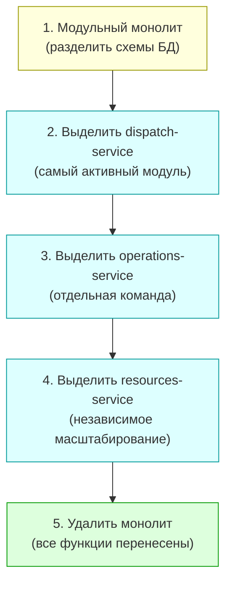

# Лекция 14. От монолита к микросервисам: стратегии перехода

> **Дисциплина:** Проектирование интернет-систем (ПИС)
> **Курс:** 3, Семестр: 6
> **Тема по учебной программе:** Тема 14 - От монолита к микросервисам
> **ADR-диапазон:** ADR-027 - ADR-028

---

## Результаты обучения

После лекции студент сможет:

1. Объяснить **причины** и **риски** перехода от монолита к микросервисам.
2. Описать паттерн **Strangler Fig** и его применение.
3. Применить **Branch by Abstraction** для постепенного выделения сервисов.
4. Спроектировать **Anti-Corruption Layer** для совместной работы монолита и нового сервиса.
5. Определить критерии готовности к выделению сервиса.

---

## Пререквизиты

- Микросервисная архитектура из **лекции 11** (dispatch, operations, resources).
- Bounded Contexts из **лекции 05** (единый язык, границы).
- Гексагональная архитектура из **лекции 06** (порты и адаптеры).
- Саги из **лекции 13** (координация транзакций между сервисами).

---

## 1. Введение: зачем мигрировать

### Монолит - не всегда проблема

Прежде чем мигрировать, ответьте на вопрос: **зачем?** Монолит работает хорошо, когда:

- Команда маленькая (3-7 человек).
- Предметная область хорошо изучена.
- Нагрузка равномерная.
- Деплой не является узким местом.

> **[О4] Ричардсон:** «Не начинайте с микросервисов. Начинайте с монолита и выделяйте сервисы, когда для этого есть обоснованные причины.»

### Когда монолит становится проблемой

| Симптом | Последствие |
| ------- | ----------- |
| **Долгие деплои** | Merge-конфликты, 2-часовые сборки, fear of deploy |
| **Невозможность масштабировать часть** | Масштабируем всё, хотя нагрузка на один модуль |
| **Команды блокируют друг друга** | Модуль A ломает модуль B при каждом релизе |
| **Технологическая привязка** | Весь монолит на одном фреймворке, нельзя обновить часть |
| **Сложность кодовой базы** | >500K строк, новый разработчик входит 3+ месяца |

### Модульный монолит - промежуточный шаг

Перед микросервисами рассмотрите **модульный монолит**: один процесс, но с чёткими границами между модулями (private API, своя схема БД). Это 80% пользы микросервисов без операционной сложности.

```mermaid
graph TD
    subgraph "Монолит (один процесс)"
        M1["dispatch module"]
        M2["operations module"]
        M3["resources module"]
        M1 -->|"internal API"| M2
        M2 -->|"internal API"| M3
        DB[(Shared DB)]
        M1 --> DB
        M2 --> DB
        M3 --> DB
    end

    subgraph "Модульный монолит"
        MM1["dispatch module"]
        MM2["operations module"]
        MM3["resources module"]
        MM1 -->|"public API only"| MM2
        MM2 -->|"public API only"| MM3
        DB1[(dispatch schema)]
        DB2[(operations schema)]
        DB3[(resources schema)]
        MM1 --> DB1
        MM2 --> DB2
        MM3 --> DB3
    end

    subgraph "Микросервисы"
        S1["dispatch-service"]
        S2["operations-service"]
        S3["resources-service"]
        S1 -->|"REST/gRPC"| S2
        S2 -->|"events"| S3
        SD1[(dispatch DB)]
        SD2[(operations DB)]
        SD3[(resources DB)]
        S1 --> SD1
        S2 --> SD2
        S3 --> SD3
    end
```



---

## 2. Основные понятия и терминология

**Определения:**

- **Strangler Fig (паттерн «Удушающая лоза»)** - постепенная замена компонентов монолита новыми сервисами. Новый код «обрастает» вокруг старого, пока старый не станет ненужным.
- **Branch by Abstraction** - замена реализации через абстракцию: создаём интерфейс → реализация A (монолит) → реализация B (новый сервис) → переключаем.
- **Anti-Corruption Layer (ACL)** - адаптер, который переводит вызовы между моделями монолита и нового сервиса (DDD, лекция 05).
- **Feature Toggle** - флаг, позволяющий переключать трафик между старой и новой реализацией.
- **Seam (шов)** - место в коде, где можно «перехватить» вызов и перенаправить его.

---

## 3. Strangler Fig: постепенная замена

### Принцип

Название - по аналогии с тропическим растением, которое растёт вокруг дерева и постепенно замещает его. Применительно к коду:

1. **Identify** - определить модуль/функцию для выделения.
2. **Implement** - реализовать функцию в новом сервисе.
3. **Redirect** - перенаправить трафик (через API Gateway или proxy).
4. **Remove** - удалить старый код из монолита.

### Пример: ПСО «Юго-Запад» - выделение dispatch-service

Представим, что ПСО начиналась как монолит (Python/FastAPI, одна БД PostgreSQL). Выделяем `dispatch` как первый сервис.

```python
# monolith/api/routes.py - ДО миграции (монолит)
# Все endpoints в одном приложении

from fastapi import APIRouter

router = APIRouter()

@router.post("/api/v1/requests")
def create_request(body: dict):
    """Создание заявки - в монолите."""
    # Логика dispatch + operations + resources в одном месте
    request = create_request_in_db(body)
    operation = create_operation_for_request(request)
    reserve_equipment(operation)
    return {"id": request.id, "status": request.status}
```

#### Шаг 1: Strangler Proxy (API Gateway)

```python
# api-gateway/routes.py - Strangler proxy
# Перенаправляет часть трафика в новый сервис

import httpx
from fastapi import APIRouter, Request

router = APIRouter()

DISPATCH_SERVICE_URL = "http://dispatch-service:8001"
MONOLITH_URL = "http://monolith:8000"

@router.api_route("/api/v1/requests/{path:path}", methods=["GET", "POST", "PUT", "DELETE"])
async def proxy_requests(request: Request, path: str = ""):
    """Перенаправление: /requests → dispatch-service (новый)."""
    url = f"{DISPATCH_SERVICE_URL}/api/v1/requests/{path}"
    async with httpx.AsyncClient() as client:
        response = await client.request(
            method=request.method,
            url=url,
            content=await request.body(),
            headers=dict(request.headers),
        )
    return response.json()

@router.api_route("/api/v1/{path:path}", methods=["GET", "POST", "PUT", "DELETE"])
async def proxy_monolith(request: Request, path: str = ""):
    """Всё остальное → монолит (старый)."""
    url = f"{MONOLITH_URL}/api/v1/{path}"
    async with httpx.AsyncClient() as client:
        response = await client.request(
            method=request.method,
            url=url,
            content=await request.body(),
            headers=dict(request.headers),
        )
    return response.json()
```

**Пояснение к примеру:**

- API Gateway работает как **strangler proxy**: `/requests` → новый `dispatch-service`, всё остальное → монолит.
- Клиент ничего не знает о миграции - URL не меняется.
- Постепенно перенаправляем всё больше endpoints в новые сервисы.

---

## 4. Branch by Abstraction

### Принцип Branch by Abstraction

Когда нельзя просто перенаправить HTTP-вызов (внутренние зависимости), используем **Branch by Abstraction**:

1. **Создаём абстракцию** (порт/интерфейс) для функциональности.
2. **Реализация A** - текущий код монолита.
3. **Реализация B** - вызов нового сервиса.
4. **Feature Toggle** - переключаемся между A и B.
5. **Удаляем A** - когда B стабилен.

### Пример: ПСО «Юго-Запад» - выделение GroupQuery

```python
# monolith/domain/ports/group_query_port.py
# Абстракция (уже была в лекции 06!)

from abc import ABC, abstractmethod

class GroupQueryPort(ABC):
    """Порт: запрос доступности группы."""

    @abstractmethod
    def is_available(self, group_id) -> bool:
        ...
```

```python
# monolith/infrastructure/adapters/local_group_query.py
# Реализация A: запрос в локальную БД (монолит)

from monolith.domain.ports.group_query_port import GroupQueryPort

class LocalGroupQuery(GroupQueryPort):
    """Адаптер A: запрос в локальную БД монолита."""

    def __init__(self, conn) -> None:
        self._conn = conn

    def is_available(self, group_id) -> bool:
        with self._conn.cursor() as cur:
            cur.execute(
                "SELECT status FROM groups WHERE id = %s",
                (str(group_id),),
            )
            row = cur.fetchone()
            return row is not None and row[0] == "AVAILABLE"
```

```python
# monolith/infrastructure/adapters/remote_group_query.py
# Реализация B: вызов нового operations-service

import httpx
from monolith.domain.ports.group_query_port import GroupQueryPort

class RemoteGroupQuery(GroupQueryPort):
    """Адаптер B: HTTP-вызов в operations-service."""

    def __init__(self, base_url: str = "http://operations-service:8002") -> None:
        self._base_url = base_url

    def is_available(self, group_id) -> bool:
        response = httpx.get(
            f"{self._base_url}/api/v1/groups/{group_id}/availability",
            timeout=5.0,
        )
        if response.status_code == 200:
            return response.json().get("available", False)
        return False
```

```python
# monolith/composition_root.py
# Feature Toggle: переключение между реализациями

import os
from monolith.domain.ports.group_query_port import GroupQueryPort
from monolith.infrastructure.adapters.local_group_query import LocalGroupQuery
from monolith.infrastructure.adapters.remote_group_query import RemoteGroupQuery

def get_group_query(conn) -> GroupQueryPort:
    """Composition Root с feature toggle."""
    use_remote = os.getenv("USE_REMOTE_GROUP_QUERY", "false").lower() == "true"
    if use_remote:
        return RemoteGroupQuery()
    return LocalGroupQuery(conn)
```

**Пояснение к примеру:**

- `GroupQueryPort` (абстракция) уже была в нашем коде с лекции 06 - гексагональная архитектура **упрощает** миграцию!
- `LocalGroupQuery` - старая реализация (SQL в монолите).
- `RemoteGroupQuery` - новая реализация (HTTP в operations-service).
- Feature toggle - переменная окружения `USE_REMOTE_GROUP_QUERY`.
- Приложение не знает, откуда приходят данные - работает через порт.

---

## 5. Anti-Corruption Layer (ACL)

### Проблема

Монолит и новый сервис могут использовать **разные модели**. Например:

- Монолит: `request.group_name` (строка).
- Новый сервис: `request.group_id` (UUID) + `Group.name` (отдельный объект).

Прямое взаимодействие «загрязняет» новую модель старыми структурами.

### Решение: ACL

**Anti-Corruption Layer** - адаптер (из DDD, лекция 05), который переводит между моделями:

```python
# dispatch-service/infrastructure/adapters/monolith_acl.py

import httpx
from uuid import UUID

class MonolithACL:
    """Anti-Corruption Layer: переводит данные монолита в модель dispatch."""

    def __init__(self, monolith_url: str = "http://monolith:8000") -> None:
        self._url = monolith_url

    def get_request_from_monolith(self, legacy_id: int) -> dict:
        """Получить заявку из монолита и преобразовать в нашу модель."""
        response = httpx.get(f"{self._url}/api/internal/requests/{legacy_id}")
        legacy = response.json()

        # Преобразование: монолит → dispatch model
        return {
            "id": UUID(legacy["uuid"]) if legacy.get("uuid") else None,
            "lat": legacy.get("latitude"),
            "lon": legacy.get("longitude"),
            "type": self._map_type(legacy.get("category")),
            "priority": self._map_priority(legacy.get("urgency_level")),
            "status": self._map_status(legacy.get("state")),
        }

    def _map_type(self, category: str | None) -> str:
        """Маппинг категорий монолита → типы dispatch."""
        mapping = {
            "fire_emergency": "FIRE",
            "water_emergency": "FLOOD",
            "missing_person": "SEARCH",
            "medical_aid": "MEDICAL",
        }
        return mapping.get(category, "SEARCH")

    def _map_priority(self, urgency: int | None) -> int:
        """Маппинг: монолит 1-10 → dispatch 1-5."""
        if urgency is None:
            return 3
        return max(1, min(5, (urgency + 1) // 2))

    def _map_status(self, state: str | None) -> str:
        """Маппинг состояний."""
        mapping = {
            "new": "PENDING",
            "in_progress": "ASSIGNED",
            "done": "CLOSED",
        }
        return mapping.get(state, "PENDING")
```

**Пояснение к примеру:**

- ACL - **адаптер**, который живёт на стороне нового сервиса.
- Новый сервис никогда не работает напрямую со старыми структурами.
- Маппинг - в одном месте: легко менять при эволюции монолита.

---

## 6. Миграция данных

### Стратегии

| Стратегия | Когда | Плюсы | Минусы |
| --------- | ----- | ----- | ------ |
| **Shared Database** (временно) | Начало миграции | Простота | Зацепление, нет автономности |
| **Database View** | Промежуточный этап | Старый код не меняется | Read-only, схема связана |
| **Change Data Capture (CDC)** | Постепенная миграция | Реальное время, минимальные изменения | Инфраструктура (Debezium) |
| **Dual Write** | Короткий переходный период | Оба источника актуальны | Сложность, risk рассогласования |
| **Big Bang migration** | Маленький объём данных | Одноразово | Downtime, риск |

### Пример: CDC с Debezium (обзор)

```yaml
# docker-compose.yml (фрагмент) - Debezium для CDC

services:
  debezium:
    image: debezium/connect:2.4
    environment:
      BOOTSTRAP_SERVERS: kafka:9092
      GROUP_ID: cdc-group
      CONFIG_STORAGE_TOPIC: cdc-configs
      OFFSET_STORAGE_TOPIC: cdc-offsets
    ports:
      - "8083:8083"
    depends_on:
      - kafka
      - monolith-db
```

```json
{
  "name": "monolith-requests-connector",
  "config": {
    "connector.class": "io.debezium.connector.postgresql.PostgresConnector",
    "database.hostname": "monolith-db",
    "database.port": "5432",
    "database.dbname": "monolith",
    "database.user": "debezium",
    "database.password": "secret",
    "table.include.list": "public.requests",
    "topic.prefix": "monolith",
    "plugin.name": "pgoutput"
  }
}
```

**Пояснение:** Debezium читает WAL PostgreSQL и транслирует изменения в Kafka/RabbitMQ. Новый сервис подписывается на поток и поддерживает свою БД в актуальном состоянии - без изменений в монолите.

---

## 7. Порядок выделения сервисов

### Критерии приоритизации

| Критерий | Высокий приоритет | Низкий приоритет |
| -------- | ----------------- | ---------------- |
| **Темп изменений** | Модуль меняется каждую неделю | Стабильный, не менялся год |
| **Нагрузка** | Пиковая нагрузка отличается | Равномерная с остальными |
| **Команда** | Отдельная команда владеет модулем | Один разработчик, разделяемый |
| **Зависимости** | Мало зависимостей от других модулей | Глубоко переплетён |
| **Bounded Context** | Чёткий BC с ясными границами | Размытые границы |

### План для ПСО «Юго-Запад»



**Почему dispatch первый:**

- Самый высокий темп изменений (новые типы заявок каждый спринт).
- Самый нагруженный модуль (все входящие заявки проходят через него).
- Чёткий Bounded Context с ясными границами (лекция 05).
- Минимальные зависимости от operations и resources (только через events).

---

## 8. ADR: закрепляем решения

### ADR-027: Strangler Fig для миграции с API Gateway

| Поле | Значение |
| ---- | -------- |
| **Контекст** | Монолит ПСО содержит dispatch, operations, resources в одном приложении. Нужно перейти на микросервисы без downtime. |
| **Решение** | Strangler Fig: API Gateway (Traefik/FastAPI proxy) перенаправляет `/requests` → dispatch-service, остальное → монолит. Постепенное выделение сервисов. |
| **Альтернативы** | (a) Big Bang - переписать всё сразу. Высокий риск, долгий срок. (b) Модульный монолит - остаться в одном процессе. Меньше операционной сложности, но нет независимого масштабирования. |
| **Затрагиваемые характеристики** | Развёртываемость ↑ (независимый деплой), Риск ↓ (постепенность), Операционная сложность ↑ |
| **Последствия** | API Gateway - обязательный компонент. Период двойной инфраструктуры (монолит + сервисы). ACL для совместимости моделей. |
| **Проверка** | Smoke-тест: трафик через proxy → тот же результат, что и напрямую. Метрика: error rate ≤ baseline. |

### ADR-028: Branch by Abstraction + Feature Toggle

| Поле | Значение |
| ---- | -------- |
| **Контекст** | Внутренние зависимости монолита (GroupQuery) нельзя перенаправить через HTTP proxy - нужна замена реализации внутри кода. |
| **Решение** | Branch by Abstraction: `GroupQueryPort` → `LocalGroupQuery` (монолит) / `RemoteGroupQuery` (HTTP). Feature toggle через переменную окружения `USE_REMOTE_GROUP_QUERY`. |
| **Альтернативы** | (a) Прямая замена кода - рискованно, нет отката. (b) Blue-green per feature - сложнее инфраструктура. |
| **Затрагиваемые характеристики** | Безопасность изменений ↑ (можно откатить toggle), Тестируемость ↑ (обе реализации рядом) |
| **Последствия** | Нужна дисциплина: удалять toggle и старую реализацию после стабилизации. Не накапливать >3 активных toggles. |
| **Проверка** | A/B-тест: toggle ON vs OFF → те же результаты. Мониторинг: latency и error rate при переключении. |

---

## Типичные ошибки и антипаттерны

| № | Ошибка | Как исправить |
| - | ------ | ------------- |
| 1 | Big Bang rewrite (переписать всё сразу) | Strangler Fig (постепенно) |
| 2 | Выделение сервиса без чёткого BC | Сначала определить BC (лекция 05) |
| 3 | Shared Database надолго | Ограничить срок → Database per Service |
| 4 | Нет ACL (загрязнение новой модели) | Anti-Corruption Layer |
| 5 | Накопление feature toggles (>5 активных) | Удалять toggles после стабилизации |
| 6 | Миграция без мониторинга | Сравнить метрики до/после каждого шага |
| 7 | Начать с самого сложного модуля | Начать с модуля с чёткими границами |
| 8 | Нет плана отката | Feature toggle = мгновенный откат |

---

## Вопросы для самопроверки

1. Когда монолит - это нормально? Когда пора мигрировать?
2. Что такое модульный монолит? Чем он отличается от микросервисов?
3. Опишите паттерн Strangler Fig. Почему он называется «удушающая лоза»?
4. Как API Gateway работает как strangler proxy?
5. Что такое Branch by Abstraction? Покажите на примере `GroupQueryPort`.
6. Зачем нужен Feature Toggle? Какие риски при его накоплении?
7. Что такое Anti-Corruption Layer? Зачем он нужен при миграции?
8. Какие стратегии миграции данных существуют? Когда использовать CDC?
9. По каким критериям выбрать первый модуль для выделения?
10. Почему dispatch выделяется первым в ПСО «Юго-Запад»?
11. Как гексагональная архитектура (лекция 06) упрощает миграцию?
12. Что произойдёт, если не удалять feature toggles?
13. Как протестировать, что strangler proxy работает корректно?
14. Чем ACL отличается от обычного адаптера?

---

## Глоссарий

| Термин | Определение |
| ------ | ----------- |
| **Strangler Fig** | Паттерн постепенной замены монолита новыми сервисами |
| **Branch by Abstraction** | Замена реализации через интерфейс без рефакторинга вызывающего кода |
| **Anti-Corruption Layer** | Адаптер, переводящий между моделями старого и нового кода |
| **Feature Toggle** | Флаг для переключения между реализациями |
| **Seam (шов)** | Место перехвата вызова для перенаправления |
| **CDC (Change Data Capture)** | Захват изменений из WAL БД для синхронизации данных |
| **Модульный монолит** | Один процесс с чёткими границами между модулями |
| **Dual Write** | Запись в два источника одновременно (переходный паттерн) |

---

## Связь с литературной основой курса

- **Характеристики:** Развёртываемость (независимый деплой), Эволюционность (постепенная миграция), Риск (контроль через toggles и мониторинг).
- **Артефакт:** ADR-027 (Strangler Fig), ADR-028 (Branch by Abstraction + Feature Toggle). Код: strangler proxy, `LocalGroupQuery`/`RemoteGroupQuery`, `MonolithACL`.
- **Проверка:** Smoke-тесты proxy. A/B-тест toggle ON/OFF. Метрики: error rate, latency при каждом шаге миграции. CDC integration test.

---

## Список литературы

### Основная

1. **[О4]** Ричардсон, К. Микросервисы. Паттерны разработки и рефакторинга. - СПб.: Питер, 2019. - 544 с. - Разделы: Strangler Application, транзакционный outbox, стратегии миграции.
2. **[О2]** Мартин, Р. Чистая архитектура. - СПб.: Питер, 2018. - 352 с. - Разделы: границы, зависимость внутрь, тестируемость.
3. **[О3]** Вернон, В. Реализация методов предметно-ориентированного проектирования. - М.: Вильямс, 2016. - 688 с. - Разделы: Anti-Corruption Layer, Bounded Context.

### Дополнительная

1. **[Д5]** Атчисон, Л. Масштабирование приложений. - СПб.: Питер, 2018. - 256 с.
2. Martin Fowler - StranglerFigApplication (martinfowler.com/bliki).
3. Sam Newman - Monolith to Microservices (O'Reilly, 2019).
